# From Retrieval Motifs To SGD Circuit Selection

Nelson Alex

Living draft: 2026-04-11

This is an ongoing research report. It records the current state of the project, not a final paper claim.

## Document Map

This page is the main public-facing paper draft.

Supporting docs:

- [Checkpoint Analysis Plan](checkpoint_analysis_plan.md): the checkpoint-level measurement design.
- [Shared Feature Dynamics Plan](shared_feature_dynamics_plan.md): the feature-basis and feature-family analysis design.

Page-local figure assets live in:

- `assets/figures/`

The deeper `artifacts/` paths listed later are source artifacts and reproducibility pointers. Figures embedded in this page are copied into `docs/assets/figures/` so the page can render from the `docs/` folder.

## Abstract

This project studies how a small decoder-only transformer forms retrieval circuits during plain autoregressive next-token training.

The previous study, [Mechanistic Transparency](https://nelson960.github.io/Mechanistic-Transparency/), showed that small transformers repeatedly learn staged retrieval motifs rather than one fixed universal head graph. The strongest stable object in that work was a role-level retrieval/write motif, while exact head identity, birth timing, and matching-slot localization varied across seeds and curricula.

This paper starts at the remaining gap:

```text
Why does SGD form one circuit family rather than another?
```

The current project builds a controlled stream-based symbolic key-value benchmark, trains a small decoder-only transformer, saves dense checkpoints, and builds a layered analysis stack that tracks behavior, residual states, heads, MLPs, shared features, feature families, candidate circuits, and gradient-linked birth factors.

Current supported result:

- useful behavior appears in stages
- the learned mechanism is dense rather than a single-neuron bottleneck
- upper-layer feature families expose candidate retrieval/write coalitions
- family7 at `layer_2_post_mlp`, features `27` and `54`, is the strongest current generalizing candidate
- family4, features `1` and `59`, is a related but weaker sibling candidate
- both candidates share traced component ancestry through `layer0_head3`, `layer0_mlp`, and a `layer2` neuron group
- family7 and family4 share a dense layer-0-heavy MLP-neuron coalition during the early `1750 -> 2500` formation window
- targeted neuron ablation at checkpoint `2500` causally drops both family feature scores, but does not yet cleanly drop overall task behavior

Current negative result:

- the first transparent `candidate-birth-model` does not yet predict family7 over family4 from shared strict pre-birth evidence
- this means the current "why" model is incomplete
- neuron-level coalition tracing alone is not enough to explain why SGD selects the final circuit

The paper should therefore be read as a live mechanistic research record. The project has moved from component observation into the harder mathematical question: how the dataset relation `d(x, y)` becomes attention geometry, MLP feature geometry, path-level logit contribution, and finally an SGD-selected internal circuit.

## Claim Status Legend

Every major claim is marked with one of these statuses:

| status | meaning |
| --- | --- |
| Supported | Directly backed by current artifacts. |
| Current best hypothesis | Consistent with artifacts, but not yet proven. |
| Negative result | A test failed or contradicted the simple story. |
| Unsupported | Not yet established by the repo. |
| Next test | A concrete experiment needed next. |

## One-Page Summary

Supported:

The project currently has a full end-to-end circuit-formation analysis stack:

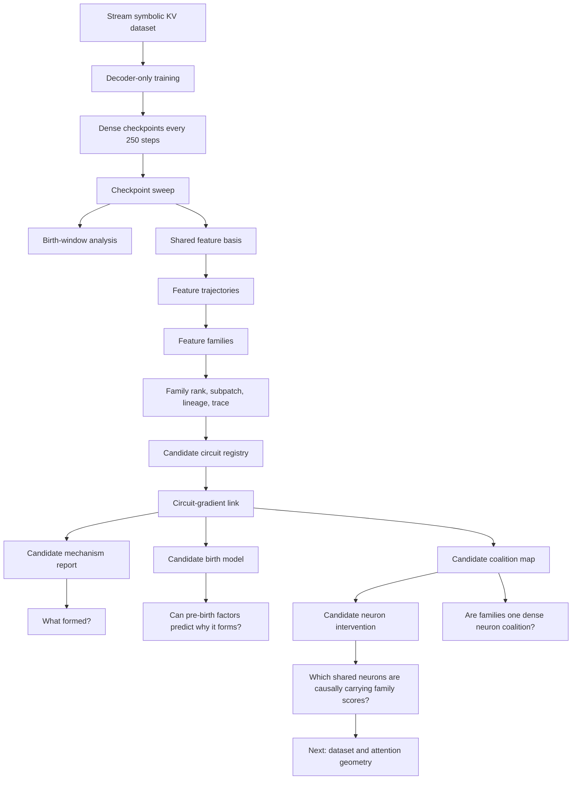

Current best hypothesis:

SGD first builds a shared dense retrieval/write coalition. Different feature families then become sibling branches of that coalition. Family7 appears to be the more generalizing branch; family4 receives strong feature amplification but generalizes much less. The shared coalition is real, but a neuron-list explanation is no longer enough: some neurons that look helpful by update geometry suppress the feature score at the current checkpoint, while some shared-negative neurons are strong current carriers.

Negative result:

The first birth model ranks family4 above family7 at the shared pre-birth cutoff, even though family7 becomes useful earlier and generalizes better.

Unsupported:

The repo does not yet support a final mathematical derivation of SGD circuit selection, attention retrieval geometry, or path-level logit decomposition.

## Relation To The Prior Paper

The prior paper studied retrieval motif emergence in small transformers and reached this core conclusion:

```text
small transformers repeatedly learn a staged retrieval motif,
not one fixed universal head graph.
```

That paper established several important facts:

- behavior, copy, routing, variable probes, and faithfulness do not birth in one universal order
- exact head identity is unstable across seeds
- the stable object is closer to a role-level motif than a fixed head graph
- the matching-slot computation is real but hard to localize cleanly
- dense and distributed structure blocks simple neuron-level explanations

Its explicit limits included:

- no explanation of why gradient descent prefers one retrieval motif over another
- no closed-form mathematical derivation of circuit formation

This project is the next step. It keeps the controlled retrieval setting, but changes the benchmark and tooling so the main object is not just the final circuit. The object is the training trajectory itself.

## Main Research Question

The central question is:

```text
Why does SGD form one circuit family over another?
```

Operationally, this becomes:

```text
Given candidate circuit families c_1, c_2, ..., c_n,
can we predict before useful birth which one SGD will reinforce?
```

The first mathematical target was:

```text
Delta S_c(t) ~= grad_theta S_c(theta_t) . Delta theta_t
```

where:

- `S_c` is the score for candidate circuit or feature family `c`
- `theta_t` is the model state at checkpoint `t`
- `Delta theta_t` is the checkpoint-to-checkpoint parameter update

Under an SGD-like update:

```text
Delta S_c(t) ~= -eta_t <grad_theta S_c(theta_t), grad_theta L(theta_t)>
```

That means a candidate should form when the update direction repeatedly aligns with the direction that increases that candidate, while also reducing training loss and avoiding excessive interference.

This is useful but not sufficient. The recent coalition and intervention results show that the same neuron set can support multiple candidate families, oppose a subfeature, and still leave task behavior partly compensated. The next mathematical target must move from a candidate-family score to a path-level explanation:

```text
m_t(x, y) =
  logit_t(y | x) - logsumexp_{z != y} logit_t(z | x)
```

where `m_t(x, y)` is the correct-answer margin for a dataset relation `d(x, y)`.

The circuit question becomes:

```text
m_t(x, y) ~= sum_P C_P(theta_t, x, y)
```

where `C_P` is the contribution of a candidate computational path:

- dataset relation
- query/key attention geometry
- value-write geometry
- MLP feature geometry
- residual stream readout
- unembedding direction

The SGD selection question becomes:

```text
E_D[Delta C_P]
  ~= -eta_t E_D[<grad_theta C_P(theta_t, x, y), grad_theta L(theta_t, x, y)>]
```

So the real target is no longer just "which family score increased?" It is:

```text
Which path contribution aligns with the data-induced loss gradient,
and why does that path win over other possible paths?
```

Supported so far:

- the repo can measure candidate score movement across checkpoints
- the repo can measure projected update alignment with loss and feature-score gradients
- the repo can compare candidate families
- the repo can show dense shared neuron support and targeted causal feature-score drops

Unsupported:

- the repo cannot yet predict the correct candidate family before birth with the first simple factor model
- the repo cannot yet decompose the correct-answer margin into mathematical attention/MLP/readout path terms

## Dataset Development Story

### Rejected Initial Direction

Supported:

The earlier terminal-answer symbolic KV format was rejected because it made the mechanism too artificial.

Old shape:

```text
SET ...
SET ...
QRY ...
ANS ...
```

Main problems:

- one obvious answer site
- answer behavior too separated from normal language-model training
- too much risk of format learning
- too little useful supervision inside the stream
- too little room for circuit competition

### Current Benchmark

Supported:

The benchmark is now a stream-based symbolic KV task trained with ordinary next-token prediction.

Example:

```text
<bos> W K00 V12 W K03 V04 R K00 V12 W K00 V07 R K03 V04 R K00 V07 <eos>
```

In this task:

- `W K V` writes a value for a key
- `R K V` reads the current value for that key
- overwrites force the model to retrieve the latest relevant value
- multiple read events appear inside one stream
- the model is trained on all next tokens, not only answer tokens

Benchmark config:

- `configs/benchmark/symbolic_kv_base.json`

Generated data:

- `data/generated/symbolic_kv_stream_learnability`

Current settings:

| field | value |
| --- | --- |
| keys | `8` |
| values | `128` |
| heldout answer-pair fraction | `0.1` |
| train/IID active keys | `2..3` |
| train/IID overwrite count | `8` |
| train/IID read count | `6..7` |
| structural OOD active keys | `4..5` |
| structural OOD overwrite count | `10..12` |
| structural OOD read count | `8..10` |

### Dataset Sanity Checks

Supported:

From the generated benchmark metadata:

| check | value |
| --- | ---: |
| exact-sequence overlap across splits | `0` |
| latent-program overlap across splits | `0` |
| heldout leakage outside heldout split | `0` |
| `first_value_for_key` heuristic | `0.0` |
| `last_value_before_query` heuristic | `0.0` |
| strongest `most_frequent_value_before_query` heuristic | about `0.146` |

Interpretation:

The benchmark is not solved by trivial sequence overlap or simple hand-coded retrieval heuristics.

## Model And Training

Supported:

The reference model is intentionally small:

| field | value |
| --- | ---: |
| `d_model` | `128` |
| `n_layers` | `3` |
| `n_heads` | `4` |
| `d_ff` | `512` |
| dropout | `0.0` |
| max sequence length | `96` |
| parameters | `626,048` |

Reference training config:

- `configs/train/symbolic_kv_generalization.json`

Formation training config:

- `configs/train/symbolic_kv_formation.json`

### Reference Checkpoint

Supported:

The current selected reference checkpoint is:

- run: `artifacts/runs/symbolic_kv_heldout_generalization`
- checkpoint: `artifacts/runs/symbolic_kv_heldout_generalization/checkpoints/best.pt`
- step: `13000`
- selection split: `heldout_pairs`
- selection metric: `answer_accuracy`

Selected-checkpoint answer accuracies:

| split | answer accuracy |
| --- | ---: |
| validation IID | `0.9578527137637138` |
| test IID | `0.9578204743320324` |
| heldout pairs | `0.873018247083458` |
| structural OOD | `0.5081577525661805` |
| counterfactual | `0.9599219453617532` |

Interpretation:

- IID behavior is strong enough for mechanistic work
- heldout-pair generalization is real
- structural OOD is not solved
- the checkpoint is a useful mechanistic reference, not a robust reasoning model

### Why Token Accuracy Is Not The Main Metric

Supported:

Global token accuracy is misleading here because many write values are intentionally stochastic under the prefix. The model is not supposed to predict random write values.

Only about `12.75%` of next-token targets are query-answer value tokens.

Therefore the main behavioral metrics are:

- answer accuracy
- heldout-pair answer accuracy
- structural OOD answer accuracy
- answer margin
- mechanistic localization and causal patch effects

## Formation Run

Supported:

The current dense formation run is:

- run: `artifacts/runs/symbolic_kv_reference_formation`
- checkpoint directory: `artifacts/runs/symbolic_kv_reference_formation/checkpoints`
- checkpoint cadence: every `250` steps
- analyzed checkpoints: `64`
- probe set: `artifacts/runs/symbolic_kv_reference_formation/analysis/probe_set.jsonl`

The dense sweep found three main windows:

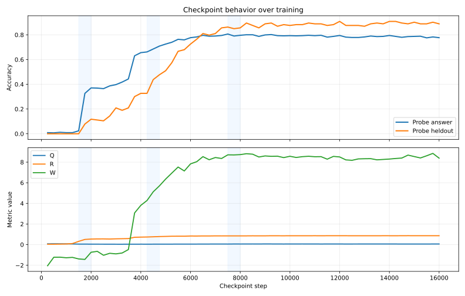

| window | steps | current interpretation |
| --- | --- | --- |
| early birth | `1500-2000` | first usable behavior appears |
| mid consolidation | `4250-4750` | heldout-pair performance improves |
| late reorganization | `7500-8000` | upper-stage representations reorganize |

Top sweep triggers:

| trigger | step |
| --- | ---: |
| top answer gain | `1750` |
| top heldout gain | `4500` |
| top `Q` gain | `7750` |

Current best hypothesis:

The mechanism forms in stages:

1. lower-layer scaffold appears
2. routing heads consolidate
3. upper-layer MLP writes become usable
4. late training refines top-layer writeout for heldout generalization
5. continued training can overspecialize or rebalance the writeout

## Tooling Stack

The tools are part of the research contribution. They turn checkpoint files into an explicit circuit-formation record.

### Tool Dependency Graph

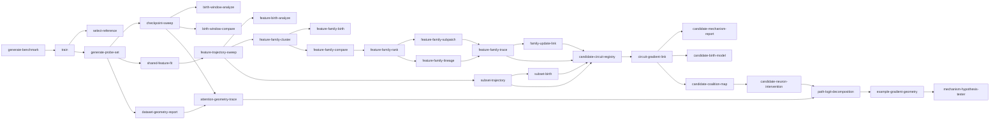

### Current Tool Inventory

| tool | why it exists | current output type |
| --- | --- | --- |
| `generate-benchmark` | create controlled train/test/OOD data | dataset directory |
| `train` | train small decoder-only model | checkpoints and metrics |
| `select-reference` | choose best completed run by heldout-aware policy | reference JSON |
| `generate-probe-set` | freeze small fixed examples for repeated checkpoint analysis | JSONL probe set |
| `checkpoint-sweep` | evaluate all checkpoints on fixed probes | checkpoint metrics JSONL |
| `birth-window-analyze` | identify major formation windows | birth-window report |
| `birth-window-compare` | patch/check selected source and target checkpoints | causal comparison report |
| `shared-feature-fit` | fit stable feature basis across checkpoints | shared basis |
| `feature-trajectory-sweep` | track feature metrics across checkpoints | feature trajectory JSONL |
| `feature-birth-analyze` | estimate individual feature births | birth report |
| `feature-family-cluster` | group features by trajectory similarity | family graph and plots |
| `feature-family-birth` | estimate family-level births | family birth report |
| `feature-family-rank` | select useful members inside one family | rank report |
| `feature-family-subpatch` | causally patch ranked feature subsets | patch report |
| `feature-family-lineage` | link feature subset to heads, MLPs, neurons | lineage graph |
| `feature-family-trace` | combine birth, rank, patch, lineage into one trace | trace report |
| `subset-trajectory` | track selected feature coalition over time | subset trajectory |
| `subset-birth` | estimate subset birth and useful birth | subset birth report |
| `family-update-link` | relate subset changes to component update shares | update-link report |
| `candidate-circuit-registry` | canonicalize candidate families for later analysis | candidate registry |
| `circuit-gradient-link` | connect checkpoint updates to loss and feature-score gradients | gradient-link report |
| `candidate-mechanism-report` | summarize what formed and which components contributed | mechanism report |
| `candidate-birth-model` | test whether pre-birth factors predict candidate birth | birth-model report |
| `candidate-coalition-map` | test whether candidate families share the same supporting MLP neurons | coalition report |
| `candidate-neuron-intervention` | causally ablate shared/specific/conflict coalition neurons | intervention report |
| `dataset-geometry-report` | planned: make the symbolic relation `d(x, y)` explicit | not built |
| `attention-geometry-trace` | planned: trace QK retrieval and OV write geometry across checkpoints | not built |
| `path-logit-decomposition` | planned: decompose answer margin into computational path contributions | not built |
| `example-gradient-geometry` | planned: compare per-example gradient alignment and conflict | not built |
| `mechanism-hypothesis-tester` | planned: test explicit mathematical circuit hypotheses | not built |

Supported:

This stack exists and runs end to end on the current traced family7/family4 artifacts.

Unsupported:

It does not yet produce a final complete circuit decomposition. The next tools must connect dataset geometry, attention geometry, path contributions, and SGD gradient alignment.

## Shared Feature Layer

Supported:

Shared feature bases exist for:

- `layer_2_post_mlp`
- `final_norm`

Both use:

- `64` features
- input dimension `128`
- fit checkpoints: `7500`, `14000`, `16000`

Current fit metrics:

| stage | explained variance | active fraction | reconstruction loss |
| --- | ---: | ---: | ---: |
| `layer_2_post_mlp` | `0.7457791864871979` | `0.5410973429679871` | `0.2546698749065399` |
| `final_norm` | `0.7311904430389404` | `0.5383508801460266` | `0.26917073130607605` |

Important caveat:

The current shared-feature basis is useful for tracking, but too dense for strong semantic feature claims. A feature ID is currently an analysis coordinate, not automatically a natural mechanistic atom.

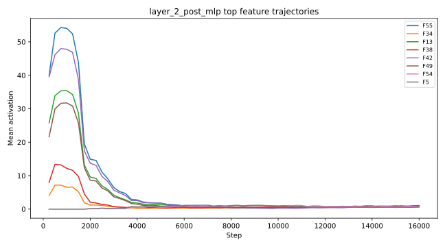

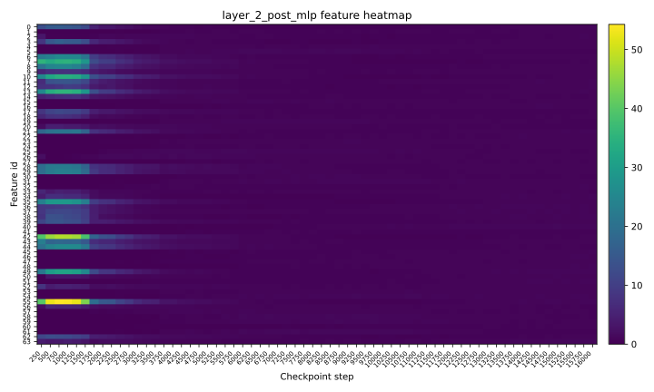

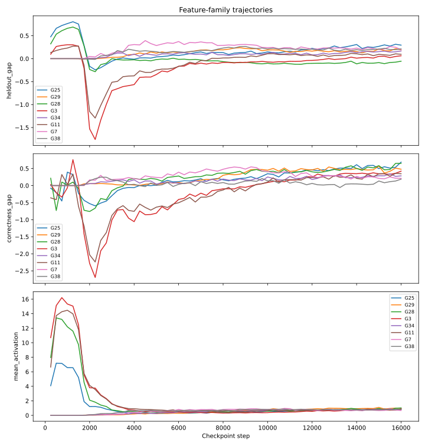

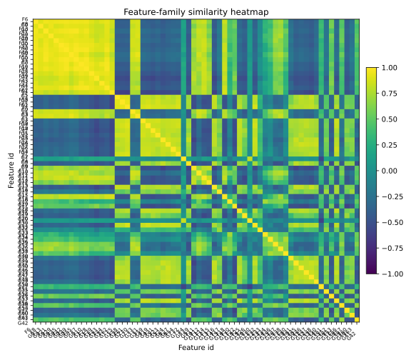

## Current Candidate Families

The strongest current traced comparison is between family7 and family4 at `layer_2_post_mlp`.

Mechanism report:

- `artifacts/runs/symbolic_kv_reference_formation/analysis/traced_candidates/layer2_family7_family4/mechanism_report/candidate_mechanism_report.md`

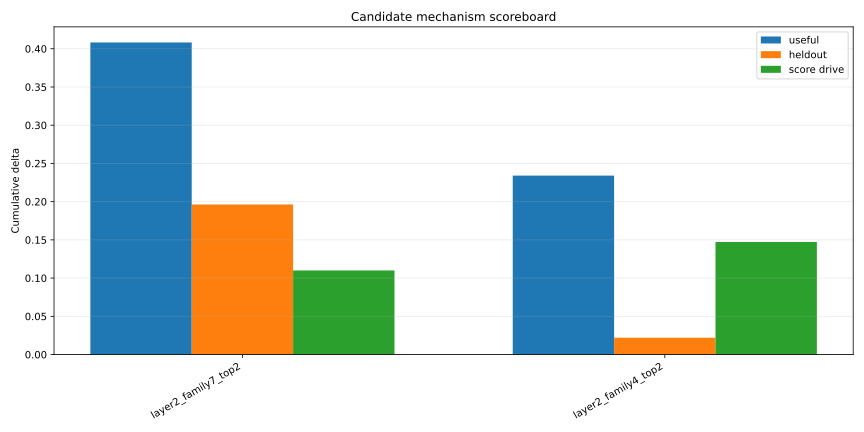

### Candidate Scoreboard

Supported:

| candidate | features | useful delta | heldout delta | traced feature-score drive | status |
| --- | --- | ---: | ---: | ---: | --- |
| `layer2_family7_top2` | `27, 54` | `0.40821056067943573` | `0.19631874561309814` | `0.10995836968906202` | `sgd_supported_generalizing_candidate` |
| `layer2_family4_top2` | `1, 59` | `0.23405300080776215` | `0.021932989358901978` | `0.14723929510814068` | `sgd_supported_generalizing_candidate` |

Interpretation:

- family7 is the stronger current candidate because it has meaningful heldout gain
- family4 is real, but weaker and less generalizing
- family4's score movement does not convert into heldout improvement as cleanly

### Component Responsibility

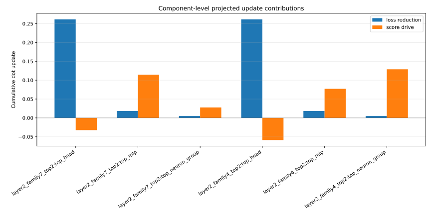

Supported:

Both families share the same top traced component groups:

- `layer0_head3`
- `layer0_mlp`
- `layer2` neuron group `180, 121, 427, 39`

Component interpretation:

| component | family7 score drive | family4 score drive | interpretation |
| --- | ---: | ---: | --- |
| `layer0_head3` | `-0.0324539` | `-0.0587729` | helps loss route, suppresses/rebalances these feature scores |
| `layer0_mlp` | `0.114723` | `0.077158` | main traced family7 formation component |
| `layer2_neurons[180,121,427,39]` | `0.0276895` | `0.128854` | strong family4 amplification/readout shard |

Current best hypothesis:

`layer0_head3` is not the direct birth source. It is part of a task-loss route. The feature-family formation signal is more visible in `layer0_mlp`, while the `layer2` neuron group amplifies or reads out the family, especially family4.

### Competition

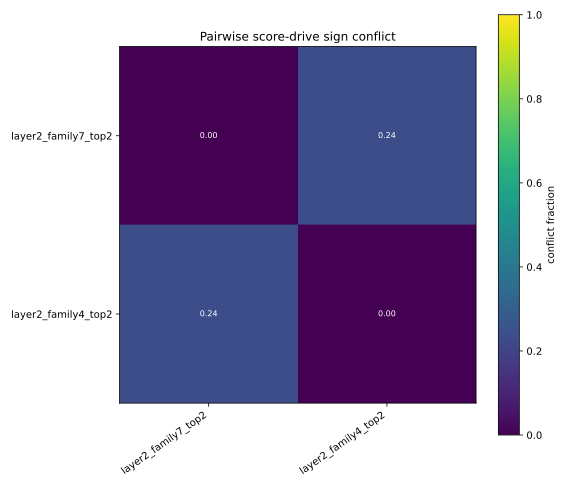

Supported:

Family7 and family4 are not clean competitors.

Pairwise relationship:

| metric | value |
| --- | ---: |
| score correlation | `0.7663` |
| useful correlation | `0.6062` |
| score sign conflict fraction | `0.2381` |
| simultaneous useful gain fraction | `0.2857` |

Interpretation:

They mostly move together. This supports the dense-coalition view: the model is not forming two clean isolated circuits, but sibling feature families inside a shared module.

## Patch Caveat

Negative result:

The `7500 -> 14000` subpatch is negative for both family7 and family4 subsets.

Interpretation:

This does not reject family7. It means `7500 -> 14000` is the wrong causal window for birth. By then family7 has already formed and is being compressed or rebalanced.

Next test:

Patch earlier formation windows:

| candidate | source -> target |
| --- | --- |
| family7 | `1750 -> 2500` |
| family7 | `2750 -> 3750` |
| family7 | `4250 -> 4500` |
| family4 | `2000 -> 2500` |
| family4 | `3500 -> 4500` |
| family4 | `5500 -> 6000` |

## The Why Gap

Supported:

The current analysis can say:

- when candidate families appear
- which components are linked to them
- whether their trajectories help answer or heldout behavior
- whether checkpoint updates align with candidate feature-score gradients

Unsupported:

This does not yet answer:

```text
Why did SGD select family7 as the more generalizing branch?
```

The distinction is:

| current stack | missing why model |
| --- | --- |
| observes candidate formation | predicts candidate formation before birth |
| traces components after candidate selection | compares possible candidates before selection |
| reports useful movement | explains why that movement was favored by SGD |
| measures gradient alignment | tests whether alignment predicts birth order |

## Candidate Birth Model

The new `candidate-birth-model` tool is the first attempt to move from observation to prediction.

It consumes:

- candidate registry
- circuit-gradient-link output
- subset birth labels
- subset trajectories

It reports:

- actual birth or useful-birth step
- prediction cutoff
- post-birth leakage flag
- factor decomposition
- predicted birth rank
- actual birth rank
- visual factor plots

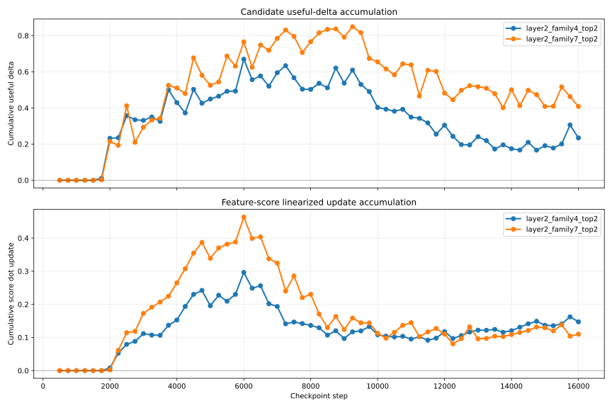

Initial factors:

| factor | intended meaning |
| --- | --- |
| `feature_score_drive` | cumulative projected update in candidate feature-score direction |
| `gradient_alignment` | mean cosine between update and feature-score gradient |
| `loss_utility` | cumulative loss reduction in candidate parameter scope |
| `component_accessibility` | candidate update and gradient share relative to global update |
| `activation_support` | candidate activation level at prediction cutoff |
| `amplification` | positive pre-birth activation and active-fraction movement |
| `interference_cost` | negative feature-score and useful movement pressure |

### Initial Birth-Model Result

Birth-model report:

- `artifacts/runs/symbolic_kv_reference_formation/analysis/traced_candidates/layer2_family7_family4/birth_model/candidate_birth_model_report.md`

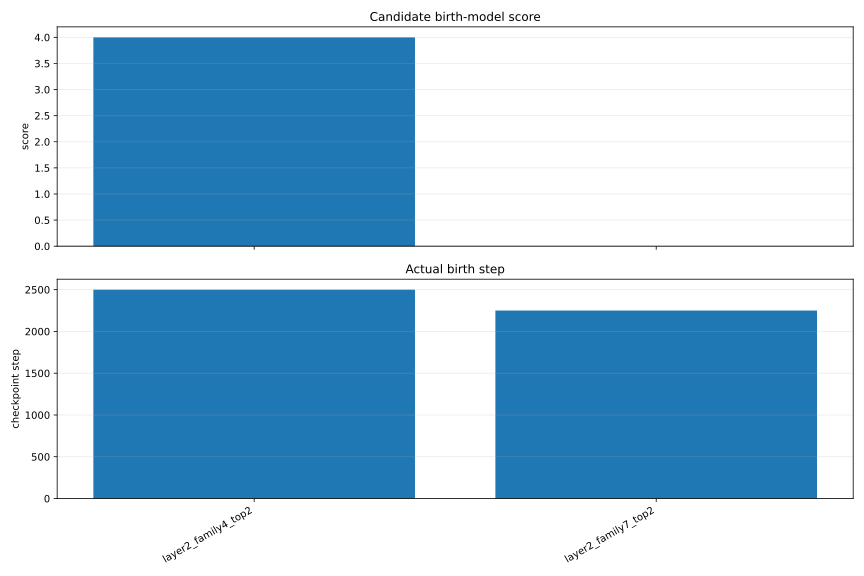

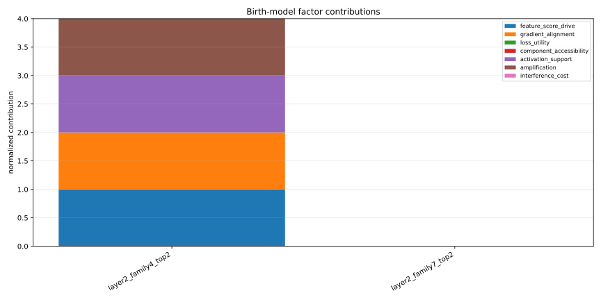

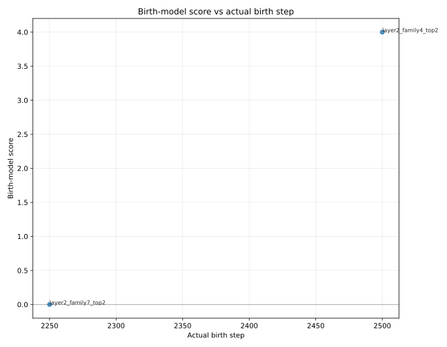

Settings:

| field | value |
| --- | --- |
| birth metric | `useful_birth_step` |
| prediction mode | `shared_strict_prebirth` |
| effective cutoff | `2000` |
| post-birth leakage | `false` |

Result:

| candidate | birth-model score | predicted rank | actual useful birth | actual rank |
| --- | ---: | ---: | ---: | ---: |
| `layer2_family4_top2` | `4` | `1` | `2500` | `2` |
| `layer2_family7_top2` | `0` | `2` | `2250` | `1` |

Negative result:

The first simple birth model predicts family4 over family7. Actual useful birth and heldout generalization favor family7.

Interpretation:

- raw pre-birth feature-score drive is not enough
- activation support is not enough
- family-level sums are hiding important per-feature structure
- the current factor model is missing generalization-specific utility

Next test:

Build per-feature birth models for:

- family7 feature `54`
- family7 feature `27`
- family4 feature `1`
- family4 feature `59`

The likely missing distinction is that family7 contains the better generalizing carrier, while family4 contains a stronger but less generalizing amplification signal.

## Candidate Coalition Map

The `candidate-coalition-map` tool was added after the first birth-model failure.

Purpose:

```text
Test whether family7 and family4 are separate circuits,
or two projections of one dense MLP-neuron coalition.
```

Method:

For each selected checkpoint interval, each candidate, and each selected MLP neuron, the tool computes:

```text
Delta score_c,n ~= grad_theta_n score_c . Delta theta_n
```

where `theta_n` is the neuron-specific MLP parameter slice:

- `fc_in` row
- `fc_in` bias
- `fc_out` column

The tool also computes pairwise feature-score gradient cosines restricted to the selected MLP-neuron parameters.

Initial bounded smoke-test report:

- `artifacts/runs/symbolic_kv_reference_formation/analysis/traced_candidates/layer2_family7_family4/coalition_map_early/candidate_coalition_map_report.md`

Settings:

| field | value |
| --- | --- |
| candidates | `layer2_family7_top2`, `layer2_family4_top2` |
| interval window | `1750 -> 2500` |
| neuron layers | `0`, `2` |
| individual features included | `f1`, `f27`, `f54`, `f59` |
| device requested first | `mps` |
| device used for smoke test | `cpu`, because this execution environment reported MPS unavailable |

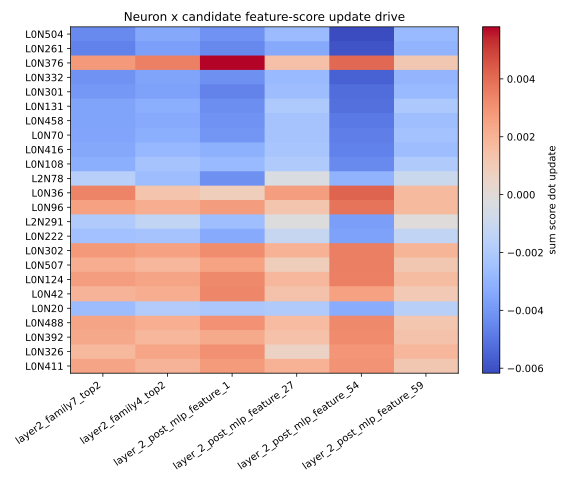

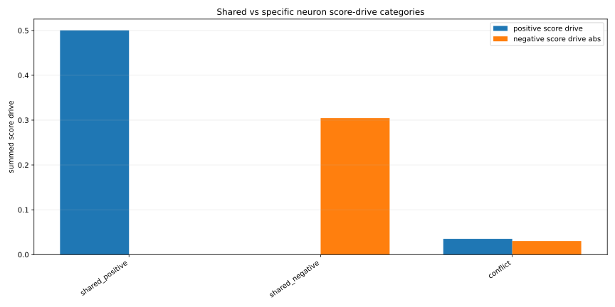

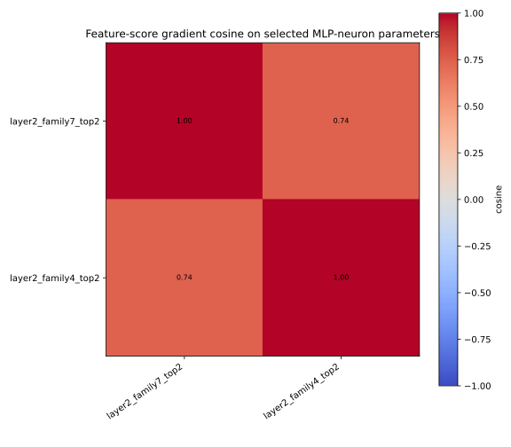

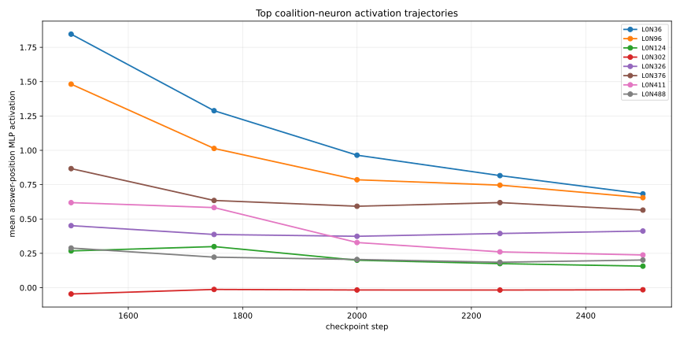

Supported by the bounded smoke test:

- family7 and family4 have strongly positive score-gradient cosine on selected MLP-neuron parameters
- early family7/family4 mean score-gradient cosine is about `0.738`
- many neurons are shared-positive for both families under the `1750 -> 2500` window
- `f54` and family7 are almost identical by this restricted score-gradient cosine, about `0.976`
- `f1` and family4 are also almost identical by this restricted score-gradient cosine, about `0.970`

Initial shared/specific category summary:

| category | neurons | positive score | negative score abs |
| --- | ---: | ---: | ---: |
| shared positive | `484` | `0.50029` | `0` |
| shared negative | `316` | `0` | `0.304594` |
| conflict | `224` | `0.0351674` | `0.0303447` |

Current best hypothesis:

This is early evidence that family7 and family4 are not separate clean circuits. They are likely sibling readouts of a shared dense MLP-neuron coalition.

Unsupported:

This is not yet a causal necessity result. It does not prove that the shared-positive neurons are necessary for behavior. That requires targeted ablation or patching of:

- top shared-positive neurons
- family7-specific neurons
- family4-specific neurons
- conflict neurons

## Candidate Neuron Intervention

The `candidate-neuron-intervention` tool is the next causal test after the coalition map.

Purpose:

```text
Take the neuron sets discovered by candidate-coalition-map,
zero their MLP hidden activations at a chosen checkpoint,
and measure whether candidate feature scores and task behavior drop.
```

The tool builds these intervention sets from the coalition map:

- `shared_positive`
- `conflict`
- `shared_negative`
- `top_overlap`
- `candidate_specific:<candidate_id>`

The key readout is:

```text
baseline feature score - ablated feature score
```

If the shared-positive ablation drops both candidate feature-family scores, the dense-coalition hypothesis becomes causal evidence instead of only update-geometry evidence.

Implemented command:

- `candidate-neuron-intervention`

Current outputs:

- `candidate_neuron_intervention_report.json`
- `candidate_neuron_intervention_report.md`
- `candidate_neuron_intervention_behavior.svg`
- `candidate_neuron_intervention_feature_scores.svg`
- `candidate_neuron_intervention_set_sizes.svg`
- optional `candidate_neuron_intervention_single_neurons.svg`

First run:

- `artifacts/runs/symbolic_kv_reference_formation/analysis/traced_candidates/layer2_family7_family4/neuron_intervention_early_step2500/candidate_neuron_intervention_report.md`
- checkpoint step: `2500`
- device: `mps`
- top K per set: `8`
- individual features included: `f1`, `f27`, `f54`, `f59`

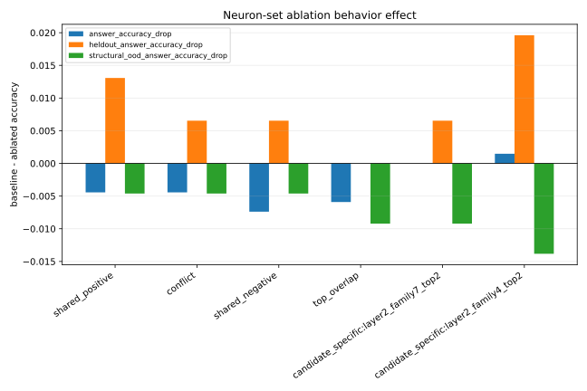

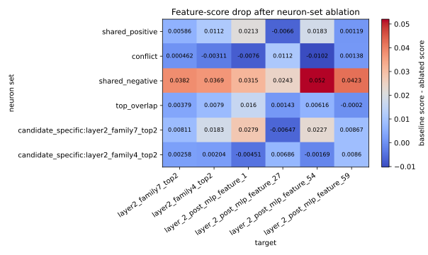

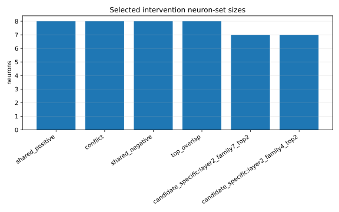

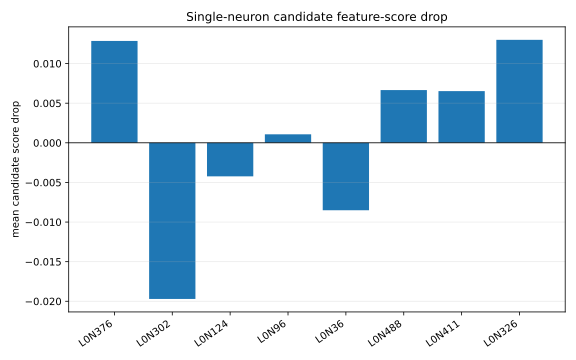

Baseline at checkpoint `2500`:

| metric | value |
| --- | ---: |
| loss | `2.45865` |
| token accuracy | `0.489369` |
| answer accuracy | `0.364845` |
| heldout accuracy | `0.104575` |
| structural OOD accuracy | `0.142857` |

Feature-family score proof:

| ablated set | family4 score drop | family7 score drop | mean candidate score drop | all candidate scores drop |
| --- | ---: | ---: | ---: | --- |
| `shared_positive` | `0.01124` (`5.84%`) | `0.00586` (`3.19%`) | `0.00855` | true |
| `top_overlap` | `0.00790` (`4.10%`) | `0.00379` (`2.07%`) | `0.00584` | true |
| `shared_negative` | `0.03691` (`19.19%`) | `0.03818` (`20.79%`) | `0.03754` | true |
| `conflict` | `-0.00311` (`-1.62%`) | `0.00046` (`0.25%`) | `-0.00133` | false |

Supported:

- the shared-positive coalition is causally supporting both family feature scores
- the top-overlap set is also a causal shared carrier
- the conflict set behaves like actual internal competition
- the strongest current score carrier is unexpectedly `shared_negative`

Important correction:

`shared_negative` does not mean useless. It means the checkpoint update direction over `1750 -> 2500` pushed against those candidate scores. At checkpoint `2500`, those neurons still carry large candidate feature-score signal. This is why a pure "positive update means useful neuron" story fails.

Behavior-level result:

| ablated set | answer drop | heldout drop | structural OOD drop | loss increase |
| --- | ---: | ---: | ---: | ---: |
| `shared_positive` | `-0.00443` | `0.01307` | `-0.00461` | `-0.00062` |
| `top_overlap` | `-0.00591` | `0` | `-0.00922` | `0.00064` |
| `shared_negative` | `-0.00739` | `0.00654` | `-0.00461` | `-0.03991` |
| `candidate_specific:layer2_family4_top2` | `0.00148` | `0.01961` | `-0.01382` | `-0.00721` |

This is the key limitation:

The neuron intervention proves causal support for feature-family scores, but not clean necessity for final task behavior. The model has compensation, dense overlap, and mixed directions. A neuron-only path can keep producing evidence, but it will not by itself explain why SGD chooses one algorithmic circuit over another.

Single-neuron proof inside the shared-positive set:

| neuron | mean candidate score drop | interpretation |
| --- | ---: | --- |
| `L0N326` | `0.012998` | strong shared support |
| `L0N376` | `0.012859` | strong shared support |
| `L0N488` | `0.006657` | moderate shared support |
| `L0N411` | `0.006526` | moderate shared support |
| `L0N302` | `-0.019708` | ablation increases family scores |
| `L0N36` | `-0.008512` | ablation increases family scores |

This is direct evidence for dense, internally mixed circuit structure rather than a sparse natural-neuron explanation.

Still unsupported:

- source-to-target neuron activation patching
- causal sufficiency of the shared neurons
- cross-seed intervention stability

## Current Research Progress

Supported:

The project has progressed through these stages:

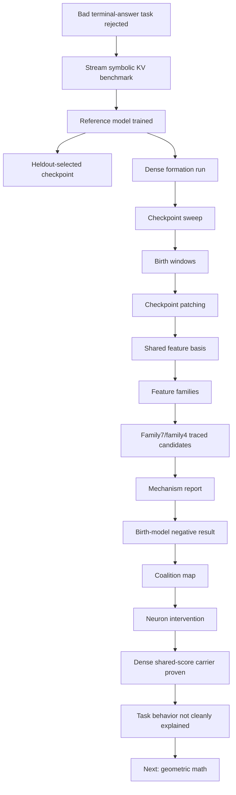

Current status by research layer:

| layer | status | summary |
| --- | --- | --- |
| dataset | Supported | stream KV benchmark is usable and checked |
| model | Supported | small reference transformer trained |
| behavior | Supported | IID and heldout are strong; structural OOD is weak |
| checkpoints | Supported | dense formation run exists |
| birth windows | Supported | early, mid, late windows identified |
| components | Supported | head/MLP/neuron lineage tools exist |
| features | Supported with caveat | shared basis exists, but is dense |
| feature families | Supported with caveat | family7/family4 traced; not final semantic units |
| mechanism report | Supported | current component and phase report exists |
| why model | Negative result | first simple model fails |
| coalition map | Supported | family7/family4 share many MLP neurons and aligned score gradients |
| neuron intervention | Supported with caveat | shared neurons causally drop family scores, but not cleanly task behavior |
| geometric theory | Next test | dataset relation, attention geometry, and path margins not yet decomposed |
| cross-seed | Unsupported | not yet replicated |
| final theory | Unsupported | no closed-form circuit-selection model yet |

## Current Blockers

Unsupported:

The project cannot yet claim:

- complete dense circuit decomposition
- natural semantic interpretation of every shared feature
- necessary and sufficient feature family
- cross-seed stability of family7/family4
- per-minibatch SGD trace
- mathematical derivation of why SGD selects family7

Current blockers:

1. Family-level aggregation hides per-feature roles.
2. The first birth model lacks heldout-specific gradient alignment.
3. The current feature basis may be sensitive to SAE hyperparameters.
4. Dense overlap means the same components feed multiple families.
5. Current neuron interventions affect feature scores more clearly than behavior.
6. The same neuron can be update-positive, currently suppressive, and behavior-compensated.
7. The current result is one run, not a seed matrix.
8. The dataset relation and attention retrieval geometry have not yet been formalized.

## Next Research Stages

The earlier next step was "more per-feature birth modeling." That is still useful, but the intervention result shows it is not the main path to the why question. The current bottleneck is mathematical: we need to understand how the dataset relation becomes geometry inside the model.

### Stage 1: Dataset Geometry Report

Next tool:

- `dataset-geometry-report`

Purpose:

Make the relation `d(x, y)` explicit before looking inside the model.

Needed quantities:

- key identity classes
- value identity classes
- read/write event graph
- latest-value dependency for each read
- distractor key/value structure
- train/heldout/OOD relation matrix
- minimal symbolic algorithm for the benchmark

Question answered:

```text
What geometric structure does the dataset ask SGD to internalize?
```

### Stage 2: Attention Geometry Trace

Next tool:

- `attention-geometry-trace`

Purpose:

Track whether attention heads learn the correct retrieval geometry.

Needed quantities:

- query-to-correct-key attention
- query-to-distractor-key attention
- QK correct-key margin
- attention entropy
- OV value-write score
- direct logit effect of attended value
- role-conditioned attention maps
- QK and OV singular directions

Question answered:

```text
When does the model learn the lookup geometry needed by d(x, y)?
```

### Stage 3: Path Logit Decomposition

Next tool:

- `path-logit-decomposition`

Purpose:

Decompose the answer margin into path-level contributions instead of component lists.

Target expression:

```text
m_t(x, y) ~= sum_P C_P(theta_t, x, y)
```

Candidate paths:

- embedding to attention to unembedding
- embedding to MLP to attention to unembedding
- attention to MLP to unembedding
- lower MLP to upper MLP to unembedding
- attention to residual feature to MLP readout

Question answered:

```text
Which computational paths carry the correct-answer margin?
```

### Stage 4: Example Gradient Geometry

Next tool:

- `example-gradient-geometry`

Purpose:

Measure which dataset examples push the same internal circuit and which examples interfere.

Needed quantity:

```text
G_ij = <grad_theta L(x_i, y_i), grad_theta L(x_j, y_j)>
```

Group by:

- same query key
- same answer value
- same write/read relation
- heldout vs train
- correct vs incorrect
- examples that support family7
- examples that support family4

Question answered:

```text
Which parts of the dataset reinforce the same path, and which parts compete?
```

### Stage 5: Mechanism Hypothesis Tester

Next tool:

- `mechanism-hypothesis-tester`

Purpose:

Stop testing vague component sets. Test explicit mathematical circuit hypotheses.

Example hypothesis:

```text
The model solves symbolic KV by learning a QK retrieval head that maps
query-key representations to matching written-key positions, then an OV/value
path writes the associated value into the residual stream, while layer-0 MLP
features shape the key/value subspace used by the later readout.
```

Required tests:

- QK-only patch
- OV-only patch
- attention path patch
- MLP feature/neuron patch
- path logit recovery
- heldout/OOD recovery

### Stage 6: Cross-Seed Replication

Next test:

Repeat the formation run over multiple seeds and compare:

- dataset-geometry readouts
- attention geometry birth
- path contribution birth
- feature families
- neuron coalition categories
- intervention effects

Until this is done, family7 is a current-run candidate, not a universal circuit family.

### Current Mathematical Target

Current best target:

```text
Circuit P wins over circuit Q when:

E_D[<grad_theta C_P(theta_t, x, y), -grad_theta L(theta_t, x, y)>]
>
E_D[<grad_theta C_Q(theta_t, x, y), -grad_theta L(theta_t, x, y)>]
```

subject to:

- architecture constraints
- initialization geometry
- feature superposition
- path interference
- behavioral faithfulness

Unsupported:

This equation is a research target, not yet a supported result.

## Artifact Index

### Core Configs

- `configs/benchmark/symbolic_kv_base.json`
- `configs/train/symbolic_kv_generalization.json`
- `configs/train/symbolic_kv_formation.json`

### Main Runs

- `artifacts/runs/symbolic_kv_heldout_generalization`
- `artifacts/runs/symbolic_kv_reference_formation`

### Main Analysis Artifacts

- `artifacts/runs/symbolic_kv_reference_formation/analysis/checkpoint_metrics.jsonl`
- `artifacts/runs/symbolic_kv_reference_formation/analysis/checkpoint_metrics_summary.json`
- `artifacts/runs/symbolic_kv_reference_formation/analysis/birth_window_analysis.json`
- `artifacts/runs/symbolic_kv_reference_formation/analysis/shared_features/layer_2_post_mlp`
- `artifacts/runs/symbolic_kv_reference_formation/analysis/traced_candidates/layer2_family7_family4`

### Current Frontier Reports

- `artifacts/runs/symbolic_kv_reference_formation/analysis/traced_candidates/layer2_family7_family4/mechanism_report/candidate_mechanism_report.md`
- `artifacts/runs/symbolic_kv_reference_formation/analysis/traced_candidates/layer2_family7_family4/birth_model/candidate_birth_model_report.md`
- `artifacts/runs/symbolic_kv_reference_formation/analysis/traced_candidates/layer2_family7_family4/coalition_map_early/candidate_coalition_map_report.md`
- `artifacts/runs/symbolic_kv_reference_formation/analysis/traced_candidates/layer2_family7_family4/neuron_intervention_early_step2500/candidate_neuron_intervention_report.md`

## Current Conclusion

Supported:

The project now has enough tooling to observe circuit formation at multiple scales:

- behavior
- checkpoint windows
- residual stages
- heads and MLPs
- shared features
- feature families
- candidate circuits
- projected gradient links
- dense neuron coalitions
- targeted neuron ablations

Current best hypothesis:

SGD forms a shared dense retrieval/write coalition first. Family7 and family4 are sibling branches of that coalition. Family7 becomes the more generalizing branch; family4 receives stronger raw pre-birth feature amplification but weaker heldout utility. The coalition is causally real at the feature-score level, but task behavior remains compensated and distributed.

Negative result:

The first pre-birth factor model fails to predict family7 over family4. The first neuron-intervention result proves shared score support but does not cleanly explain behavior. Together, these show that the project has not yet answered the why question.

Next test:

The next decisive step is mathematical geometry: dataset relation, attention QK/OV geometry, path-level logit decomposition, and example-gradient alignment.

The scientific standard from here is:

```text
If a proposed explanation cannot express the dataset relation,
decompose the answer margin, and predict which path SGD reinforces,
it is only a post-hoc story.
```
