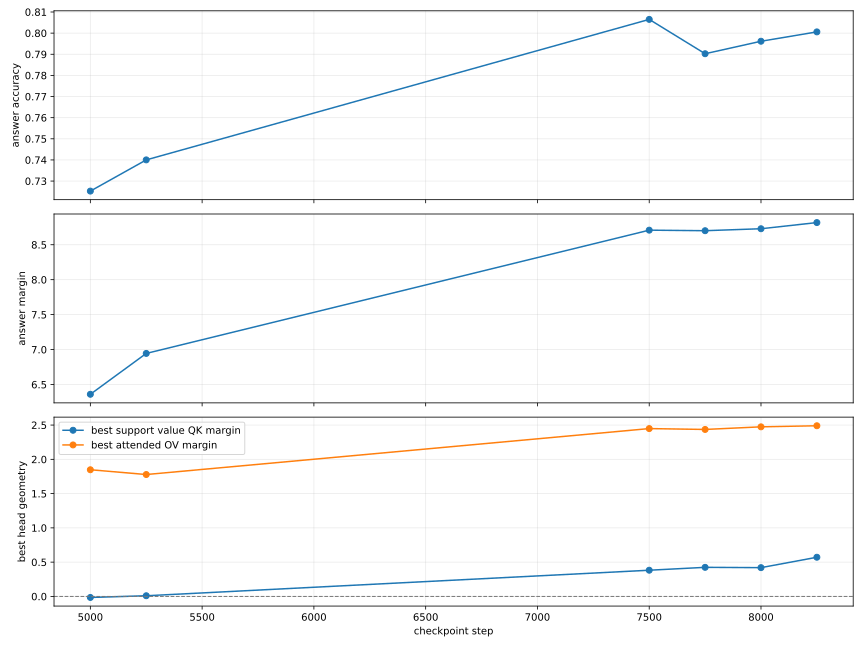
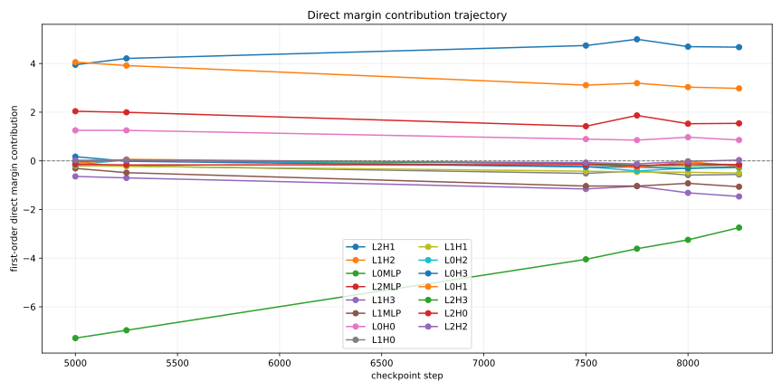
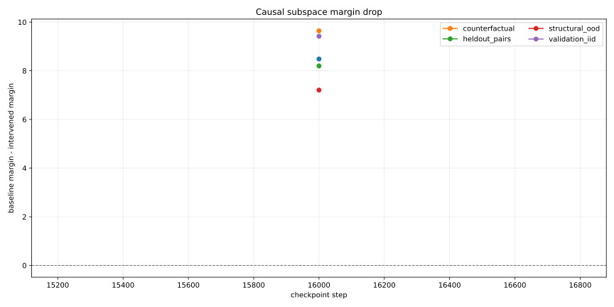
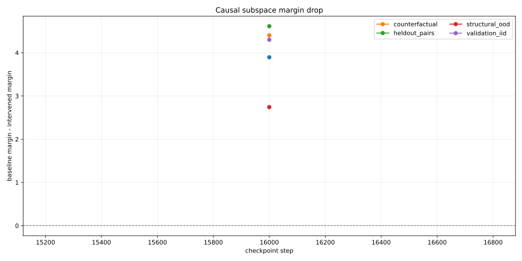
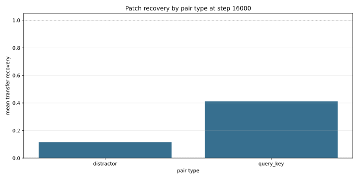
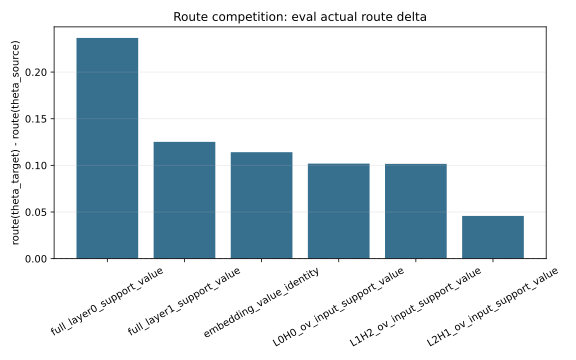
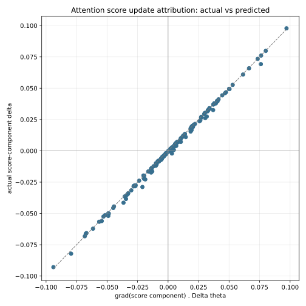

# From Loss To Lookup: Tracing Circuit Formation In A Small Transformer

Nelson Alex

Living draft: 2026-04-18

This is a living research paper. It is not a final solved claim. The point of this page is to make the current evidence readable: what task was trained, what the model learned, what we measured, what failed, what now looks true, and what is still missing before we can honestly say we understand why SGD formed this circuit.

## Short Version

We trained a small transformer on a stream-based symbolic key-value task. The model sees writes and reads:

```text
W K03 V14   W K01 V09   R K03 V14   W K03 V02   R K03 V02
```

The rule is simple:

```text
When the model reads key K, it must output the most recent value written for K.
```

The research question is not just:

```text
Which head or neuron matters?
```

The real question is:

```text
Why does SGD build one internal route for this relation instead of another?
```

The current answer is partial but sharper than where we started:

```text
The model does not form one clean isolated circuit.
It forms a dense residual infrastructure.

Inside that infrastructure:
  L2H1 becomes a strong late support-value retrieval/write route.
  L1H2 and L0H0 also shape retrieval geometry.
  MLPs and full residual routes carry substantial growth.
  Feature families reveal useful projections, but they are not final mechanism units.
```

The strongest new progress is that we can now measure actual optimizer updates, not just static component importance. In a traced continuation from step `5500` to `5550`, the recorded batches and actual parameter deltas can be compared against route growth step by step.

The strongest remaining gap is that this still does not prove a unique route-selection theorem. The data gradients support several routes at once, and broad residual routes often receive more support than isolated heads.

## How Far The Project Has Come

The research has gone through several stages.

| stage | what we asked | what happened |
| --- | --- | --- |
| behavior | does the model learn symbolic KV retrieval? | yes, heldout retrieval becomes strong |
| components | which heads and MLPs matter? | L2H1, L1H2, L0H0, MLPs, and full residual routes all matter |
| feature families | can feature families explain circuit birth? | family7/family4 were useful, but the birth model failed |
| coalitions | are families separate circuits? | no, they share a dense neuron base |
| geometry | can QK/OV subspaces explain retrieval/write roles? | partially, especially for L2H1 support-value retrieval/write |
| causality | are these subspaces necessary and sufficient? | removal shows necessity; patching shows only partial sufficiency |
| update attribution | do actual parameter updates move routes? | yes, one-step updates predict local route movement well |
| actual batches | do recorded batches support route growth? | yes for tested support-value routes, but support ranking does not equal growth ranking |

The current position is:

```text
We are past raw observation.
We are not yet at a full mathematical proof.

We can now connect:
  actual update -> route movement
  recorded batch gradient -> route support

We still cannot fully explain:
  why the route with the largest batch support
  is not always the route with the largest realized growth.
```

## What This Project Tries To Prove

The desired final proof has this shape:

```text
data relation d(x, y)
  -> loss gradient from actual training batches
  -> parameter update Delta theta
  -> change in internal geometry
  -> growth of a candidate route C_P
  -> improvement in answer margin m(x, y)
```

In plain words:

```text
The data creates errors.
Backprop turns those errors into gradients.
The optimizer changes the weights.
Those weight changes reshape attention and residual geometry.
Some routes become better at solving the task.
The answer margin improves.
```

The mathematical object we are tracking is the answer margin:

```text
m_t(x, y) = logit_t(y | x) - max_{z != y} logit_t(z | x)
```

Here `y` is the correct value token, and `z` ranges over wrong value tokens. A positive margin means the model prefers the right answer over the best wrong answer.

For a candidate route `P`, we define a route score or contribution:

```text
C_P(theta_t, x, y)
```

The local first-order update equation is:

```text
Delta C_P(t)
  ~= grad_theta C_P(theta_t) . Delta theta_t
```

If the update is approximately SGD-like:

```text
Delta theta_t ~= -eta grad_theta L_batch(theta_t)
```

then route growth is linked to batch-gradient alignment:

```text
Delta C_P(t)
  ~= eta < -grad_theta L_batch(theta_t), grad_theta C_P(theta_t) >
```

This inner product is the core mathematical question. It asks:

```text
Does the actual training batch push the model in a direction that increases this route?
```

That is different from saying:

```text
This head has high attention.
This neuron ablation hurts.
This feature activates.
```

Those are useful measurements, but they are not yet an explanation of SGD selection.

## Why Existing Work Does Not Already Solve This

This project sits inside mechanistic interpretability, but it is asking a narrower training-time question than most circuit work:

```text
Given a fixed data relation and a fixed architecture,
why does SGD amplify this route rather than another possible route?
```

Several existing lines of work give pieces of the answer.

[A Mathematical Framework for Transformer Circuits](https://transformer-circuits.pub/2021/framework/index.html) gives the right decomposition for attention heads:

```text
QK decides where information routes.
OV decides what information gets written.
```

That is why this paper separates QK support-vs-distractor geometry from OV/value-write geometry.

[In-Context Learning and Induction Heads](https://transformer-circuits.pub/2022/in-context-learning-and-induction-heads/index.html) shows that useful attention circuits can form during training and that their formation is visible in training curves. That motivates checkpoint tracing, but it does not by itself explain why one route wins in this particular symbolic KV task.

[Toy Models of Superposition](https://www.anthropic.com/research/toy-models-of-superposition) explains why individual neurons are often not clean variables. A model can pack more features than dimensions by representing sparse features in shared directions. In that setting, one neuron can participate in many features, and one feature can be distributed across many neurons.

[Towards Monosemanticity](https://transformer-circuits.pub/2023/monosemantic-features/index.html) motivates looking for feature directions rather than assuming neurons are the natural atoms. Our feature-family phase followed that idea, but our results also show a limit: fitted feature families can still be analysis coordinates rather than final mechanism units.

[Progress Measures for Grokking via Mechanistic Interpretability](https://huggingface.co/papers/2301.05217) is close in spirit because it connects training dynamics, progress measures, and a learned algorithm. This project tries to do something similar for latest-write symbolic retrieval.

[ACDC](https://proceedings.neurips.cc/paper_files/paper/2023/hash/34e1dbe95d34d7ebaf99b9bcaeb5b2be-Abstract-Conference.html) and automated circuit-discovery work clarify that a circuit claim must specify the task, metric, intervention unit, and graph of dependencies. This is why our reports separate behavior, DLA, causal removal, controlled patching, route competition, and update attribution.

[Causal Abstraction](https://jmlr.org/beta/papers/v26/23-0058.html) gives the right standard for stronger claims: a mechanistic explanation should identify abstract variables and show that they remain faithful under interventions. That is why this project distinguishes:

```text
removal drop:
  this part is load-bearing

patch recovery:
  this part carries transferable abstract content
```

The literature explains why this is possible and why it is hard. It does not give a finished proof for this run. The missing object is still:

```text
actual data batch
  -> actual optimizer update
  -> change in route geometry
  -> change in answer margin
  -> comparison against competing routes
```

## Document Map

Supporting plans:

- [Checkpoint Analysis Plan](checkpoint_analysis_plan.md)
- [Shared Feature Dynamics Plan](shared_feature_dynamics_plan.md)

The page figures live in:

```text
docs/assets/figures/
```

The source artifacts live in:

```text
artifacts/runs/symbolic_kv_reference_formation/analysis/
```

All numbers on this page come from those reports.

## The Benchmark

The task is deliberately small but not trivial. Each sequence is a stream of key-value events:

```text
W K V  means write value V into key K
R K V  means read key K and emit the current value V
```

The target relation is:

```text
d(x, y) = 1 if y is the latest written value for the queried key in x
d(x, y) = 0 otherwise
```

The minimal algorithm is:

```text
store = {}
for token event in stream:
  if event is W K V:
    store[K] = V
  if event is R K:
    output store[K]
```

This matters because the model is not given this algorithm directly. It only receives next-token loss. The question is how that loss turns into an internal implementation of this algorithm.

<figure class="paper-figure">
  
  <figcaption>Dataset geometry summary. The train, IID, heldout, OOD, and counterfactual splits differ in query structure, active keys, writes, overwrites, and lag.</figcaption>
</figure>

<figure class="paper-figure">
  
  <figcaption>The heldout-pairs split is structurally important because it separates key-value pair combinations from the training set.</figcaption>
</figure>

The dataset geometry report says:

| split | records | queries | active keys | writes | overwrites | query lag |
| --- | ---: | ---: | ---: | ---: | ---: | ---: |
| train | 8000 | 52105 | 2.502 | 10.502 | 8.000 | 1.182 |
| validation_iid | 1024 | 6667 | 2.505 | 10.505 | 8.000 | 1.179 |
| heldout_pairs | 1024 | 6686 | 2.483 | 10.483 | 8.000 | 1.176 |
| structural_ood | 1024 | 9255 | 4.507 | 15.472 | 10.965 | 2.425 |

The heldout split has zero pair overlap with train in the dataset report. That is why heldout behavior is more meaningful than only checking IID accuracy.

## Model And Training Run

The reference run is:

| property | value |
| --- | --- |
| model | decoder-only transformer |
| layers | 3 |
| heads | 4 |
| width | 128 |
| seed | 7 |
| training steps | 16000 |
| batch size | 128 |

The model reaches strong heldout behavior. The best checkpoint report records heldout-pairs answer accuracy around `0.872`.

The broad training trajectory is staged:

| window | center | behavior |
| --- | ---: | --- |
| early | 1750 | weak retrieval, behavior beginning |
| mid | 4500 | useful retrieval is forming |
| later | 7500 to 8250 | strong support-value retrieval/write routes |
| final | 14000 to 16000 | high heldout behavior but still dense and distributed |

This staged pattern is important. If the model simply memorized all answers, we would not expect clean formation windows or route growth. But staged behavior alone does not explain why the route forms.

## First Attempt: Feature Families

The first deep analysis asked:

```text
Which activation features form during training?
Which families appear first?
Which neurons support those families?
```

This found real structure.

At `layer_2_post_mlp`, two candidate families became central:

| family | features | interpretation |
| --- | --- | --- |
| family7 | 27, 54 | stronger useful/generalizing candidate |
| family4 | 1, 59 | related sibling candidate with stronger raw pre-birth factor score |

The candidate mechanism report found:

| candidate | useful | heldout | score drive |
| --- | ---: | ---: | ---: |
| family7 top2 | 0.408211 | 0.196319 | 0.109958 |
| family4 top2 | 0.234053 | 0.021933 | 0.147239 |

Simple reading:

```text
family7 helped useful and heldout behavior more.
family4 had stronger raw feature-score drive.
```

This difference matters because it exposed the first major failure. The transparent `candidate-birth-model` predicted family4 over family7 from shared strict pre-birth evidence:

| candidate | birth-model score | predicted rank | actual useful birth |
| --- | ---: | ---: | ---: |
| family4 top2 | 4 | 1 | 2500 |
| family7 top2 | 0 | 2 | 2250 |

That is a negative result. It means:

```text
Our first factor model did not explain why the more generalizing family won.
```

## Why The Feature-Family Path Hit A Wall

Feature families were useful, but they were not the final unit of explanation.

The coalition map showed that family7 and family4 are not cleanly separate circuits. They share a dense neuron base:

| coalition category | neurons |
| --- | ---: |
| shared positive | 484 |
| shared negative | 316 |
| conflict | 224 |

The top shared neurons were mostly in layer 0 MLP, including neurons such as `L0N376`, `L0N302`, `L0N124`, `L0N96`, and `L0N36`.

This means the model is not using one neuron family for family7 and another independent family for family4. The same early neurons can support multiple later feature projections.

The important lesson was:

```text
Feature IDs are analysis coordinates.
They are not guaranteed to be natural circuit atoms.
```

This is where the research pivoted. Instead of asking only which feature family formed, we started asking:

```text
What relation does the dataset impose?
Which attention and residual routes implement that relation?
Do actual SGD updates increase those routes?
```

## Superposition And Polysemantic Neurons

The main obstacle is not that the model is too large. This model is small. The obstacle is that the internal representation is dense.

In a clean hand-written program, a variable might live in one named location:

```text
query_key = K03
stored_value[K03] = V14
```

A transformer does not have to use clean locations like that. It can represent information as directions in the residual stream, combinations of neuron activations, and routes that only become meaningful when several components interact.

This is the superposition problem:

```text
The model can represent many features in overlapping directions.
```

And this is the polysemantic-neuron problem:

```text
One neuron can participate in more than one feature or computation.
```

Our own results show this directly.

The coalition map did not find two clean neuron sets, one for family7 and one for family4. It found:

```text
shared positive neurons: 484
shared negative neurons: 316
conflict neurons:        224
```

That means family7 and family4 are different projections through a shared substrate. Some neurons support both. Some oppose both. Some are in conflict.

The prompt-neuron trace also showed why neuron labels are unstable. Some neurons with negative DLA still caused positive margin drops when ablated. Some single-neuron ablations changed the margin but barely changed accuracy. That is not a contradiction. It means:

```text
current direct write direction
  is not the same thing as
causal role inside the whole network
```

So the research cannot stop at:

```text
find important neurons
```

It must ask:

```text
which residual directions, attention routes, MLP updates, and readout directions
jointly implement the task relation?
```

This is why the later tools moved toward QK/OV geometry, direct logit attribution, controlled patching, route competition, and actual update attribution.

## Geometry: What The Model Must Build

For this task, a successful internal computation needs at least two pieces:

```text
1. Retrieval geometry:
   the read position must attend to the correct support value
   more than to distractor values.

2. Write/readout geometry:
   the retrieved value must move the residual stream toward
   the correct output token.
```

For a head, the QK part controls routing:

```text
score(i, j, h)
  = h_i^T W_QK^h h_j / sqrt(d_head)

W_QK^h = W_Q^h (W_K^h)^T
```

The retrieval margin is:

```text
QK separation
  = score(prediction_position, support_value_position)
    - mean score(prediction_position, distractor_value_positions)
```

The OV/readout part controls what gets written:

```text
head output -> residual stream -> unembedding -> value logits
```

So a useful support-value route should show:

```text
QK support-vs-distractor separation rises.
Attention mass on the support value rises.
OV/value margin rises.
Direct logit attribution rises.
Answer margin improves.
```

## Attention Geometry Result

The attention geometry trace identified L2H1 as the strongest late support-value retrieval/write head.

At final traced step `8250`:

| measurement | strongest head | value |
| --- | --- | ---: |
| support-value attention | L2H1 | 0.787570 |
| support-value QK margin | L2H1 | 0.571587 |
| attended OV value margin | L2H1 | 2.490426 |
| low entropy | L2H1 | 0.455578 |

<figure class="paper-figure">
  
  <figcaption>Attention geometry over checkpoints. L2H1 becomes a strong support-value route, but the figure should be read as route evidence, not as a complete proof of SGD selection.</figcaption>
</figure>

The first positive joint geometry was:

| head | first step | QK value margin | attention value margin | attended OV margin |
| --- | ---: | ---: | ---: | ---: |
| L2H1 | 5250 | 0.009791 | 0.611896 | 1.576235 |
| L1H2 | 7500 | 0.197961 | 0.561577 | 0.222418 |

Simple reading:

```text
L2H1 becomes a strong value-write route earlier.
L1H2 later also has meaningful retrieval geometry.
```

## Direct Logit Attribution

Direct logit attribution asks:

```text
When a component writes a vector into the residual stream,
how much does that vector point toward the correct answer logit?
```

For a component write `r_c` and answer-margin gradient `g_margin`:

```text
DLA_c(x, y) = r_c(x) . g_margin(x, y)
```

This does not prove causality. It only says the component's write is aligned with the answer direction at the readout.

The path-logit report found these final positive direct components:

| component | type | DLA mean | positive fraction |
| --- | --- | ---: | ---: |
| L2H1 | attention head | 4.674101 | 0.832 |
| L1H2 | attention head | 2.978323 | 0.724 |
| L2MLP | MLP block | 1.541451 | 0.600 |
| L0H0 | attention head | 0.856416 | 0.601 |

<figure class="paper-figure">
  
  <figcaption>Direct logit attribution shows L2H1 as the largest late direct writer, with L1H2, L2MLP, and L0H0 also contributing.</figcaption>
</figure>

The key warning:

```text
DLA tells us who writes toward the answer.
It does not tell us who is necessary, sufficient, or selected by SGD.
```

## Causal Removal And Causal Patching

We used two intervention types.

First, removal:

```text
z_removed = z - (z B) B^T
```

This asks:

```text
If this subspace is removed, does behavior drop?
```

Second, controlled patching:

```text
z_patched = z_corrupted - (z_corrupted B) B^T + (z_clean B) B^T
```

This asks:

```text
Does this subspace carry transferable abstract content?
```

Removal found large causal effects:

| intervention | margin drop | accuracy drop |
| --- | ---: | ---: |
| remove embedding key identity at query key | 8.368843 | 0.200886 |
| remove L2H1 QK key-side at support value | 8.484934 | 0.227474 |
| remove L2H1 OV output at prediction | 3.893747 | 0.081241 |

<figure class="paper-figure">
  
  <figcaption>Removing the L2H1 QK key-side subspace causes a large margin drop. This proves the subspace is load-bearing.</figcaption>
</figure>

<figure class="paper-figure">
  
  <figcaption>Removing the L2H1 OV-output subspace causes a smaller but real drop. This supports the value-write role.</figcaption>
</figure>

But controlled patching was mixed:

| patch | pair type | recovery | patched clean-answer fraction |
| --- | --- | ---: | ---: |
| L2H1 QK query-side | query key | 0.411789 | 0.336 |
| L2H1 QK query-side | distractor | 0.114662 | 0.938 |
| L2H1 QK key-side | query key | -0.049551 | 0.164 |
| L2H1 QK key-side | distractor | -0.000002 | 0.945 |

<figure class="paper-figure">
  
  <figcaption>Query-side patching transfers some query-key content, but not enough to call it a clean sufficient variable.</figcaption>
</figure>

The conclusion is precise:

```text
These subspaces are necessary or load-bearing.
They are not yet clean standalone causal variables.
```

That is exactly what a dense circuit should look like.

## Neuron-Level Finding

Prompt-conditioned neuron tracing asked:

```text
Which MLP neurons write toward or against the answer margin?
What happens when selected neurons are ablated?
```

The top absolute-DLA neurons were mostly in layer 2:

| neuron | DLA mean | abs DLA mean | active fraction |
| --- | ---: | ---: | ---: |
| L2N180 | -0.058170 | 1.063912 | 0.999 |
| L2N121 | -0.106536 | 1.057197 | 0.997 |
| L2N477 | 0.140675 | 0.903545 | 1.000 |
| L2N372 | -0.115744 | 0.873528 | 1.000 |

Single-neuron ablations had small behavior effects. For example:

| neuron | DLA mean | margin drop | accuracy drop |
| --- | ---: | ---: | ---: |
| L2N477 | 0.140675 | 0.353949 | 0.002954 |
| L1N366 | -0.057806 | 0.192114 | -0.004431 |
| L2N180 | -0.058170 | 0.192028 | 0.004431 |

Simple reading:

```text
Individual neurons matter, but the behavior is not bottlenecked through one neuron.
Some neurons with negative direct attribution can still be causally load-bearing.
This is another sign of dense, superposed computation.
```

## Route Competition

After feature families and DLA, we moved to routes.

A route is a candidate information path such as:

```text
L2H1 OV-input support-value route
L1H2 QK query route
full layer1 residual support-value route
embedding value-identity route
```

The route score is measured by controlled transfer:

```text
route_score = patched_transfer_margin - corrupted_transfer_margin
```

This lets us compare candidate routes directly.

For query-key route comparison at `5000 -> 5250`:

| route | eval actual delta | eval predicted delta |
| --- | ---: | ---: |
| L2H1 QK query | 0.8421 | 0.9461 |
| L1H2 QK query | 0.3871 | 0.4654 |
| L0H0 QK query | -0.1933 | -0.1774 |
| embedding key identity | 1.6082 | 2.2511 |
| full layer1 post-MLP | 2.3723 | 3.3806 |

The isolated head route matters, but the full residual route is larger.

For support-value route transfer in the 50-step traced continuation:

| route | actual route growth | predicted by actual update | sign match |
| --- | ---: | ---: | ---: |
| full layer1 support value | 0.913913 | 2.512411 | 47 / 50 |
| L2H1 OV-input support value | 0.776056 | 1.362492 | 49 / 50 |
| full layer0 support value | 0.423815 | 3.313448 | 49 / 50 |
| L0H0 OV-input support value | 0.047569 | 0.828024 | 48 / 50 |
| embedding value identity | 0.040278 | 0.805444 | 47 / 50 |
| L1H2 OV-input support value | 0.008181 | 0.735241 | 50 / 50 |

<figure class="paper-figure">
  
  <figcaption>Support-value route competition over the traced 50-step continuation. L2H1 grows strongly, but broad residual routes are still larger.</figcaption>
</figure>

Simple reading:

```text
L2H1 is a major route.
It is not the whole mechanism.
```

## Attention Retrieval Chain

For L2H1 over `5500 -> 7500`, we measured a chain of internal quantities:

| quantity | total change |
| --- | ---: |
| QK separation | +1.598671 |
| attention separation | +0.049371 |
| attended support OV value margin | +1.249723 |
| head value-margin DLA | +1.292189 |
| answer margin | +1.624128 |
| answer loss reduction | +0.219068 |

<figure class="paper-figure">
  
  <figcaption>The L2H1 chain improves in aggregate: QK support-vs-distractor separation, attention separation, OV/value terms, DLA, answer margin, and loss.</figcaption>
</figure>

However, the interval correlations are not a clean single-line story:

| relation | correlation |
| --- | ---: |
| QK change to attention change | 0.540 |
| attention change to head-margin DLA change | -0.297 |
| head-margin DLA change to answer-margin change | -0.530 |
| answer-margin change to loss reduction | 0.685 |

This is important. The aggregate chain improves, but the local substeps are coupled and sometimes anti-correlated.

Simple reading:

```text
The model is not improving by turning one knob.
Several interacting quantities move together and against each other.
```

## Actual Optimizer Trace

Static checkpoint reports are not enough. To study SGD, we need actual updates.

We traced an instrumented continuation:

```text
resume checkpoint: step_005500.pt
traced steps:      5500 -> 5550
checkpoint interval: 1
recorded batches: 50
saved checkpoints: 51
```

The trace status is:

```text
instrumented_continuation_not_historical_replay
```

Reason:

```text
Old checkpoints save model and optimizer state,
but not the DataLoader iterator position or RNG stream.
```

So this trace is a real continuation from the checkpoint, not an exact replay of the original historical 5500 to 5550 training segment.

Summary:

| measurement | value |
| --- | ---: |
| steps traced | 50 |
| mean loss | 1.16623 |
| mean token accuracy | 0.701193 |
| mean parameter update L2 | 0.0566402 |

This matters because now we can measure:

```text
actual batch
  -> actual gradient
  -> actual optimizer update
  -> actual route movement
```

## Stepwise Retrieval-Separation Attribution

The stepwise retrieval-separation reports compare:

```text
actual_delta = score(theta_{t+1}) - score(theta_t)
predicted_delta = grad score(theta_t) . (theta_{t+1} - theta_t)
```

For support-value QK retrieval separation from `5500 -> 5550`:

| head | actual score growth | predicted growth | sign match |
| --- | ---: | ---: | ---: |
| L2H1 | +0.086687 | +0.160357 | 50 / 50 |
| L1H2 | +0.128266 | +0.141779 | 50 / 50 |
| L0H0 | +0.045533 | +0.046169 | 49 / 50 |

<figure class="paper-figure">
  
  <figcaption>At one-step resolution, first-order update attribution tracks L2H1 retrieval-separation movement much better than coarse checkpoint intervals.</figcaption>
</figure>

The important correction:

```text
L2H1 is strongest in absolute retrieval separation.
But L1H2 sharpens more during this short 50-step continuation.
```

For L2H1, the QK decomposition shows:

| side | actual growth | predicted growth | sign match |
| --- | ---: | ---: | ---: |
| query side | +0.155511 | +0.157958 | 50 / 50 |
| key side | -0.076688 | +0.002399 | 48 / 50 |

Simple reading:

```text
For L2H1 in this window, useful QK improvement is mostly query-side.
The support/key side partially moves against the total.
```

This supports a dense-residual interpretation:

```text
The model is shaping what the prediction/query position looks like,
not only changing the stored support-value vectors.
```

## Actual-Batch Route Attribution

This is the newest missing-link result.

The actual-batch route attribution report uses the recorded batch at each traced step and computes:

```text
actual_route_delta_t =
  route(theta_{t+1}; source_basis_t) - route(theta_t; source_basis_t)

actual_update_predicted_route_delta_t =
  grad route(theta_t) . (theta_{t+1} - theta_t)

actual_batch_route_support_t =
  < -grad loss_batch_t(theta_t), grad route(theta_t) >

actual_batch_update_alignment_t =
  < -grad loss_batch_t(theta_t), theta_{t+1} - theta_t >
```

Integrity check:

```text
max absolute loss mismatch against optimizer trace: 0
```

So the batch-gradient recomputation matched the recorded optimizer-trace loss.

The route summary:

| route | actual route delta | predicted by actual update | actual-batch route support | local SGD route delta | sign match |
| --- | ---: | ---: | ---: | ---: | ---: |
| full layer1 support value | 0.913913 | 2.51241 | 76.4356 | 0.0305742 | 0.940 |
| L2H1 OV-input support value | 0.776056 | 1.36249 | 26.8469 | 0.0107387 | 0.980 |
| full layer0 support value | 0.423815 | 3.31345 | 140.974 | 0.0563898 | 0.980 |
| L0H0 OV-input support value | 0.0475691 | 0.828024 | 39.4372 | 0.0157749 | 0.960 |
| embedding value identity | 0.0402784 | 0.805444 | 38.6213 | 0.0154485 | 0.940 |
| L1H2 OV-input support value | 0.00818082 | 0.735241 | 36.3225 | 0.014529 | 1.000 |

This result is subtle.

Ranked by actual route growth:

```text
1. full layer1 support-value route
2. L2H1 OV-input support-value route
3. full layer0 support-value route
```

Ranked by actual-batch route support:

```text
1. full layer0 support-value route
2. full layer1 support-value route
3. L0H0 OV-input support-value route
4. embedding value identity
5. L1H2 OV-input support-value route
6. L2H1 OV-input support-value route
```

This means:

```text
The actual batches do support L2H1.
But they support broad residual/value routes even more.
And support ranking is not identical to realized route-growth ranking.
```

That is a key constraint on the next explanation. Gradient support is necessary, but it is not the whole story. Architecture, current geometry, nonlinear interactions, optimizer state, and interference decide how support becomes realized growth.

## What We Know Mathematically

Some parts of the story are not mysterious.

We know the optimizer changes parameters using the loss gradient. For simple SGD:

```text
theta_{t+1} = theta_t - eta grad_theta L_batch(theta_t)
```

For AdamW or another adaptive optimizer, the exact update has extra state, but the update is still computed from loss gradients, optimizer moments, weight decay, and learning-rate schedule.

We know how attention scores are computed:

```text
q_i = W_Q h_i
k_j = W_K h_j
score(i, j) = q_i . k_j / sqrt(d_head)
attention(i, j) = softmax_j(score(i, j))
```

We know how a head writes information:

```text
v_j = W_V h_j
head_write_i = sum_j attention(i, j) v_j W_O
```

We know how logits are read from the residual stream:

```text
logits = W_U final_residual
```

And for a small update, we can approximate any scalar route score with a first-order Taylor expansion:

```text
C(theta + Delta theta)
  ~= C(theta) + grad_theta C(theta) . Delta theta
```

This is why our update-attribution tools are meaningful. They are not arbitrary scores. They are measuring a concrete local derivative:

```text
Does the real parameter update point in the direction that increases this route?
```

What remains hard is not the update rule. The hard part is the competition among many coupled route scores.

One parameter update changes all of these at once:

```text
embeddings
layer norms
Q projections
K projections
V projections
O projections
MLP input weights
MLP output weights
unembedding/readout
```

Those changes interact through softmax, residual addition, nonlinear MLP activations, and layer norm. So even if:

```text
< -grad L_batch, grad C_P > > 0
```

route `P` might not grow the most, because other routes also receive support, interfere less, start from a better geometry, or have lower nonlinear residual error.

## Current Mechanistic Picture

The best current explanation is:

```text
The data relation pushes the model to distinguish support values from distractors.
Early layers and MLPs shape the residual stream into a useful geometry.
L1H2 and L0H0 participate in retrieval geometry.
L2H1 becomes a strong late route that retrieves support-value information
and writes in a direction that helps the answer logit.
The route is useful, but embedded in a larger dense infrastructure.
```

In simple terms:

```text
The model is not building a wire.
It is building a landscape.

L2H1 is one major road through that landscape.
But the land underneath it is shaped by earlier layers, MLPs, embeddings,
and full residual-stream directions.
```

This also explains why the early neuron story was confusing:

```text
Early neurons do not intentionally prepare a later circuit.
They get reinforced when their activation pattern helps reduce loss.
Later, once an attention route becomes useful, backprop sends credit through that route,
and some earlier neurons start receiving gradients that shape the residual geometry
needed by the later route.
```

## Where The Research Is Stuck

The current bottleneck is:

```text
actual batch-gradient support
  -> realized route selection
```

The actual-batch attribution result is the clearest example.

For support-value routes from `5500 -> 5550`, the recorded batches supported L2H1:

```text
L2H1 actual-batch route support: +26.8469
L2H1 actual route growth:        +0.776056
```

But the batches supported broad residual routes even more:

```text
full layer0 support: +140.974
full layer1 support:  +76.4356
```

And the ranking by support did not equal the ranking by realized route growth:

```text
highest batch support:
  full layer0

highest realized route growth:
  full layer1

strong isolated head growth:
  L2H1
```

So the missing explanation is not:

```text
Does the batch gradient support L2H1?
```

It does.

The missing explanation is:

```text
Why does this supported route become a strong realized route,
while other supported directions become broad infrastructure,
auxiliary support, or interference?
```

Likely missing factors:

| factor | why it matters |
| --- | --- |
| current geometry | a route that already has useful alignment can amplify faster |
| softmax nonlinearity | small score changes can have different attention effects depending on saturation |
| layer norm | scaling and centering can change the effect of residual directions |
| optimizer state | Adam-style moments can rotate or rescale the raw gradient effect |
| route basis drift | the subspace being measured can change as weights change |
| second-order terms | first-order attribution can overpredict when updates are not infinitesimal |
| interference | one update can increase one route while weakening another |
| architecture constraints | some routes have shorter or easier paths to the answer logit |

This is why the proof is hard even in a tiny model.

The model is small enough to inspect, but the mechanism is not a sparse symbolic program. It is a learned dynamical system where many parameters change together and several routes are partially correct at the same time.

## What We Know Versus What We Do Not Know

| category | known from this project | still unknown |
| --- | --- | --- |
| dataset | the target relation is latest-write lookup; heldout pairs are separated | whether this exact geometry generalizes to larger symbolic tasks |
| behavior | the model learns strong heldout retrieval | whether the same formation path appears across seeds |
| features | family7 is more useful/generalizing than family4 | whether family7 is a natural mechanism unit |
| neurons | neuron support is dense and shared | how to decompose all neuron-level effects without double-counting superposed features |
| attention | L2H1 is a major late support-value route; L1H2 and L0H0 also matter | why the architecture assigns these roles to these heads in this seed |
| causality | QK/OV/key-identity removals cause large drops | clean sufficient variable transfer is still incomplete |
| updates | one-step actual updates predict local route movement well | first-order predictions still overestimate some route changes |
| actual batches | recorded batches support tested support-value routes | support ranking does not yet explain realized route ranking |
| final proof | local pieces are measurable | the full data-to-answer-margin derivation is not closed |

## What Is Supported

Supported:

| claim | evidence |
| --- | --- |
| The model learns the task. | best checkpoint heldout-pairs accuracy around 0.872 |
| The task relation is controlled and explicit. | dataset geometry report |
| Feature-family analysis found meaningful candidates. | family7/family4 mechanism report |
| The first birth model failed. | family4 predicted above family7 |
| The mechanism is dense. | coalition map, neuron tracing, full-residual route growth |
| L2H1 is a major late direct writer. | DLA and attention geometry |
| L2H1 QK/OV subspaces are load-bearing. | geometry removal interventions |
| L2H1 query-side carries partial transferable query-key content. | causal variable patch |
| One-step actual updates predict route movement better than coarse intervals. | optimizer trace and stepwise attribution |
| Actual recorded batches support tested support-value routes. | actual-batch route attribution |

## What Is Not Yet Proven

Not proven:

| missing claim | why it is missing |
| --- | --- |
| SGD uniquely selected L2H1 over all alternatives. | broad residual routes and other heads also receive support |
| L2H1 alone implements the algorithm. | full residual routes are larger; causal patching is partial |
| Feature family7 is the final natural circuit atom. | family basis is an analysis coordinate and coalitions are dense |
| We can derive answer-margin improvement end to end. | route-to-answer chain has mixed local correlations |
| The result is seed-stable. | cross-seed repeat is still missing |
| We have exact historical replay. | original checkpoints did not save dataloader/RNG state |
| First-order attribution fully explains growth. | predicted deltas often overestimate actual deltas |

## The Research Has Moved

The project began with:

```text
Which components and neurons changed?
```

Then it moved to:

```text
Which feature families formed?
```

That hit the dense-superposition wall.

The current project is now asking:

```text
Can we account for route growth from actual optimizer updates?
Can we account for those updates from actual data batches?
Can we connect route growth to answer-margin improvement?
```

That is a stronger and more mathematical target.

The practical difference is:

```text
old evidence:
  this component matters

new evidence:
  this actual update moved this route by this amount,
  and this recorded batch gradient had this alignment with that route
```

But the new evidence also makes the problem harder, because it shows that SGD does not only support one route. It supports a field of possible improvements. Circuit formation is the realized trajectory through that field.

## Next Experiments

The next stage should not add another broad observational dashboard. It should close specific proof gaps.

### 1. Actual-Batch Query-Key Attribution

We have actual-batch attribution for support-value routes. We still need the same treatment for query-key routes:

```text
recorded batch
  -> gradient
  -> actual update
  -> query-key route growth
```

This checks whether the same recorded batches that support value routes also support retrieval-key geometry.

### 2. Actual-Batch Route Competition Across More Candidates

The support-value actual-batch report compared a small candidate set. The next comparison should include:

```text
L2H1 support-value route
L1H2 support-value route
L0H0 support-value route
full residual routes
query-key QK routes
OV-output prediction routes
embedding key/value identity routes
```

This is needed because route selection is comparative. A positive support number for one route is not enough. We need to know whether it is larger, cleaner, more stable, or more causally connected than alternatives.

### 3. Route-To-Answer Closure

We need to connect:

```text
route growth -> answer margin growth
```

in the same traced window. Right now, L2H1 route measures improve, but answer-margin movement is still affected by other components and nonlinear interactions.

### 4. Second-Order Residual Accounting

The first-order equation:

```text
Delta C_P ~= grad C_P . Delta theta
```

is useful, but overpredicts some route changes. We need to measure:

```text
residual = actual_delta - first_order_prediction
```

and decide whether that residual is caused by:

- checkpoint interval size
- softmax nonlinearities
- layer norm effects
- optimizer state
- route basis drift
- interactions between changing Q, K, V, O, MLP, and residual vectors

### 5. Superposition-Aware Decomposition

Neuron-level decomposition should not simply rank neurons. It should avoid double-counting shared features.

The next useful version should decompose:

```text
residual directions
feature directions
MLP neuron writes
attention QK/OV subspaces
unembedding readout directions
```

and ask where the same information is shared across them.

### 6. Cross-Seed Repeat

A final paper claim cannot depend on seed 7 only. The key question is whether the same role-level geometry appears across seeds, even if head identity changes.

### 7. Exact Future Training Trace

For future runs, the batch stream should be recorded from the beginning. Then we can avoid the current limitation:

```text
instrumented continuation, not exact historical replay
```

## Current Bottom Line

The project has not solved SGD circuit selection yet.

But it has moved from observation to local mathematical accounting.

The current strongest statement is:

```text
In this symbolic KV transformer, the learned mechanism is dense.
L2H1 is a major late support-value retrieval/write route.
Actual optimizer updates predict local route movement at one-step resolution.
Actual recorded batches support the tested support-value routes.
But route selection is not explained by one head, one feature family, or one neuron group.
The remaining problem is to explain how batch-gradient support, residual geometry,
and nonlinear route interactions combine to make one route grow more than another.
```

The current central unresolved sentence is:

```text
We know the update rule, and we can measure many local consequences of that rule.
We do not yet have a closed theory that predicts the realized route competition
from the data distribution and architecture alone.
```

That is the honest state of the research.

## Main Artifact Sources

| artifact | path |
| --- | --- |
| dataset geometry | `artifacts/runs/symbolic_kv_reference_formation/analysis/dataset_geometry/dataset_geometry_report.md` |
| candidate mechanism | `artifacts/runs/symbolic_kv_reference_formation/analysis/traced_candidates/layer2_family7_family4/mechanism_report/candidate_mechanism_report.md` |
| candidate birth model | `artifacts/runs/symbolic_kv_reference_formation/analysis/traced_candidates/layer2_family7_family4/birth_model/candidate_birth_model_report.md` |
| coalition map | `artifacts/runs/symbolic_kv_reference_formation/analysis/traced_candidates/layer2_family7_family4/coalition_map_early/candidate_coalition_map_report.md` |
| causal variable patch query-side | `artifacts/runs/symbolic_kv_reference_formation/analysis/causal_variable_patch/l2h1_qk_query_side_query_key/causal_variable_patch_report.md` |
| causal variable patch key-side | `artifacts/runs/symbolic_kv_reference_formation/analysis/causal_variable_patch/l2h1_qk_key_side_query_key/causal_variable_patch_report.md` |
| geometry interventions | `artifacts/runs/symbolic_kv_reference_formation/analysis/geometry_interventions/` |
| attention geometry | `artifacts/runs/symbolic_kv_reference_formation/analysis/attention_geometry/l2h1_value_write_timeline/attention_geometry_trace_report.md` |
| path-logit decomposition | `artifacts/runs/symbolic_kv_reference_formation/analysis/path_logit_decomposition/l2h1_value_write_timeline/path_logit_decomposition_report.md` |
| prompt-neuron trace | `artifacts/runs/symbolic_kv_reference_formation/analysis/prompt_neuron_trace_probe/prompt_neuron_trace_report.md` |
| retrieval chain | `artifacts/runs/symbolic_kv_reference_formation/analysis/attention_retrieval_chain/l2h1_support_value_minus_distractors_5500_7500_neighbor_intervals/attention_retrieval_chain_report.md` |
| optimizer trace | `artifacts/runs/symbolic_kv_reference_formation/analysis/optimizer_update_trace/l2h1_support_value_5500_5550_stepwise/optimizer_update_trace_report.md` |
| actual-batch route attribution | `artifacts/runs/symbolic_kv_reference_formation/analysis/actual_batch_route_attribution/support_value_routes_5500_5550_stepwise/actual_batch_route_attribution_report.md` |
