# From Loss To Lookup: Tracing Circuit Formation In A Small Transformer

Nelson Alex

Living draft: 2026-04-20

This is a living research paper. It is not a finished proof. The goal is to explain, in simple but technical terms, how a small transformer trained by SGD turns a symbolic key-value lookup rule into dense internal machinery.

## Short Version

We trained a small decoder-only transformer on a stream-based symbolic key-value task. The external rule is simple:

```text
When the model reads key K, output the most recent value written for K.
```

The deeper research question is not only:

```text
Which head, MLP, or neuron matters?
```

It is:

```text
How does the loss from this data relation cause SGD updates that build an internal lookup mechanism?
```

The current answer is partial.

We have a strong causal map of the trained model. The model uses a dense residual-stream system. Late components such as `L2H1`, `L2MLP`, and `L1H2` behave closest to direct output/readout routes. Early components such as `L0MLP`, `L1H3`, and `L1MLP` are causally essential, but they mostly act as upstream infrastructure rather than clean answer writers.

We do not yet have a complete proof that SGD selected this mechanism over all alternatives. The missing object is a small, validated internal scalar `C(theta)` whose growth can be traced from actual optimizer updates to behavior improvement and compared against competing routes.

Current proposed proof object:

```text
C(theta) = L2H1 support-value retrieval separation
```

This scalar asks whether `L2H1`, at the prediction position, scores the correct support value above distractor values. It is not the whole mechanism. It is the current best anchor because it has task meaning, can be causally tested, can be differentiated against actual optimizer updates, and can be compared against alternative routes.

In one sentence:

```text
We understand much more about the trained mechanism than about the exact historical reason SGD formed it.
```

## The Task

Each prompt is a stream of writes and reads:

```text
W K03 V14   W K01 V09   R K03   W K03 V02   R K03
```

`W K V` means "write value `V` into key `K`." `R K` means "read key `K`." The correct answer is the value from the latest previous write with that key.

<figure class="paper-figure">
  
  <figcaption><strong>Figure 1. Latest-write lookup rule.</strong> The first `R K03` should output `V14`; after a later `W K03 V02`, the next `R K03` should output `V02`. The model is not given this algorithm directly. It only receives next-token loss.</figcaption>
</figure>

The dataset relation can be written as:

```text
d(x, y) = 1  if y is the latest written value for the queried key in x
d(x, y) = 0  otherwise
```

The minimal symbolic algorithm would be:

```text
store = {}
for event in stream:
  if event is W K V:
    store[K] = V
  if event is R K:
    output store[K]
```

The transformer does not have a Python dictionary. It has token embeddings, attention scores, MLP activations, residual streams, layer norms, and logits. The research question is how SGD turns the loss on this relation into that internal machinery.

<figure class="paper-figure">
  
  <figcaption><strong>Figure 2. Dataset split geometry.</strong> The train, IID, heldout, OOD, and counterfactual splits differ in query structure, active keys, writes, overwrites, and lag. This matters because a shortcut can work on IID examples while failing on heldout key-value relations.</figcaption>
</figure>

<figure class="paper-figure">
  
  <figcaption><strong>Figure 3. Answer-pair structure.</strong> The heldout-pair split separates key-value combinations from the training set. This makes heldout success more meaningful than memorizing seen pairs.</figcaption>
</figure>

The dataset geometry report records:

| split | records | queries | active keys | writes | overwrites | query lag |
| --- | ---: | ---: | ---: | ---: | ---: | ---: |
| train | 8000 | 52105 | 2.502 | 10.502 | 8.000 | 1.182 |
| validation_iid | 1024 | 6667 | 2.505 | 10.505 | 8.000 | 1.179 |
| heldout_pairs | 1024 | 6686 | 2.483 | 10.483 | 8.000 | 1.176 |
| structural_ood | 1024 | 9255 | 4.507 | 15.472 | 10.965 | 2.425 |

The heldout-pairs split has zero pair overlap with train in the dataset report.

## Model And Run

The reference run is:

| property | value |
| --- | --- |
| model | decoder-only transformer |
| layers | 3 |
| heads per layer | 4 |
| width | 128 |
| seed | 7 |
| training steps | 16000 |
| batch size | 128 |

The model learns the task. A best-checkpoint report records heldout-pairs answer accuracy around `0.872`.

The important training windows are:

| window | rough step range | role in the analysis |
| --- | ---: | --- |
| early | 1750 to 2500 | first useful behavior and feature-family movement |
| middle | 4500 to 8250 | main route-formation window |
| stepwise trace | 5500 to 5550 | actual batch/update continuation used for short-step attribution |
| final | 14000 to 16000 | high behavior, dense trained mechanism |

## The Proof Chain We Want

A finished explanation would connect the data relation all the way to behavior:

```text
data relation d(x,y)
  -> loss on actual batches
  -> gradient
  -> parameter update Delta theta
  -> attention/residual geometry change
  -> route growth
  -> answer-margin improvement
```

<figure class="paper-figure">
  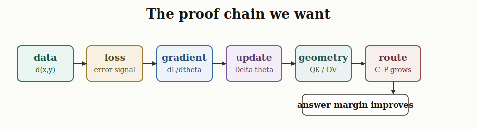
  <figcaption><strong>Figure 4. The desired proof chain.</strong> A full result must connect actual training loss to parameter updates, then to internal route growth, and finally to answer-margin improvement.</figcaption>
</figure>

The main behavioral scalar is answer margin:

```text
m_t(x, y) = logit_t(y | x) - max_{z != y} logit_t(z | x)
```

where `y` is the correct value token and `z` ranges over wrong value tokens. A larger margin means the model prefers the correct answer more strongly.

For a candidate internal route `P`, we want a scalar:

```text
C_P(theta_t, x, y)
```

The local update question is:

```text
Delta C_P(t) ~= grad_theta C_P(theta_t) dot Delta theta_t
```

If the update is close to SGD:

```text
Delta theta_t ~= -eta grad_theta L_batch(theta_t)
```

then route growth is controlled by an alignment:

```text
Delta C_P(t)
  ~= eta < -grad_theta L_batch(theta_t), grad_theta C_P(theta_t) >
```

This is the central mathematical object. It asks whether the actual training batch pushed the model in a direction that increased a candidate route.

## Evidence Ladder

Different measurements prove different things. A head being active is not the same as proving that SGD selected it.

<figure class="paper-figure">
  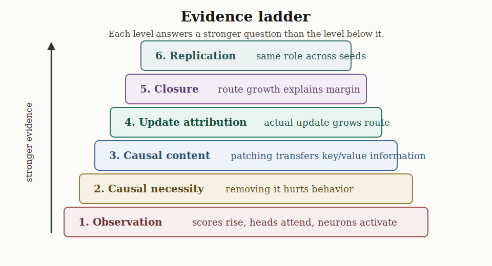
  <figcaption><strong>Figure 5. Evidence ladder.</strong> Observation is the weakest evidence. Causal removal, causal patching, actual update attribution, route-to-margin closure, and cross-seed replication are stronger.</figcaption>
</figure>

The levels are:

| level | question it answers | example |
| --- | --- | --- |
| observation | does something move or activate? | attention score rises |
| causal necessity | is it load-bearing? | removing it drops margin |
| causal content | does it carry the right variable? | patching transfers key/value information |
| update attribution | did the actual optimizer step grow it? | `grad C dot Delta theta_actual` predicts route movement |
| closure | does route growth explain behavior growth? | route deltas explain answer-margin delta |
| replication | is the role stable? | same role appears across seeds |

Most early experiments were below the closure level. The current work is now near update attribution and partial closure, but not yet cross-seed replication.

The proof object matters. Different internal objects are useful for different levels of the ladder:

| object | why useful | why not enough alone |
| --- | --- | --- |
| single neuron | concrete unit inside the model | often polysemantic and shared |
| activation-feature family | finds structured activation directions | fitted basis, not automatically a model variable |
| full residual state | causally strong and easy to patch | too broad; hides which variable mattered |
| attention head | interpretable QK/OV role | head identity can be seed-specific |
| route scalar `C(theta)` | task-meaningful, causal, differentiable | still needs margin closure and cross-seed replication |

Candidate-level route analysis is not a step away from depth. It is the anchor that makes deeper analysis possible. Once a route scalar is validated, we can decompose it downward into QK/OV matrices, residual directions, MLP neurons, parameter tensors, actual optimizer updates, and data-example gradients.

But routes are still a map, not the deepest object of explanation. A route tells us where computation seems to flow after the system has started working. The harder question is how SGD, acting only through loss and weight updates, shapes a dense shared residual system of polysemantic units into something that behaves like a retrieval circuit. That is the real research target, and it is only partially solved here.

<figure class="paper-figure">
  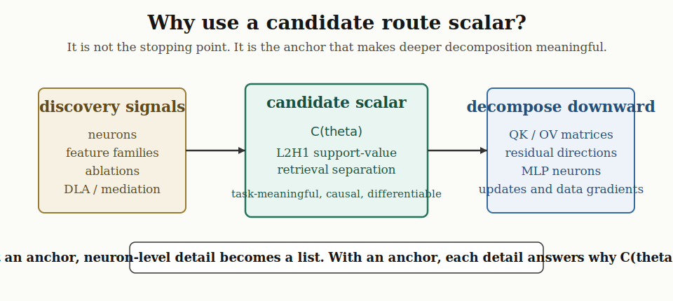
  <figcaption><strong>Figure 6. Why use a candidate route scalar?</strong> Neurons, feature families, ablations, DLA, and mediation are discovery signals. The route scalar is the anchor. Once the anchor is validated, deeper neuron- and weight-level decomposition has a target.</figcaption>
</figure>

## What Existing Work Contributes

This project uses several ideas from mechanistic interpretability:

- Transformer-circuits work says attention should be decomposed into `QK` and `OV`: `QK` decides where a head reads from, and `OV` decides what gets written.
- Induction-head work shows that useful attention circuits can form during training and have measurable progress signals.
- Grokking progress-measure work motivates tracking mechanism strength continuously rather than only measuring final accuracy.
- Superposition work explains why individual neurons are often not clean variables.
- Causal abstraction work raises the standard: a mechanism should correspond to abstract variables that survive interventions.

This project is narrower than those papers. It asks:

```text
In this symbolic KV task, which internal route grows under actual SGD updates,
and how much of the behavioral improvement does that growth explain?
```

That route question is a tractable handle, not the final philosophical answer. The deeper target is:

```text
How do many small SGD updates reorganize shared residual geometry
so that a useful retrieval route becomes possible at all?
```

## First Attempt: Feature Families

The first deep analysis tried to explain formation through activation features and neuron coalitions.

At `layer_2_post_mlp`, two feature families became important:

| family | features | initial interpretation |
| --- | --- | --- |
| family7 | 27, 54 | stronger useful/generalizing candidate |
| family4 | 1, 59 | related sibling candidate with stronger raw pre-birth factor score |

The candidate mechanism report found:

| candidate | useful | heldout | score drive |
| --- | ---: | ---: | ---: |
| family7 top2 | 0.408211 | 0.196319 | 0.109958 |
| family4 top2 | 0.234053 | 0.021933 | 0.147239 |

But the transparent birth model failed. It predicted family4 over family7 from shared strict pre-birth evidence:

| candidate | birth-model score | predicted rank | actual useful birth |
| --- | ---: | ---: | ---: |
| family4 top2 | 4 | 1 | 2500 |
| family7 top2 | 0 | 2 | 2250 |

This was a useful negative result. It showed that feature-family score drive was not enough to explain why the more generalizing route emerged earlier.

The feature-family phase is still important, but its role has changed. It is now treated as candidate-discovery evidence rather than the final proof object. Feature families helped reveal where structure was forming and where neurons were shared, but the final explanation needs a scalar with direct task meaning, causal testability, and update attribution.

## Why Feature Families Hit A Wall

Feature families were useful for discovery, but they were not final mechanism units.

The coalition map showed that family7 and family4 share a dense neuron substrate:

| coalition category | neurons |
| --- | ---: |
| shared positive | 484 |
| shared negative | 316 |
| conflict | 224 |

That means the model did not use one clean neuron set for family7 and another clean neuron set for family4. The same early neurons participate in multiple later projections.

The lesson:

```text
Feature IDs are analysis coordinates.
They are not guaranteed to be natural circuit atoms.
```

This is why the project moved from feature-family stories toward route-level and residual-stream measurements.

## Superposition And Polysemantic Neurons

The main difficulty is not model size. This model is small. The difficulty is that the learned representation is dense.

In a hand-written program, the state might be:

```text
query_key = K03
stored_value[K03] = V14
```

A transformer does not need to represent those variables in clean named slots. It can distribute them across:

- residual-stream directions
- QK attention subspaces
- OV write directions
- MLP activations
- neuron combinations
- layer norm scaling
- final unembedding directions

This is superposition:

```text
many features can share overlapping directions
```

This is polysemanticity:

```text
one neuron can participate in more than one feature or role
```

Our own results show this. Some neurons with weak or negative direct readout are still causally important. Some early MLP effects are huge under ablation but badly explained by Direct Logit Attribution. That is not a contradiction. It means the component is shaping later computation rather than directly writing the answer.

## Attention Geometry

For this task, a useful route needs at least two things:

```text
retrieval:
  the read/prediction position must identify the correct support value
  over distractor values

write/readout:
  the retrieved value must move the residual stream toward the correct answer token
```

For an attention head:

```text
QK decides where to read from.
OV decides what gets written after reading.
```

The support-vs-distractor score is:

```text
support retrieval separation
  = score(prediction position, support value position)
    - mean score(prediction position, distractor value positions)
```

The attention geometry trace identified `L2H1` as the strongest late support-value retrieval/write head.

At final traced step `8250`:

| measurement | strongest head | value |
| --- | --- | ---: |
| support-value attention | L2H1 | 0.787570 |
| support-value QK margin | L2H1 | 0.571587 |
| attended OV value margin | L2H1 | 2.490426 |
| low entropy | L2H1 | 0.455578 |

<figure class="paper-figure">
  
  <figcaption><strong>Figure 7. Attention geometry over checkpoints.</strong> L2H1 becomes a strong support-value route. This is route evidence, not by itself a proof of SGD selection.</figcaption>
</figure>

<figure class="paper-figure">
  
  <figcaption><strong>Figure 8. L2H1 retrieval chain.</strong> During the 5500 to 7500 window, L2H1 increasingly separates the correct support value from value distractors. This is one of the clearest route-level signals found so far.</figcaption>
</figure>

## Direct Logit Attribution

Direct Logit Attribution, or DLA, asks:

```text
If this component writes a vector into the residual stream,
how much does that vector directly increase the correct answer logit?
```

For component output `r_component` and correct answer unembedding direction `W_U[y]`:

```text
DLA(component, y) = r_component dot W_U[y]
```

DLA is useful because it projects into the model's own output basis. It avoids some problems with fitted feature bases.

But DLA measures direct writing. It does not measure total causal importance. A component can have low or negative DLA and still be important because it prepares the state used by later components.

<figure class="paper-figure">
  
  <figcaption><strong>Figure 9. Direct output contributions.</strong> Path-logit decomposition shows which components directly write toward the correct answer over training. This is a direct-readout measurement, not a full causal story.</figcaption>
</figure>

## Causal Removal And Patching

Two causal tests are central:

```text
causal removal:
  remove a component or subspace and measure behavior drop

causal patching:
  move a component or subspace from one prompt to another and ask
  whether it transfers the abstract variable
```

Removal asks whether something is necessary. Patching asks whether it carries the right content.

<figure class="paper-figure">
  
  <figcaption><strong>Figure 10. L2H1 QK key-side removal.</strong> Removing this subspace hurts margin, showing that it is load-bearing. Removal alone does not prove that it carries a specific abstract variable.</figcaption>
</figure>

<figure class="paper-figure">
  
  <figcaption><strong>Figure 11. L2H1 OV output removal.</strong> Removing this output/write subspace hurts margin. This supports a value-write role.</figcaption>
</figure>

<figure class="paper-figure">
  
  <figcaption><strong>Figure 12. Controlled query-side patching.</strong> Patch recovery tests whether a subspace carries transferable query-key information rather than merely being important. Distractor controls prevent false positives.</figcaption>
</figure>

## Current Trained-Model Picture

The best current picture is not a clean serial circuit. It is a dense residual-stream mechanism.

<figure class="paper-figure">
  
  <figcaption><strong>Figure 13. Current trained-model picture.</strong> Early components such as L0MLP, L1H3, and L1MLP shape a shared residual state. Later components such as L1H2, L2H1, and L2MLP are closer to direct answer readout. The arrows should be read as supported causal structure, not as a complete closed circuit.</figcaption>
</figure>

Simple version:

```text
Early components do not intentionally prepare a later circuit.
They get reinforced when their activation pattern helps reduce loss.
Later, once an attention/write route becomes useful,
backprop sends credit through that route.
Some earlier components then receive gradients that shape the residual geometry
needed by the later route.
```

That is the plausible formation story. The remaining work is proving it from actual updates rather than only describing it after training.

## Recent Causal Accounting Update

The most recent tools tested whether trained-model component effects are direct, mediated, or hidden in residual state.

### Component Causal Validation

This experiment compared DLA against causal ablation for output-facing components over `512000` rows.

Late components had better DLA/causal agreement:

| component | scalar | causal effect | DLA | sign agreement | corr | R2 |
| --- | --- | ---: | ---: | ---: | ---: | ---: |
| L2MLP | fixed-source margin | 3.364054 | 1.850016 | 0.880 | 0.985 | 0.897 |
| L2MLP | fixed-target margin | 3.358048 | 1.844964 | 0.881 | 0.985 | 0.898 |
| L2H1 | fixed-source margin | 7.345897 | 5.444075 | 0.921 | 0.881 | 0.626 |
| L2H1 | fixed-target margin | 7.347727 | 5.444509 | 0.921 | 0.881 | 0.626 |
| L1H2 | fixed-source margin | 6.553232 | 3.990044 | 0.922 | 0.725 | 0.293 |
| L1H2 | fixed-target margin | 6.549956 | 3.987632 | 0.922 | 0.727 | 0.295 |

Early components were causally huge but not direct answer writers:

| component | scalar | causal effect | DLA | sign agreement |
| --- | --- | ---: | ---: | ---: |
| L0MLP | correct-value logit | 27.738898 | -7.652493 | 0.162 |
| L1H3 | correct-value logit | 21.515125 | -2.711512 | 0.318 |
| L1MLP | correct-value logit | 15.712419 | -0.387060 | 0.495 |

<figure class="paper-figure">
  
  <figcaption><strong>Figure 14. Direct attribution versus causal effect.</strong> Late components behave more like direct answer writers. Early components have large causal effects but poor direct attribution, which means their main role is upstream state shaping.</figcaption>
</figure>

This is one of the clearest findings so far:

```text
late components are closer to direct output routes
early components are load-bearing infrastructure
```

### Mediation Through Later Components

The next question was whether early components act through later components.

For target-endpoint correct-value logit:

| source | total causal effect | direct DLA | mediated through selected later components | direct + mediated | explained fraction |
| --- | ---: | ---: | ---: | ---: | ---: |
| L0MLP | 27.738898 | -7.652493 | 16.124124 | 8.471631 | 0.305 |
| L1H3 | 21.515125 | -2.711512 | 12.577657 | 9.866145 | 0.459 |
| L1MLP | 15.712419 | -0.387060 | 11.584630 | 11.197570 | 0.713 |

Strong mediated paths included:

| path | mediated correct-logit effect |
| --- | ---: |
| L0MLP -> L2H1 | 7.4515 |
| L0MLP -> L1H2 | 5.1969 |
| L0MLP -> L2MLP | 3.1648 |
| L1H3 -> L2H1 | 6.5816 |
| L1H3 -> L2MLP | 3.3300 |
| L1MLP -> L2MLP | 6.1051 |
| L1MLP -> L2H1 | 2.8337 |

<figure class="paper-figure">
  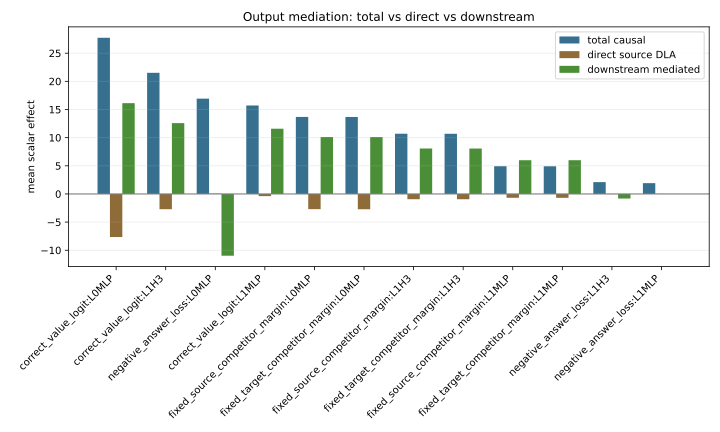
  <figcaption><strong>Figure 15. Source-level mediation.</strong> Some early-component effects flow through later components, especially L2H1, L1H2, and L2MLP. The mediation is real but incomplete.</figcaption>
</figure>

<figure class="paper-figure">
  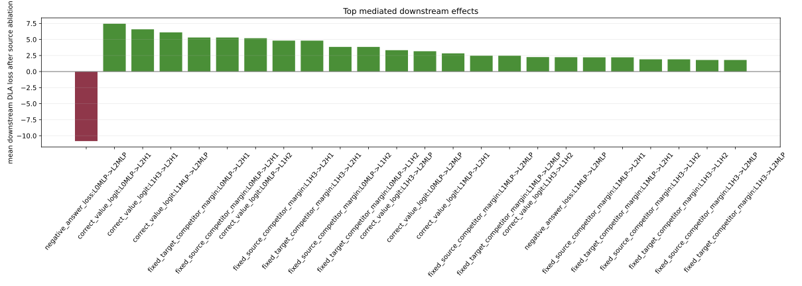
  <figcaption><strong>Figure 16. Downstream mediation.</strong> The downstream routes do not simply add up into a clean chain. Some later components help, some oppose, and some interact through the shared residual state.</figcaption>
</figure>

### All-Later Mediation Did Not Close The Gap

We then tested whether the missing mediation was just because too few downstream components were included. That hypothesis failed.

Adding all later components did not improve closure:

| source | narrow explained fraction | all-later explained fraction | scalar |
| --- | ---: | ---: | --- |
| L0MLP | 0.305 | 0.147 | correct-value logit |
| L1H3 | 0.459 | 0.452 | correct-value logit |
| L1MLP | 0.713 | 0.629 | correct-value logit |

For `L0MLP -> correct_value_logit`, later components had conflicting signs:

| positive paths | effect |
| --- | ---: |
| L2H1 | +7.451 |
| L1H2 | +5.197 |
| L2MLP | +3.165 |

| negative paths | effect |
| --- | ---: |
| L1H3 | -2.744 |
| L1H0 | -0.837 |
| L1MLP | -0.458 |
| L1H1 | -0.364 |

This means the trained model is not a clean additive chain. It is a dense, sign-conflicted system.

### Residual-State Rescue

Residual-state rescue asked:

```text
If removing an early component damages behavior,
can we rescue behavior by patching the full residual state after that component?
```

The answer was yes, exactly at the expected stage boundary:

| source | first stage that rescues target correct logit | rescue fraction |
| --- | --- | ---: |
| L0MLP | layer_0_post_mlp | 1.000 |
| L1H3 | layer_1_post_attn | 1.000 |
| L1MLP | layer_1_post_mlp | 1.000 |

<figure class="paper-figure">
  
  <figcaption><strong>Figure 17. Residual rescue fraction.</strong> Full residual patching rescues the damage once the patch is placed after the source component. This localizes where the missing information enters the residual stream.</figcaption>
</figure>

<figure class="paper-figure">
  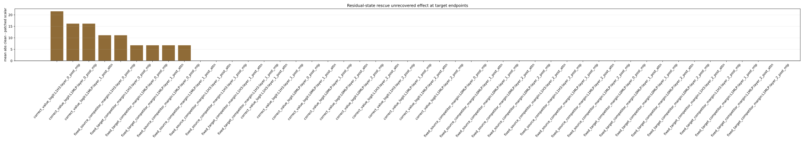
  <figcaption><strong>Figure 18. Unrecovered residual effect.</strong> Once the full post-source residual state is patched, the unrecovered effect largely disappears. This proves the damage is in the residual state, but full-state patching does not identify the exact direction or variable inside that state.</figcaption>
</figure>

This is important but also limited:

```text
Full residual rescue proves where the information is.
It does not prove what the information is.
```

## Actual Optimizer Trace

The project then moved from trained-model causality to update attribution.

The question became:

```text
Does the actual optimizer update move the model in a direction that increases a measured route?
```

For a route scalar `C`:

```text
actual route change:
  C(theta_{t+1}) - C(theta_t)

first-order predicted route change:
  grad C(theta_t) dot Delta theta_actual
```

The stepwise retrieval-separation result for `L2H1` was much cleaner when measured as support-minus-distractor separation than when measuring raw score alone.

<figure class="paper-figure">
  
  <figcaption><strong>Figure 19. L2H1 stepwise retrieval-separation attribution.</strong> On short intervals, first-order attribution often gets the sign and direction of route movement right. This is evidence that actual updates are linked to route growth.</figcaption>
</figure>

However, first-order prediction often overpredicts magnitude. That means the local gradient direction is informative, but it does not close the full nonlinear behavior change.

## Answer Scalar Residual Diagnosis

The answer-margin scalar itself can be tricky because the best wrong competitor token can switch.

The diagnosis compared:

- moving answer margin
- fixed-source-competitor margin
- fixed-target-competitor margin
- correct-value logit
- source best-wrong logit
- target best-wrong logit
- negative answer loss

<figure class="paper-figure">
  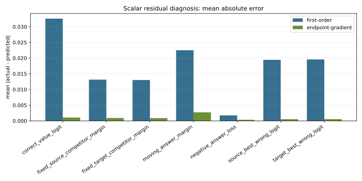
  <figcaption><strong>Figure 20. Scalar residual diagnosis.</strong> First-order update attribution often captures direction better than magnitude. The residual is partly a scalar-definition issue and partly a nonlinear-training issue.</figcaption>
</figure>

<figure class="paper-figure">
  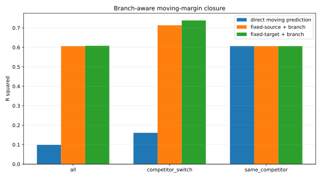
  <figcaption><strong>Figure 21. Branch-aware margin closure.</strong> Moving-margin errors can come from active competitor switching. Fixed-competitor margins are cleaner local proof targets than the raw moving max margin.</figcaption>
</figure>

Simple version:

```text
The update often points in the right direction.
But the output scalar is nonlinear.
The best wrong token can change.
Several components move together.
So a first-order route story does not automatically close the full answer margin.
```

## Route-To-Output Closure

Closure asks:

```text
Do the measured route changes explain the output-scalar change?
```

If closure is high, we can say:

```text
This set of routes explains most of the behavioral improvement.
```

If closure is low or unstable, then our route set is missing part of the mechanism.

<figure class="paper-figure">
  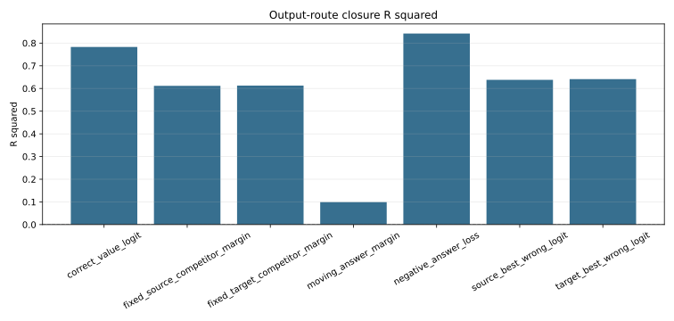
  <figcaption><strong>Figure 22. Output route closure.</strong> Route-to-output closure tests whether measured component changes explain scalar output changes. The current result is informative but not yet a complete answer-margin closure proof.</figcaption>
</figure>

Current interpretation:

```text
We have partial route-to-output accounting.
We do not yet have full answer-margin closure from a small route set.
```

## Why This Is So Hard

This task is small, but the mechanism is not simple.

<figure class="paper-figure">
  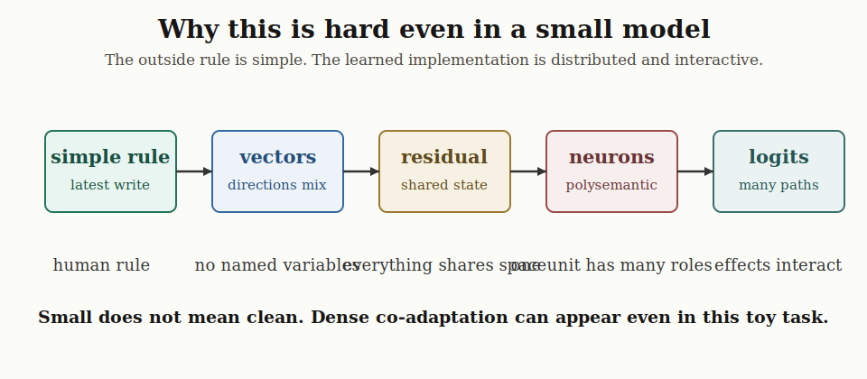
  <figcaption><strong>Figure 23. Why small does not mean clean.</strong> A simple external rule becomes vectors, shared residual state, superposed neurons, interacting components, and logits. The learned implementation is distributed even in a toy model.</figcaption>
</figure>

The difficulty has several layers.

First, the symbolic rule is discrete, but the implementation is geometric:

```text
latest write for K03
```

becomes directions in:

```text
embedding space
QK attention space
OV write space
MLP activation space
residual stream
unembedding space
```

Second, the residual stream is a shared workspace. Many components read and write to the same vector. That makes it hard to say one component owns one variable.

Third, neurons are not clean variables. A neuron can help multiple features, and a feature can be spread across many neurons.

Fourth, ablation is off-manifold. Removing a component creates a state the later network may not normally see.

Fifth, SGD does not choose named circuits. It only follows loss gradients. Every update changes many weights at once. A later route can grow because earlier components already created a useful residual geometry, and earlier components can later receive credit because the later route uses them.

So the hard part is not computing one more metric. The hard part is identifying the right internal variable:

```text
C(theta)
```

and proving that its growth is caused by actual optimizer updates and explains behavior.

## How Deep Can We Dig?

There are several depths of explanation:

| depth | what it tells us | current status |
| --- | --- | --- |
| behavior | the model gets answers right | strong |
| logits | correct token wins over wrong tokens | strong |
| DLA | which components directly write to output | strong for late components |
| causal ablation | which components are load-bearing | strong |
| causal patching | which subspaces carry transferable content | partial |
| mediation | how early effects pass through later components | partial and sign-conflicted |
| residual rescue | where missing information enters the residual stream | strong but coarse |
| update attribution | whether actual updates grow routes | partial |
| closure | whether route growth explains margin growth | not complete |
| cross-seed role replication | whether the role is stable beyond seed 7 | not done |
| exact historical trace | full original training stream from step 0 | not done |

We can dig below neurons into weights and gradients, but that creates a combinatorial problem. The model has many weights, and each update moves many of them. The right next step is not to inspect every weight. It is to pick one validated route scalar and close the chain around it.

So candidate-level analysis is the spine, not the stopping point. Without a route anchor, neuron-level analysis becomes a long list of important units with no clear reason why they matter. With the anchor, we can ask which neurons, matrices, parameter tensors, and data examples specifically increase `C(theta)`.

The deeper direction is still below the route. Once a route is located, the next question is what changes inside the shared residual system made the route usable: which residual directions became available, which MLP neurons shaped those directions, which attention matrices learned to read them, and which data examples pushed the updates that made this happen.

## What Is Supported

Current supported claims:

| claim | status |
| --- | --- |
| The model learns the symbolic KV task above chance | supported |
| Heldout-pair behavior is meaningful because heldout pair overlap with train is zero in the dataset report | supported |
| L2H1 develops strong late support-value retrieval/write geometry | supported |
| L2H1, L2MLP, and L1H2 behave closer to direct output/readout routes | supported |
| L0MLP, L1H3, and L1MLP are causally essential upstream infrastructure | supported |
| Early-component effects are partly mediated through later components | supported but incomplete |
| All-later mediation does not close the early-component effect | supported |
| Full residual patching rescues early-component damage at the expected stage boundary | supported |
| The trained mechanism is dense and sign-conflicted | supported |
| Short-step update attribution captures some route-movement directions | supported |

## What Is Not Yet Proven

Current unsupported or incomplete claims:

| claim | status |
| --- | --- |
| SGD selected exactly L2H1 for a unique reason | not proven |
| A small set of routes fully closes answer-margin growth | not proven |
| The exact abstract variable inside early residual state is identified | not proven |
| Neuron-level growth is the right proof object | not supported |
| Feature families are natural circuit atoms | not supported |
| Current results generalize across seeds | not tested |
| We have reconstructed the original historical training stream from step 0 | not done |

The main gap:

```text
trained-model causal accounting is strong
SGD-formation proof is still incomplete
```

## Next Finite Proof Unit

The next step should stop expanding the tool list and test the current primary variable:

```text
C_retrieval(theta)
  = E[
      score_L2H1(prediction, correct_support_value)
      - mean score_L2H1(prediction, distractor_values)
    ]
```

This is the current strongest proof object because it corresponds directly to one algorithmic step:

```text
find the stored value that answers the read query
```

The behavior scalar should avoid moving-max instability:

```text
B(theta)
  = E[logit_correct - logit_fixed_wrong]
```

The proof unit is:

<figure class="paper-figure">
  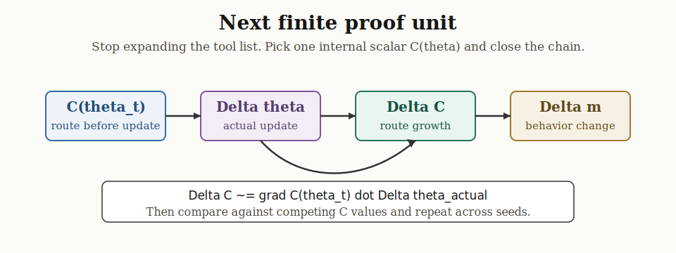
  <figcaption><strong>Figure 24. The next finite proof unit.</strong> Pick one internal scalar `C(theta)`, measure its actual change, predict that change from the actual optimizer update, connect it to behavior change, compare against alternatives, and then repeat across seeds.</figcaption>
</figure>

Concretely:

```text
1. Measure C_retrieval(theta_t)
2. Measure C_retrieval(theta_{t+1})
3. Compute Delta C_retrieval_actual
4. Compute grad C_retrieval(theta_t) dot Delta theta_actual
5. Show the actual batch update predicts Delta C_retrieval
6. Show Delta C_retrieval predicts fixed-competitor margin or log-prob improvement
7. Show competing route scalars explain less
8. Repeat the role-level result across seeds
```

If this scalar fails, that is also useful. It would mean the real proof object is broader than `L2H1` and must be a residual/readout route rather than a single-head retrieval route.

Either way, the route scalar is a handle on a deeper question. The goal is not merely to name a route. The goal is to explain how the optimizer shaped dense residual geometry until a retrieval-like route emerged.

## Current Bottom Line

The central result so far is:

```text
The trained model implements symbolic lookup through a dense residual-stream mechanism.
Late components provide more direct answer readout.
Early components are causally essential infrastructure.
Their effects are partly mediated through later routes,
but not in a clean additive chain.
```

The central open problem is:

```text
Validate or falsify the proposed scalar:

C(theta) = L2H1 support-value retrieval separation

by showing whether actual optimizer updates grow it,
whether its growth explains output improvement,
and whether alternative route scalars explain less.
```

This is still a proxy for the deeper formation question:

```text
How does SGD reshape a dense residual system of polysemantic components
into machinery that behaves like lookup?
```

That is the path from:

```text
this component matters
```

to:

```text
this is how SGD built the lookup mechanism
```

## Main Artifact Sources

Primary artifacts:

| artifact group | path |
| --- | --- |
| dataset geometry | `artifacts/runs/symbolic_kv_reference_formation/analysis/dataset_geometry/` |
| attention geometry | `artifacts/runs/symbolic_kv_reference_formation/analysis/attention_geometry/` |
| path logit decomposition | `artifacts/runs/symbolic_kv_reference_formation/analysis/path_logit_decomposition/` |
| causal variable patching | `artifacts/runs/symbolic_kv_reference_formation/analysis/causal_variable_patch/` |
| route competition | `artifacts/runs/symbolic_kv_reference_formation/analysis/route_competition/` |
| actual update attribution | `artifacts/runs/symbolic_kv_reference_formation/analysis/checkpoint_update_attribution/` |
| attention retrieval update attribution | `artifacts/runs/symbolic_kv_reference_formation/analysis/attention_retrieval_separation_update_attribution/` |
| answer scalar residual diagnosis | `artifacts/runs/symbolic_kv_reference_formation/analysis/answer_scalar_residual_diagnosis/` |
| output route closure | `artifacts/runs/symbolic_kv_reference_formation/analysis/output_route_closure/` |
| output component causal validation | `artifacts/runs/symbolic_kv_reference_formation/analysis/output_component_causal_validation/` |
| output mediated causal decomposition | `artifacts/runs/symbolic_kv_reference_formation/analysis/output_mediated_causal_decomposition/` |
| residual state rescue | `artifacts/runs/symbolic_kv_reference_formation/analysis/residual_state_rescue/` |

Supporting plans:

- [Checkpoint Analysis Plan](checkpoint_analysis_plan.md)
- [Shared Feature Dynamics Plan](shared_feature_dynamics_plan.md)
