# From Loss To Lookup: Tracing Circuit Formation In A Small Transformer

Nelson Alex

Living draft: 2026-04-23

This is a living research paper. The result is not a theorem about all transformers. It is a detailed mechanistic accounting of one small transformer task, then a cross-seed check of the central pattern.

The motivating question behind the project was simple:

```text
How does SGD find a circuit at all?
```

The current paper keeps that question, but answers it in the narrower form supported by the traced run:

```text
How does gradient-based training, realized here as AdamW rather than raw SGD,
select and reinforce a retrieval route?
```

## Abstract

We trained a 3-layer decoder-only transformer on a symbolic key-value lookup task:

```text
When the model reads key K, output the most recent value written for K.
```

The final mechanism is not a clean table, a single neuron, or one stable feature family. It is a dense residual-stream mechanism. The strongest route-level object we found is a support-value retrieval scalar:

```text
C_r(theta)
  = E[ score_r(prediction, support_value)
       - mean score_r(prediction, value_distractors) ]
```

For the reference seed, this scalar is implemented most clearly by `L2H1 W_QK` at rank 8. The evidence chain is:

```text
behavior improves
  -> L2H1 support-value retrieval separation grows
  -> L2H1 W_QK develops a low-rank matching direction
  -> actual parameter updates grow that route
  -> exact AdamW decomposition reconstructs the route-growth direction
```

The most important optimizer result is negative and positive at the same time:

```text
raw SGD is far too small to explain the route formation;
AdamW's preconditioned current-gradient and momentum terms carry the useful update.
```

Across 5 additional seeds, the same support-value retrieval role appears, but the winning head changes. The circuit is stable as a role pattern and unstable as a named address.

<figure class="paper-figure">
  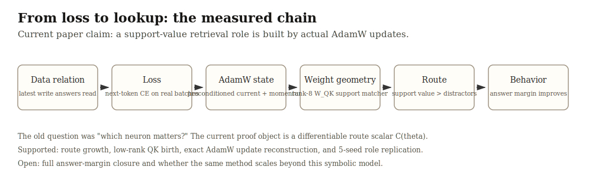
  <figcaption><strong>Figure 1. Current measured chain.</strong> The current paper claim is no longer only that a component matters. The claim is that a task-meaningful route grows in weight space and that actual AdamW updates explain that growth.</figcaption>
</figure>

<figure class="paper-figure">
  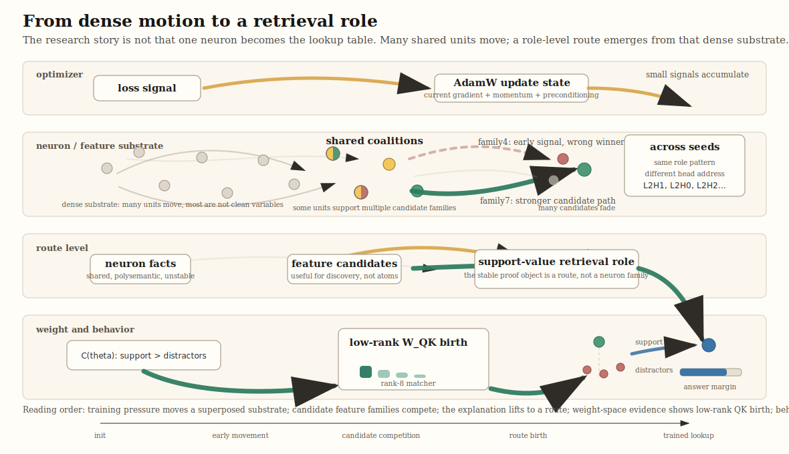
  <figcaption><strong>Formation sketch.</strong> This is a conceptual map, not a measurement plot. It shows why the explanation had to move upward from neurons and feature families to route-level variables: many shared units move, candidate families compete, a support-value retrieval role consolidates, `W_QK` gives weight-level evidence for the role, and answer margin grows.</figcaption>
</figure>

## The Task

Each prompt is a stream of writes and reads:

```text
W K03 V14   W K01 V09   R K03   W K03 V02   R K03
```

`W K V` means write value `V` into key `K`. `R K` means read key `K`. The correct answer is the latest previous value written for that key.

<figure class="paper-figure">
  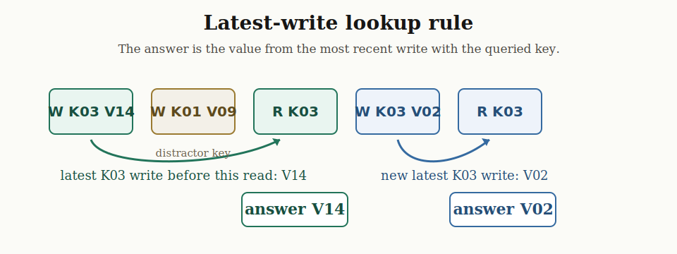
  <figcaption><strong>Figure 2. Latest-write lookup rule.</strong> The first `R K03` should output `V14`; after a later `W K03 V02`, the next `R K03` should output `V02`. The model only receives next-token loss.</figcaption>
</figure>

The symbolic relation can be written:

```text
d(x, y) = 1  if y is the latest written value for the queried key in x
d(x, y) = 0  otherwise
```

The hand-written algorithm is simple:

```text
store = {}
for event in stream:
  if event is W K V:
    store[K] = V
  if event is R K:
    output store[K]
```

The transformer has no dictionary. It has embeddings, attention scores, MLP activations, residual streams, layer norms, and logits. The research question is how the training loss reshapes those weights into a lookup mechanism.

<figure class="paper-figure">
  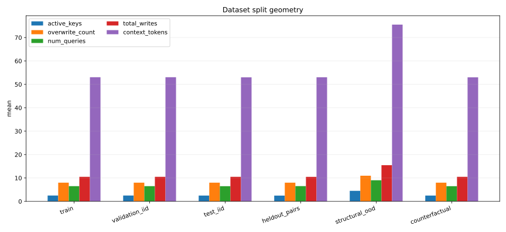
  <figcaption><strong>Figure 3. Dataset split geometry.</strong> The train, IID, heldout, OOD, and counterfactual splits differ in query structure, active keys, writes, overwrites, and lag. This matters because a shortcut can work on IID examples while failing on heldout key-value relations.</figcaption>
</figure>

<figure class="paper-figure">
  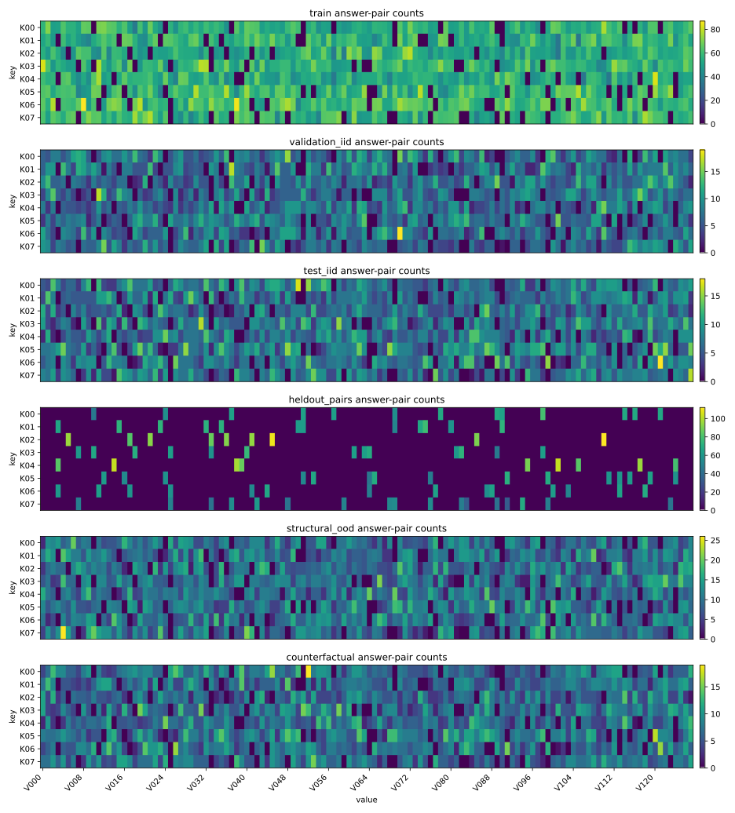
  <figcaption><strong>Figure 4. Heldout answer-pair structure.</strong> The heldout-pair split separates key-value combinations from the training set. This makes heldout success more meaningful than memorizing seen pairs.</figcaption>
</figure>

The dataset geometry report records:

| split | records | queries | active keys | writes | overwrites | query lag |
| --- | ---: | ---: | ---: | ---: | ---: | ---: |
| train | 8000 | 52105 | 2.502 | 10.502 | 8.000 | 1.182 |
| validation_iid | 1024 | 6667 | 2.505 | 10.505 | 8.000 | 1.179 |
| heldout_pairs | 1024 | 6686 | 2.483 | 10.483 | 8.000 | 1.176 |
| structural_ood | 1024 | 9255 | 4.507 | 15.472 | 10.965 | 2.425 |

The heldout-pairs split has zero pair overlap with train in the dataset report.

## Model And Reference Run

The reference run is:

| property | value |
| --- | --- |
| model | decoder-only transformer |
| layers | 3 |
| heads per layer | 4 |
| width | 128 |
| reference seed | 7 |
| training steps | 16000 |
| batch size | 128 |
| optimizer | AdamW |

The best-checkpoint report records heldout-pairs answer accuracy around `0.872`.

The important windows are:

| window | step range | role in the analysis |
| --- | ---: | --- |
| early feature movement | `1750 -> 2500` | feature-family and coalition signals |
| QK route birth | `750 -> 3500` | low-rank `W_QK` route formation |
| main route geometry | `4500 -> 8250` | trained route and output geometry |
| exact AdamW trace | `0 -> 6000` | from-initialization optimizer decomposition |
| cross-seed validation | `750 -> 2500` | exact Adam-state attribution on selected heads |

## The Proof Object

The behavioral scalar is answer margin:

```text
m_t(x, y) = logit_t(y | x) - max_{z != y} logit_t(z | x)
```

where `y` is the correct value token and `z` ranges over wrong value tokens.

For an internal route, we need a scalar with task meaning. The current route scalar is:

```text
C_r(theta)
  = E[ score_r(prediction, support_value)
       - mean score_r(prediction, value_distractors) ]
```

For the reference seed, the strongest version is:

| field | value |
| --- | --- |
| head | `L2H1` |
| matrix | `W_QK = W_Q W_K^T` |
| rank | `8` |
| context stage | `layer_1_post_mlp` |
| query role | `prediction` |
| support role | `support_value` |
| distractor role | `value_distractors` |

In plain terms:

```text
Does the prediction position match the real support value more than distractor values?
```

For local update attribution, the key first-order identity is:

```text
Delta C_r ~= grad_theta C_r(theta_t) dot Delta theta_actual
```

If the optimizer were plain SGD:

```text
Delta theta_t ~= -eta grad_theta L_batch(theta_t)
```

then:

```text
Delta C_r
  ~= eta < -grad_theta L_batch(theta_t), grad_theta C_r(theta_t) >
```

This inner product is the first mathematical bridge from loss to route growth. The later optimizer experiments show why plain SGD is not enough in this run.

## Why We Stopped Treating Neurons As The Main Object

The first deep analysis tried to explain formation through activation features and neuron coalitions. That was useful, but it failed as a final proof object.

At `layer_2_post_mlp`, two feature families looked important:

| family | features | interpretation during discovery |
| --- | --- | --- |
| family7 | 27, 54 | stronger useful/generalizing candidate |
| family4 | 1, 59 | related sibling candidate with stronger raw pre-birth score |

The candidate mechanism report found:

| candidate | useful | heldout | score drive |
| --- | ---: | ---: | ---: |
| family7 top2 | 0.408211 | 0.196319 | 0.109958 |
| family4 top2 | 0.234053 | 0.021933 | 0.147239 |

The first transparent birth model predicted the wrong family:

| candidate | birth-model score | predicted rank | actual useful birth |
| --- | ---: | ---: | ---: |
| family4 top2 | 4 | 1 | 2500 |
| family7 top2 | 0 | 2 | 2250 |

That mistake mattered. It showed that a feature-family scoring model could describe some movement without explaining why the generalizing mechanism formed first.

<figure class="paper-figure">
  
  <figcaption><strong>Figure 5. Feature-family trajectories.</strong> Feature families exposed meaningful structure, but their identities are analysis coordinates. They are not automatically the model's natural mechanism units.</figcaption>
</figure>

The coalition map made the problem sharper:

| coalition category | neurons |
| --- | ---: |
| shared positive | 484 |
| shared negative | 316 |
| conflict | 224 |

<figure class="paper-figure">
  
  <figcaption><strong>Figure 6. Dense shared neuron substrate.</strong> Family7 and family4 were not cleanly separate circuits. Hundreds of neurons were shared or sign-conflicted across the two families.</figcaption>
</figure>

The lesson is:

```text
single neurons and feature families are discovery tools;
they are not the final proof object in this dense model.
```

The right move was not to stop looking inside. It was to move to a better anchor: a task-meaningful route scalar, then decompose that route into weights, residual directions, gradients, and optimizer state.

## The Trained-Model Causal Picture

Transformer attention naturally separates into two pieces:

```text
QK decides where a head reads from.
OV decides what gets written after reading.
```

For this task, a useful route needs:

```text
retrieval:
  prediction position finds the correct support value
  over distractor values

write/readout:
  the retrieved value moves the residual stream toward the correct answer token
```

The attention geometry trace identified `L2H1` as the strongest late support-value retrieval/write head. At final traced step `8250`:

| measurement | strongest head | value |
| --- | --- | ---: |
| support-value attention | L2H1 | 0.787570 |
| support-value QK margin | L2H1 | 0.571587 |
| attended OV value margin | L2H1 | 2.490426 |
| low entropy | L2H1 | 0.455578 |

<figure class="paper-figure">
  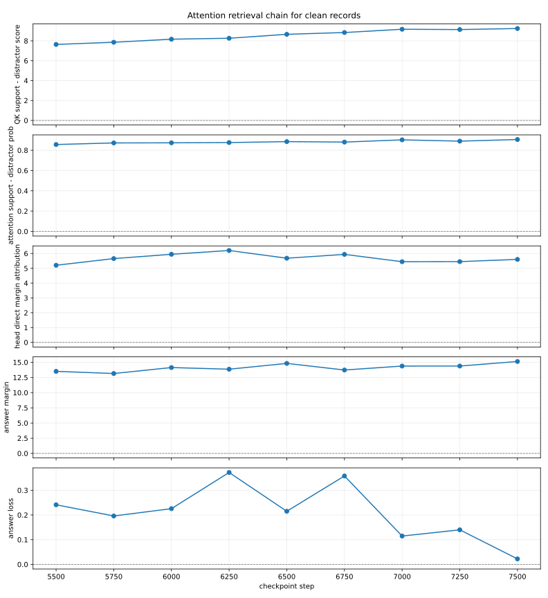
  <figcaption><strong>Figure 7. L2H1 retrieval trajectory.</strong> During the `5500 -> 7500` window, L2H1 increasingly separates the correct support value from value distractors.</figcaption>
</figure>

Direct Logit Attribution asks how much a component directly writes toward the correct answer:

```text
DLA(component, y) = r_component dot W_U[y]
```

Late components behave more like direct answer writers:

| component | scalar | causal effect | DLA | sign agreement | corr | R2 |
| --- | --- | ---: | ---: | ---: | ---: | ---: |
| L2MLP | fixed-source margin | 3.364054 | 1.850016 | 0.880 | 0.985 | 0.897 |
| L2H1 | fixed-source margin | 7.345897 | 5.444075 | 0.921 | 0.881 | 0.626 |
| L1H2 | fixed-source margin | 6.553232 | 3.990044 | 0.922 | 0.725 | 0.293 |

Early components were causally huge but not direct answer writers:

| component | scalar | causal effect | DLA | sign agreement |
| --- | --- | ---: | ---: | ---: |
| L0MLP | correct-value logit | 27.738898 | -7.652493 | 0.162 |
| L1H3 | correct-value logit | 21.515125 | -2.711512 | 0.318 |
| L1MLP | correct-value logit | 15.712419 | -0.387060 | 0.495 |

<figure class="paper-figure">
  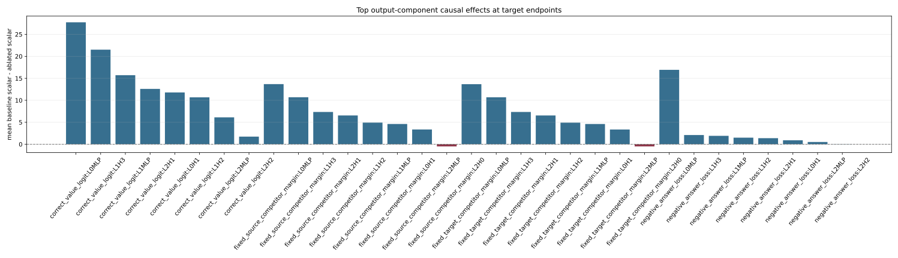
  <figcaption><strong>Figure 8. Direct attribution versus causal effect.</strong> Late components have cleaner direct readout. Early components are load-bearing but mostly shape the residual state used by later computation.</figcaption>
</figure>

Mediation and residual-rescue experiments support the same dense picture. Some early effects flow through later components:

| path | mediated correct-logit effect |
| --- | ---: |
| L0MLP -> L2H1 | 7.4515 |
| L0MLP -> L1H2 | 5.1969 |
| L0MLP -> L2MLP | 3.1648 |
| L1H3 -> L2H1 | 6.5816 |
| L1H3 -> L2MLP | 3.3300 |
| L1MLP -> L2MLP | 6.1051 |
| L1MLP -> L2H1 | 2.8337 |

But all-later mediation did not close the gap. Some later components help and some oppose. The trained model is not a clean additive chain.

Residual-state rescue then asked:

```text
If removing an early component damages behavior,
can we rescue behavior by patching the full residual state after that component?
```

The answer was yes at the expected boundary:

| source | first stage that rescues target correct logit | rescue fraction |
| --- | --- | ---: |
| L0MLP | layer_0_post_mlp | 1.000 |
| L1H3 | layer_1_post_attn | 1.000 |
| L1MLP | layer_1_post_mlp | 1.000 |

<figure class="paper-figure">
  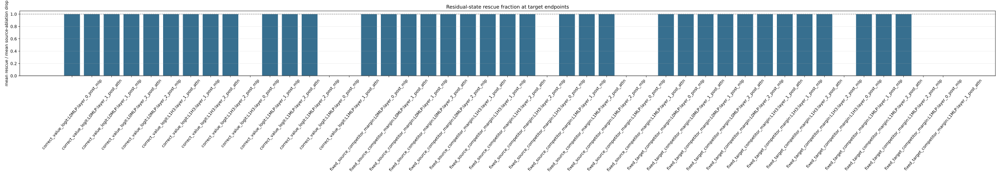
  <figcaption><strong>Figure 9. Residual-state rescue.</strong> Full residual patching rescues early-component damage once the patch is placed after the source component. This localizes where the missing information enters the residual stream.</figcaption>
</figure>

The current trained-model picture is:

<figure class="paper-figure">
  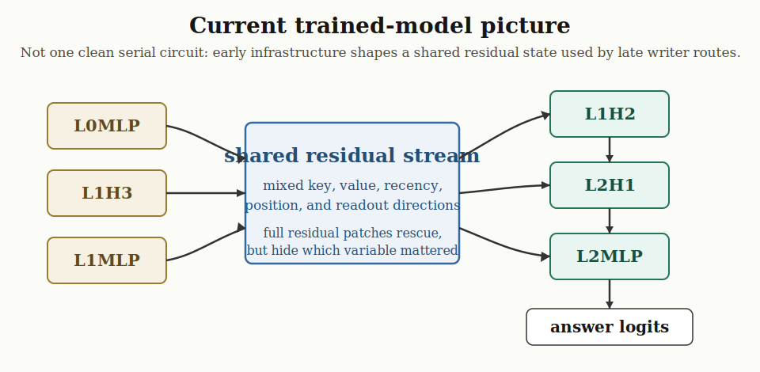
  <figcaption><strong>Figure 10. Dense residual mechanism.</strong> Early components shape a shared residual workspace. Later components are closer to direct output/readout. The arrows are supported causal structure, not a closed serial circuit.</figcaption>
</figure>

Simple version:

```text
early components build usable residual geometry;
late attention and MLP routes read and write closer to the answer;
the mechanism is dense, sign-conflicted, and distributed.
```

## Weight-Level Birth

Routes tell us where computation appears to flow. To study formation, we need to watch the weights change.

For each checkpoint we decomposed attention-head functional matrices:

```text
W_QK = W_Q W_K^T
W_QK = U Sigma V^T
```

The singular values tell us whether a head is developing concentrated low-rank structure. We also measured effective rank:

```text
effective_rank = (sum_i sigma_i)^2 / sum_i sigma_i^2
```

For `L2H1 W_QK`, the weight-SVD pattern report found:

| matrix | start -> end | sv1 delta | relative delta | effective-rank delta | top-3 mass delta |
| --- | ---: | ---: | ---: | ---: | ---: |
| L2H1 W_QK | 250 -> 5500 | 2.8336 | 4.2500 | -10.4120 | 0.1587 |

In words:

```text
L2H1 W_QK starts weak and mixed.
Its top singular value grows strongly.
Its effective rank drops.
Its top-3 spectral mass rises.
```

That is a weight-level birth pattern: the head is not merely activating differently; its QK matrix is becoming a more concentrated matcher.

<figure class="paper-figure">
  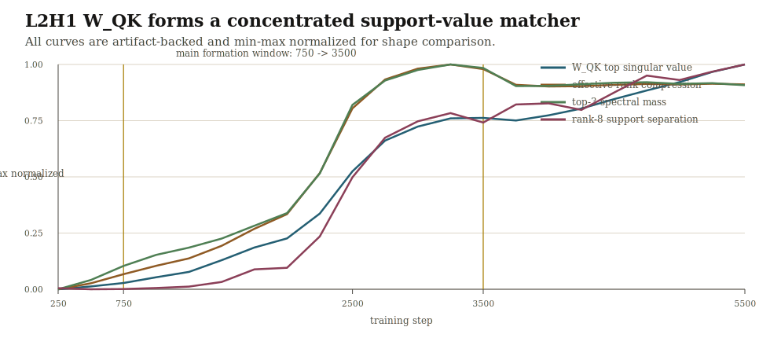
  <figcaption><strong>Figure 11. Weight-level birth.</strong> `L2H1 W_QK` becomes more concentrated while rank-8 support-value retrieval separation grows. The plotted curves are min-max normalized to compare timing.</figcaption>
</figure>

The bilinear QK match separation run connected that weight pattern to task semantics:

| quantity | value |
| --- | ---: |
| formation window | `750 -> 3500` |
| support-value separation delta | +4.19295 |
| separation vs top singular value correlation | 0.9934 |
| separation vs answer margin correlation | 0.6664 |

So the SVD result is not only:

```text
some singular value grew
```

It is:

```text
the growing low-rank direction tracks support-value-over-distractor retrieval.
```

The semantic object is contextual. Static token embeddings are not the whole story. The route reads residual states produced by earlier layers.

<figure class="paper-figure">
  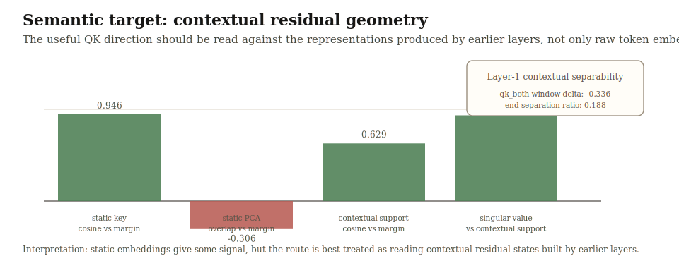
  <figcaption><strong>Figure 12. Contextual semantic target.</strong> The useful question is how `W_QK` aligns with contextual residual states at the prediction/support roles, not whether it is merely close to raw token embeddings.</figcaption>
</figure>

This is why the result is a dense-circuit result:

```text
early layers transform token/context information into residual geometry;
L2H1 W_QK learns a low-rank route that reads that geometry;
the route separates the real support value from distractors.
```

But correlation is still not a training explanation. A growing singular direction can track retrieval quality and still leave open whether that route was actually selected by the realized optimizer update, or whether it only co-moved with other changing quantities. To cross that gap we need to stop looking only at trajectories and start attributing the actual parameter movement.

## Optimizer-Level Why

Weight growth still does not explain why the route formed. For that, we need the actual optimizer update.

The checkpoint update question is:

```text
actual route change:
  C(theta_{t+1}) - C(theta_t)

first-order predicted route change:
  grad C(theta_t) dot Delta theta_actual
```

For the formation-window update attribution:

| rank | window | actual delta | predicted delta | sign match |
| ---: | --- | ---: | ---: | ---: |
| 8 | 750 -> 3500 | +2.03547 | +2.21138 | 11 / 11 |

That says the actual parameter movement points in the direction that grows the rank-8 retrieval matcher.

But this still leaves a deeper question:

```text
Is the current raw batch gradient itself large enough to build the route?
```

The answer is no. In the actual-batch attribution window `750 -> 1000`:

| quantity | value |
| --- | ---: |
| actual route growth | +0.0275398 |
| actual-update predicted growth | +0.0263239 |
| actual-batch route support | +0.0654552 |
| SGD-equivalent contribution | +0.00002618 |

The SGD-equivalent contribution is about `0.095%` of actual route growth. This falsifies the naive story:

```text
wrong:
  the immediate raw gradient directly pushes the route hard enough to build it
```

The stronger run traced training from initialization through step `6000` and decomposed the actual AdamW update.

The trace status is:

```text
instrumented_from_initialization_exact_for_this_trace
```

For `0 -> 6000`, rank-8 `L2H1` support-value route:

| quantity | value |
| --- | ---: |
| actual route growth | +4.11462 |
| actual-update prediction | +5.21768 |
| reconstructed AdamW prediction | +5.21734 |
| reconstruction sign match | 6000 / 6000 |

AdamW decomposition:

| component | contribution | fraction of actual growth |
| --- | ---: | ---: |
| raw SGD | +0.03136 | 0.76% |
| clipped SGD | +0.02404 | 0.58% |
| Adam current gradient | +2.37417 | 57.7% |
| Adam historical momentum | +3.04547 | 74.0% |
| Adam preconditioned total | +5.41964 | 131.7% |
| weight decay | -0.20230 | -4.9% |

<figure class="paper-figure">
  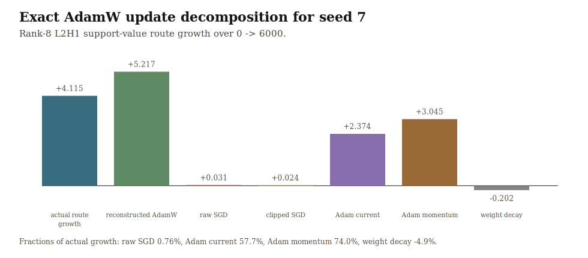
  <figcaption><strong>Figure 13. Optimizer-level explanation.</strong> Raw SGD is tiny. AdamW's preconditioned current-gradient and historical-momentum terms carry the support-value route growth.</figcaption>
</figure>

The phase structure matters:

| window | actual growth | raw SGD | Adam current | Adam momentum | interpretation |
| --- | ---: | ---: | ---: | ---: | --- |
| 0 -> 750 | +0.07007 | -0.00142 | -0.00101 | +0.06746 | weak setup, mostly momentum |
| 750 -> 2500 | +1.66529 | -0.00302 | +0.00495 | +1.60536 | clean momentum-driven formation |
| 2500 -> 3500 | +1.67303 | +0.01987 | +1.16475 | +1.13675 | fresh gradients and momentum amplify route |
| 3500 -> 6000 | +0.70622 | +0.01593 | +1.20549 | +0.23590 | optimizer still pushes, realized growth saturates |

The current answer to “why did it form?” is therefore:

```text
the loss supplies many small gradient signals;
AdamW accumulates and preconditions those signals;
the optimizer state repeatedly pushes W_QK toward a support-value matcher;
once the route becomes useful, fresh preconditioned gradients reinforce it.
```

This is not “SGD selected exactly L2H1 for a universal reason.” It is a measured optimizer-level explanation for this reference run.

## Cross-Seed Validation

A single seed can be a case study. To test whether the role is real, we trained and analyzed 5 additional seeds:

```text
11, 13, 17, 23, 29
```

The replication target was not:

```text
L2H1 wins every time.
```

The replication target was:

```text
some head forms the same support-value retrieval role.
```

For each seed, we scanned all 12 heads, selected winner / runner-up / bottom-control heads by rank-8 support-value-over-distractor QK growth, then ran exact Adam-state attribution for `750 -> 2500`.

Winning heads:

| seed | winning head | scan score | sep vs singular value | sep vs answer margin | support-win delta |
| ---: | --- | ---: | ---: | ---: | ---: |
| 11 | L2H0 | 2.815 | 0.882 | 0.668 | 0.157 |
| 13 | L2H2 | 2.727 | 0.956 | 0.670 | 0.523 |
| 17 | L2H3 | 1.463 | 0.484 | 0.561 | 0.183 |
| 23 | L2H1 | 6.361 | 0.868 | 0.918 | 0.843 |
| 29 | L1H2 | 2.428 | 0.502 | 0.891 | 0.248 |

The winning head changes. Four of five winners are in layer 2; one winner is in layer 1.

<figure class="paper-figure">
  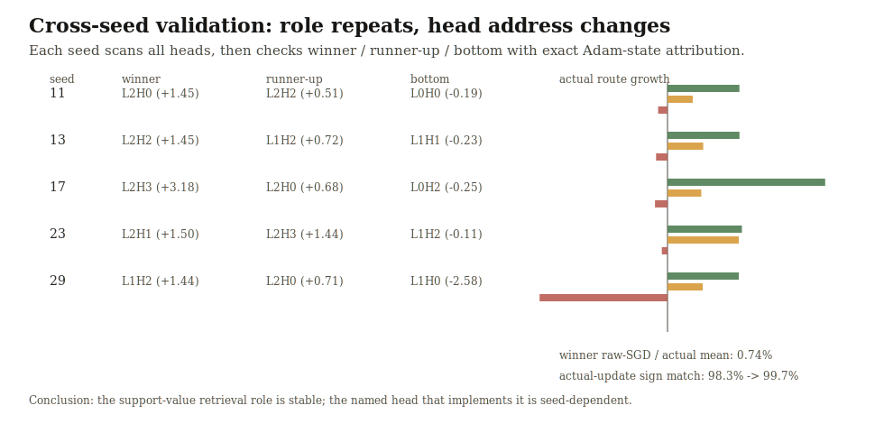
  <figcaption><strong>Figure 14. Cross-seed role replication.</strong> Winner heads grow in the support-value retrieval direction. Runner-up heads often grow too. Bottom-control heads move in the opposite direction.</figcaption>
</figure>

Exact Adam-state attribution gives the stronger control:

| seed | winner | winner actual | runner-up | runner-up actual | bottom | bottom actual |
| ---: | --- | ---: | --- | ---: | --- | ---: |
| 11 | L2H0 | 1.448 | L2H2 | 0.509 | L0H0 | -0.190 |
| 13 | L2H2 | 1.451 | L1H2 | 0.719 | L1H1 | -0.230 |
| 17 | L2H3 | 3.178 | L2H0 | 0.680 | L0H2 | -0.254 |
| 23 | L2H1 | 1.500 | L2H3 | 1.437 | L1H2 | -0.114 |
| 29 | L1H2 | 1.439 | L2H0 | 0.712 | L1H0 | -2.577 |

Across winners:

| seed | winner | raw SGD / actual | clipped SGD / actual | current-gradient / actual | momentum / actual | sign match |
| ---: | --- | ---: | ---: | ---: | ---: | ---: |
| 11 | L2H0 | -0.13% | -0.65% | 39.0% | 79.7% | 99.7% |
| 13 | L2H2 | 0.83% | 0.55% | 63.8% | 62.5% | 99.7% |
| 17 | L2H3 | 1.26% | 1.31% | 101.3% | 47.8% | 98.3% |
| 23 | L2H1 | 1.15% | 1.04% | 91.0% | 55.4% | 99.4% |
| 29 | L1H2 | 0.60% | 0.75% | 52.8% | 66.9% | 99.3% |

The repeated pattern is:

```text
winner actual growth is positive in all 5 seeds;
bottom-control actual growth is negative in all 5 seeds;
raw SGD is consistently tiny;
AdamW preconditioned state consistently carries useful route growth.
```

The cross-seed conclusion is:

```text
the circuit is stable as a role,
but unstable as an address.
```

This is stronger than saying “seed 7 uses L2H1.” It says the task tends to induce a support-value retrieval role, while random initialization decides which head implements it.

## What Is Supported

<figure class="paper-figure">
  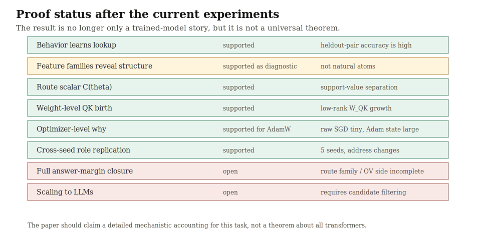
  <figcaption><strong>Figure 15. Proof status.</strong> The project now has behavior, trained-model causality, weight-level birth, optimizer-level attribution, and cross-seed role replication. Full answer-margin closure and scaling remain open.</figcaption>
</figure>

Current supported claims:

| claim | status |
| --- | --- |
| The model learns symbolic latest-write lookup above chance | supported |
| Heldout-pair behavior is meaningful because heldout train pair overlap is zero | supported |
| Feature-family analysis reveals real structure but not natural circuit atoms | supported |
| Neuron coalitions are dense and shared across candidate families | supported |
| L2H1 develops strong support-value retrieval geometry in the reference seed | supported |
| `L2H1 W_QK` forms a low-rank support-value matcher in the reference seed | supported |
| Actual checkpoint updates grow the rank-8 retrieval scalar | supported |
| Exact AdamW reconstruction explains the update direction in the traced run | supported |
| Raw SGD is far too small to explain route formation | supported |
| Adam current-gradient and momentum terms carry most route growth | supported |
| The support-value retrieval role appears across 5 additional seeds | supported |
| The exact winning head is seed-dependent | supported |

## What Is Not Proven

Current limits:

| claim | status |
| --- | --- |
| A small route set fully explains all answer-margin improvement | open |
| The OV/value-write side has as clean a formation story as QK routing | open |
| The current/momentum split is seed-dependent and not yet systematically characterized | open |
| SGD without AdamW would form the same route | not tested |
| The same role appears for every possible seed | not proven |
| The method scales directly to large language models | not proven |
| Individual neurons are the right proof object | not supported |
| Feature-family IDs are natural circuit atoms | not supported |

The most precise current claim is:

```text
In this symbolic KV setting, training repeatedly forms a dense support-value retrieval role.
The role is not tied to one head identity.
In the reference seed, rank-8 L2H1 W_QK becomes the clearest low-rank matcher.
That matcher's route growth is explained by actual AdamW updates,
while raw per-batch SGD is far too small to account for it.
```

## Why This Is Hard Even In A Small Model

The external rule is simple, but the implementation is geometric and dense.

In a hand-written program, the state might be:

```text
query_key = K03
stored_value[K03] = V14
```

The transformer can distribute those variables across:

- residual-stream directions
- QK attention subspaces
- OV write directions
- MLP activations
- neuron combinations
- layer norm scaling
- final unembedding directions

This is why the neuron-first story failed. A neuron can participate in more than one feature, and a feature can be spread across many neurons. Removing one neuron or family often does not isolate one clean variable.

The residual stream is a shared workspace. Early MLPs and attention heads can shape a state that later heads read. That means a component can be causally essential even if its direct logit attribution is weak or negative.

The optimizer adds another layer. The route is not built by one obvious gradient step. It is built by many small signals accumulated and preconditioned by AdamW. Looking only at the current raw gradient misses most of the actual update.

## Why This Matters

The practical value is not the toy task itself. The value is the method:

```text
watch a circuit form in weight space;
connect weight movement to route behavior;
decompose the actual optimizer update that caused it;
check whether the role repeats across seeds.
```

Most interpretability work can say:

```text
this component matters in the trained model
```

This work moves toward:

```text
this optimizer update wrote this route into these weight directions during training
```

The AdamW result matters on its own. A lot of circuit-formation reasoning in the field implicitly treats the current raw gradient as if it were the training signal that built the mechanism. In this traced run that would have told the wrong story. Raw SGD is tiny relative to realized route growth, while AdamW's preconditioned current-gradient and momentum terms carry most of the update. So at least on this task, optimizer-state-blind gradient analysis is not just incomplete; it is systematically misleading about which route is actually being reinforced.

If the method generalizes, it could help with:

- detecting shortcut circuits during training
- tracking when factual-recall routes form
- studying refusal or safety circuits under fine-tuning
- checking whether a model learned the intended mechanism or a brittle alternative
- preserving useful circuits across training changes

There are three major walls:

| wall | why it matters |
| --- | --- |
| scale | large models have many more layers, heads, parameters, and simultaneous behaviors |
| superposition | larger models may distribute the same algorithm across many overlapping directions |
| task overlap | language models learn many algorithms at once, so one weight direction can support multiple behaviors |

The current result is therefore not “we solved interpretability.” It is a concrete step toward training-dynamics interpretability: watching one algorithmic role become implemented in weights under real optimizer updates.

## Main Artifact Sources

| artifact group | path |
| --- | --- |
| dataset geometry | `artifacts/runs/symbolic_kv_reference_formation/analysis/dataset_geometry/` |
| feature families and coalitions | `artifacts/runs/symbolic_kv_reference_formation/analysis/traced_candidates/layer2_family7_family4/` |
| attention geometry | `artifacts/runs/symbolic_kv_reference_formation/analysis/attention_geometry/` |
| path logit decomposition | `artifacts/runs/symbolic_kv_reference_formation/analysis/path_logit_decomposition/` |
| output causal validation | `artifacts/runs/symbolic_kv_reference_formation/analysis/output_component_causal_validation/` |
| residual-state rescue | `artifacts/runs/symbolic_kv_reference_formation/analysis/residual_state_rescue/` |
| weight SVD trace | `artifacts/runs/symbolic_kv_reference_formation/analysis/weight_svd_trace/phase1_000250_5500_top16/` |
| contextual SVD alignment | `artifacts/runs/symbolic_kv_reference_formation/analysis/contextual_svd_alignment/` |
| contextual key separability | `artifacts/runs/symbolic_kv_reference_formation/analysis/contextual_key_separability/` |
| bilinear QK match separation | `artifacts/runs/symbolic_kv_reference_formation/analysis/bilinear_qk_match_separation/` |
| rank update attribution | `artifacts/runs/symbolic_kv_reference_formation/analysis/bilinear_qk_rank_update_attribution/` |
| exact from-init optimizer trace | `artifacts/runs/symbolic_kv_reference_formation/analysis/optimizer_update_trace/from_init_seed7_0000_6000_stepwise/` |
| Adam-state route attribution | `artifacts/runs/symbolic_kv_reference_formation/analysis/bilinear_qk_rank_adam_state_attribution/from_init_l2h1_rank8_support_value_0000_6000_stepwise/` |
| cross-seed validation | `artifacts/runs/symbolic_kv_cross_seed_adam/` |

Supporting pages:

- [Checkpoint Analysis Plan](checkpoint_analysis_plan.md)
- [Shared Feature Dynamics Plan](shared_feature_dynamics_plan.md)
- [Analysis CLI Guide](analysis_cli_guide.md)
