# From Loss To Lookup: Tracing Circuit Formation In A Small Transformer

Nelson Alex

Living draft: 2026-05-06

## Abstract

I study circuit formation in a 3-layer decoder-only transformer trained on a symbolic key-value lookup task. Because the task has a known algorithmic structure, I can define role-level progress measures for support-value retrieval and write/readout coupling. I find that the trained mechanism is dense and not localized to a stable head or neuron identity. Instead, a support-value retrieval role repeatedly forms across random seeds, while its implementing head changes. In the reference seed, the QK side appears as a low-rank `W_QK` matcher whose route growth is tracked by first-order route attribution using the exact AdamW update. The instantaneous raw-gradient, SGD-equivalent update explains only a small fraction of this growth, while AdamW-preconditioned current and momentum terms carry the movement. A matched seed-7 optimizer ablation strengthens this point: AdamW variants learn and form the route, while a same-budget SGD/SGD+momentum learning-rate sweep does not. The write side does not reduce to a clean static `W_OV` matrix or to a pure support-value copy. It creates a prediction-position residual state whose broad value-token identity geometry is causally used by the answer readout, and contextual transfer rescue shows that the prediction slot itself carries much of the recoverable value-code signal. These results support role-level, optimizer-state-aware circuit formation in a controlled model, while leaving full answer-margin closure, broader optimizer sweeps, and scaling open.

## Contributions

I make nine claims that can be checked against the artifact map. They fall into four groups.

| group | claims |
| --- | --- |
| setup | a controlled symbolic key-value benchmark; role-level progress measures for support-value retrieval and write/readout coupling |
| QK route | low-rank `W_QK` crystallization; first-order route attribution using exact AdamW updates; cross-seed role/address dissociation |
| write/readout | contextual residual coupling rather than a static `W_OV` theorem; causal broad prediction-position value code; source-plus-prediction-context transfer rescue |
| optimizer ablation | AdamW variants form the lookup role under the tested recipe; same-budget SGD variants do not |

## Bounded Claim

This is a role-theoretic formation account, not a full closed-form reverse engineering result.

QK is the most complete part of the account: a low-rank support-value pointer forms, the pointer is causal and cross-seed stable at the role level, and first-order attribution using the exact AdamW update tracks its growth in the traced runs. The write/readout side is different. It is a contextual, high-rank prediction-position value-code operation. I characterize that operation with causal subspace interventions, source-plus-context transfer rescue, and optimizer attribution rather than deriving it from a simple prior basis such as Fourier modes.

So the claim is bounded:

```text
In this controlled symbolic transformer, training forms a stable lookup role.
The role moves addresses across seeds.
The route side is a low-rank QK support-value matcher.
The write side is a contextual, high-rank prediction value-code operation.
AdamW-preconditioned updates carry the measured role growth in the traced runs.
```

## The Ghost Moves Rooms

The first surprise was not just that a lookup circuit formed. The surprise was that the same role did not live in the same place.

Across additional seeds, the support-value retrieval role repeated, but the winning head changed:

```text
seed 0011: QK winner L2H0
seed 0013: QK winner L2H2
seed 0017: QK winner L2H3
seed 0023: QK winner L2H1
seed 0029: QK winner L1H2
```

That is the mystery the paper explains. The computation repeats, but the named component changes. The stable object is the role; the unstable object is the address.

The question was simple:

```text
How does training find a circuit?
```

The usual answer is "the gradient found it." That is not precise enough. A model is not updated by a slogan. It is updated by a particular optimizer, on particular batches, through particular weights, over a particular trajectory.

I ran into this early. A transparent feature-family birth model used activation support, amplification, feature-score drive, and aggregate gradient alignment. It predicted `family4` should form first. The model actually formed the more generalizing `family7` first: `family7` became useful at step `2250`, while `family4` followed at step `2500`. `family7` also had the larger useful delta (`0.408` versus `0.234`) and heldout-gap delta (`0.196` versus `0.022`). That failure was useful. It told me a gradient-flavored feature score was not enough. I needed to track the role being written, not just the most tempting feature family.

I follow one small transformer's lookup circuit from the outside inward: behavior, activations, residual states, route geometry, weight movement, optimizer state, and then cross-seed replication. The result is not a clean neuron story. It is a role story.

The strongest claim is this:

```text
Under this training setup, the support-value retrieval role repeatedly appears.
The role is stable.
The named head address is not.
In the traced runs, AdamW-preconditioned updates carry the useful growth,
while the instantaneous raw-gradient, SGD-equivalent direction is tiny.
```

That is the core finding. The write side is real too, but it is not QK again. QK becomes a clean low-rank route matcher. The write side creates a broad value-code state at the prediction position. Removing value identity from that state damages behavior; keeping nearly all of that value-identity geometry almost preserves IID behavior. A later contextual rescue test shows why the write side resisted a simple copy story: the prediction slot already contains a readout-ready value-code scaffold, and support retrieval helps shape that scaffold rather than writing the whole answer code from scratch.

<figure class="paper-figure">
  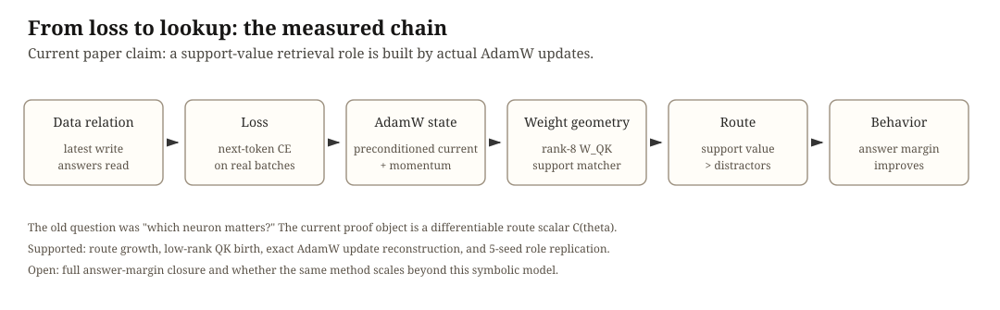
  <figcaption><strong>Figure 1. The measured chain.</strong> I follow one role from loss pressure, to optimizer state, to weight geometry, to route separation, to output behavior.</figcaption>
</figure>

## The Growth Story

I trained a 3-layer decoder-only transformer on symbolic key-value lookup. The model sees writes and reads:

```text
W K03 V14   W K01 V09   R K03   W K03 V02   R K03
```

The correct answer is the latest previous value for the queried key. In the example above, the last read of `K03` should return `V02`, not `V14`, because `V02` is the latest write for that key.

The task is small on purpose. It is not meant to be language modeling. It is meant to be a controlled world where I can ask a sharper question:

```text
when lookup behavior appears, what exactly changed inside the model?
```

The answer is developmental. The model starts as a dense shared substrate with many candidate routes and write paths. The task applies pressure for latest-write lookup. AdamW turns that pressure into a parameter trajectory. A compact QK pointer crystallizes. The write/readout side grows differently: not as one clean OV vector, but as a broad value-code state at the prediction position.

<figure class="paper-figure">
  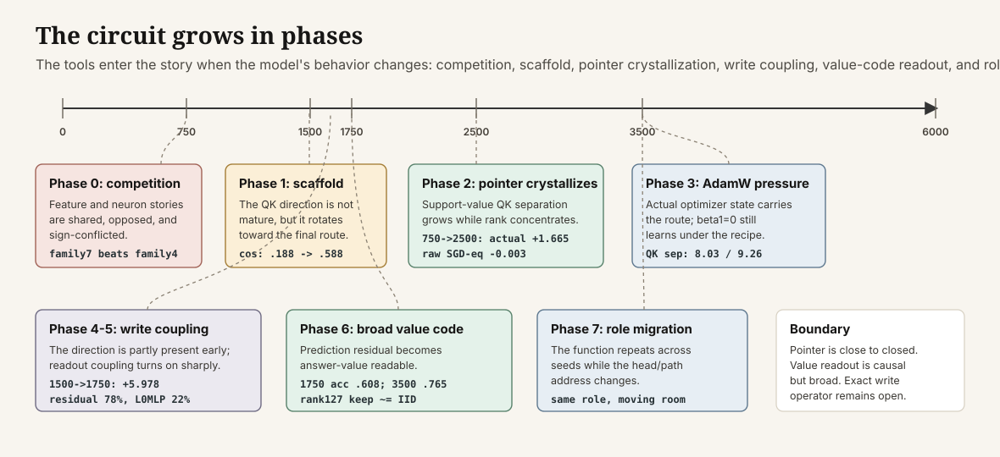
  <figcaption><strong>Figure 2. Circuit growth timeline.</strong> The paper follows overlapping growth stages: dense candidate competition, early scaffold, QK pointer crystallization, optimizer pressure, write/readout coupling, broad value-code readout, later heldout consolidation, and role migration across seeds.</figcaption>
</figure>

The next sections unpack those stages. They overlap in training time, so I use them as a developmental spine rather than a strict chronological partition. The short technical version has two halves.

The QK half asks where the model reads. In the reference seed, `L2H1 W_QK` becomes a low-rank support-value matcher. Its route score grows during formation, its singular structure crystallizes, and first-order route attribution using exact AdamW updates tracks the growth. The raw-gradient, SGD-equivalent update accounts for only about `0.76%` of the route growth in the traced from-initialization run.

A matched optimizer ablation tests whether this is only a post-hoc AdamW story. It is not a universal SGD impossibility proof, but the same-budget result is sharp: AdamW baseline reaches validation answer accuracy `0.976` with QK separation `8.03`; AdamW with `beta1 = 0` reaches `0.984` with QK separation `9.26`; the best SGD+momentum learning-rate sweep run reaches only `0.0085` validation answer accuracy, and the best observed SGD QK separation is about `0.118`.

The write half asks what useful state gets written after reading. This does not reduce to a clean `W_OV` matrix theorem. The better object is a residual perturbation at the prediction position:

```text
C_write(theta) = E_x [ g_ref(x) . delta_write_theta(x) ]
```

In words: remove a source, look at the missing residual change, and ask whether that missing change points in the answer-relevant direction used by the mature model. For the reference seed fixed-readout write scalar over `1500 -> 2500`, the raw-gradient, SGD-equivalent update is about `0.13%` of actual growth. Adam momentum carries about `93%` of the same scalar aggregate in that run.

The residual state that readout uses is now clearer. At `layer_2_post_mlp / prediction`, removing the rank-16 value-identity subspace drops validation margin by `4.97` and validation answer accuracy by `0.288` at step `3500`. Keeping only a very low-rank value subspace fails, but keeping rank `127` value identity almost preserves IID behavior: validation accuracy goes from `0.7647` to `0.7582`. A support-to-prediction transfer partly reconstructs this state, but the stronger rescue uses both support value-code and prediction-position context. So the write/readout side is a contextual broad value-code state, not a tiny OV vector.

Across five additional seeds, both sides repeat at the role level but move at the address level. QK winners include `L2H0`, `L2H2`, `L2H3`, `L2H1`, and `L1H2`. Write winners include paths such as `L1H3 -> L1MLP`, `L1H1 -> L1MLP`, and `L2H1 -> L2MLP`.

This is the same role/address split introduced above. The rest of the paper explains how I measured the role strongly enough to see it move.

## Act 1: The Circuit Did Not Start As A Circuit

The first lesson was negative but important: the circuit was real, but the unit of explanation was not a neuron, feature family, or stable head name.

Component-level maps found load-bearing pieces, but they did not identify a clean atom of computation. Feature-family analysis exposed superposition rather than escaping it: candidate stories shared many neurons, opposed each other through other neurons, and contained sign-conflicted units. Geometry-level interventions also had mixed signs. Even the useful QK and write-side objects are subspaces, not monosemantic components.

This forced the analysis to move from components to roles. A role is a task-level object such as:

```text
prefer the true support value over distractors
```

or:

```text
write a prediction-position residual change that the answer readout can use
```

That premise matters for the rest of the paper. I am not trying to prove that one named head or one neuron is "the circuit." I am tracking whether training writes a role into the model, where that role is instantiated, and which optimizer-state terms carried the movement.

## Related Work

This work sits between mechanistic interpretability and training dynamics.

The transformer architecture comes from [Vaswani et al. 2017](https://arxiv.org/abs/1706.03762). The QK/OV language and the habit of decomposing attention heads into route and write maps follows the transformer-circuits line of work, especially [Elhage et al. 2021](https://transformer-circuits.pub/2021/framework/index.html). The closest circuit-formation precedent is the induction-head work of [Olsson et al. 2022](https://transformer-circuits.pub/2022/in-context-learning-and-induction-heads/index.html), which connects a learned attention circuit to a training-time phase change. I ask a narrower but more optimizer-specific question: which update components actually moved the role scalar during formation?

The superposition framing follows [Elhage et al. 2022](https://transformer-circuits.pub/2022/toy_model/index.html). That is why I do not force a neuron-level theorem when the evidence says the useful object is a subspace.

The write-side interventions are related to causal tracing and model-editing work such as [Meng et al. 2022](https://arxiv.org/abs/2202.05262), but the question is different. Causal tracing asks where a finished model mediates a fact. Here I ask how training forms a reusable write/readout role. That is why the residual intervention is paired with optimizer-state attribution, source-plus-context transfer rescue, and cross-seed role tracking.

The optimizer accounting is specific to AdamW. Adam was introduced by [Kingma and Ba 2014](https://arxiv.org/abs/1412.6980), and decoupled weight decay for AdamW by [Loshchilov and Hutter 2017](https://arxiv.org/abs/1711.05101). Small algorithmic tasks have also been used to study delayed generalization and training dynamics, most famously in grokking work by [Power et al. 2022](https://arxiv.org/abs/2201.02177). I use a small symbolic task for a different purpose: to make a role-level circuit formation story auditable end to end.

## The Growth Medium: A Tiny Lookup World

The task rule is deliberately simple: a read asks for the latest previous write for the same key.

<figure class="paper-figure">
  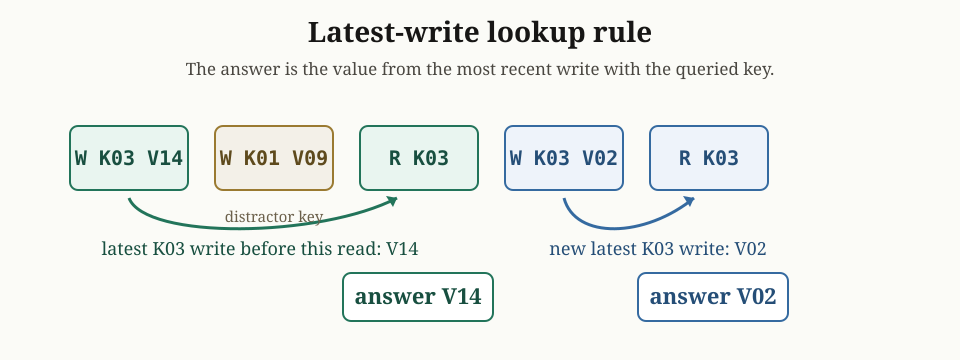
  <figcaption><strong>Figure 3. Latest-write lookup.</strong> The model must return the most recent value written for the queried key, not just any value associated with the key.</figcaption>
</figure>

The split is part of the experiment. IID validation asks whether the model learned the training distribution. Heldout-pair validation asks whether it learned the relation rather than memorizing value pairs.

The benchmark also has shortcut checks. Exact sequence overlap across splits is `0`, latent-program overlap is `0`, and heldout leakage outside the heldout split is `0`. Trivial rules are weak: `first_value_for_key` and `last_value_before_query` score `0`, and the strongest tested `most_frequent_value_before_query` heuristic is only about `0.146`.

<figure class="paper-figure">
  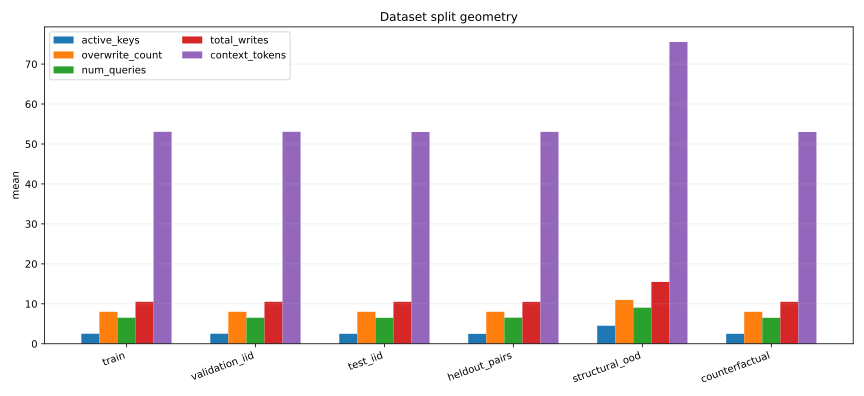
  <figcaption><strong>Figure 4. Split geometry.</strong> The benchmark separates ordinary validation from heldout answer-pair and structural tests.</figcaption>
</figure>

<figure class="paper-figure">
  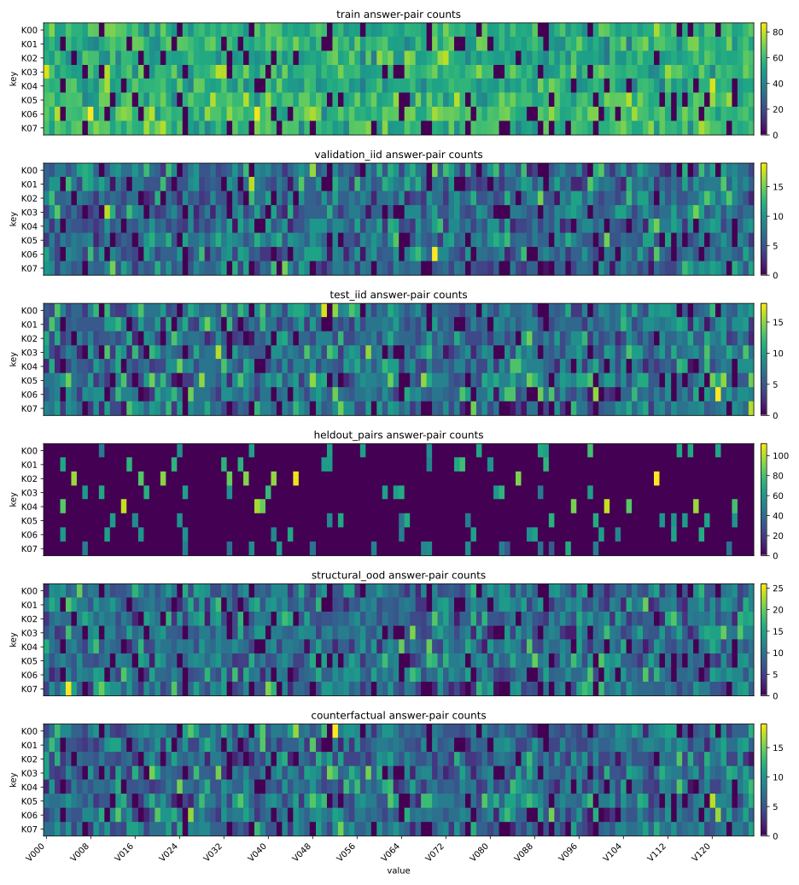
  <figcaption><strong>Figure 5. Answer-pair matrix.</strong> Heldout-pair evaluation checks whether the model can answer key-value combinations excluded from training.</figcaption>
</figure>

There are two closely related seed-7 runs in the paper. `symbolic_kv_heldout_generalization` is the sparse-checkpoint selection run used to choose a strong heldout-generalizing model. `symbolic_kv_reference_formation` uses the same model and optimizer recipe with dense checkpoints, and most of the exact optimizer/SVD formation microscope is taken from its `0 -> 6000` horizon.

The shared model recipe is:

| field | value |
| --- | --- |
| reference seed | 7 |
| layers / heads | 3 / 4 |
| `d_model` / `d_ff` | 128 / 512 |
| parameters | 626,048 |
| batch size / steps | 128 / 16,000 |
| optimizer | AdamW |
| learning rate | 0.0004 |
| betas / weight decay | 0.9, 0.95 / 0.01 |
| gradient clip / warmup | 1.0 / 200 steps |

The selected heldout-generalization run reaches heldout-pair answer accuracy around `0.8730`. Structural OOD remains much weaker, around `0.5082`. The formation microscope is not a different architecture; it is the dense-checkpoint view of the same recipe. That is enough behavior to study formation, but not enough to pretend every generalization question is solved.

## Candidate Circuits Compete Inside The Substrate

I did not start with QK. I started with the obvious maps.

First I asked which components mattered. That found real load-bearing pieces, but it did not explain the computation. Late components often had clean direct readout toward the answer. Early components were different: they were causally important, but their direct logit attribution could be weak or even point the wrong way.

That told me early components were not dead. They were shaping the residual workspace that later components read.

Then I looked for feature families and neurons. This also found structure, but not atoms. The feature-family phase exposed superposition instead of escaping it. In one coalition map, hundreds of neurons were shared by candidate stories, hundreds opposed both, and hundreds were sign-conflicted. A neuron intervention was not isolating one clean variable.

That was the first important lesson:

```text
the circuit was real,
but the unit of explanation was not a neuron.
```

So the search moved from components to roles. A role is a computation-level object: "prefer the true support value over distractors" or "write a prediction-position residual change that the answer readout can use." A role can be implemented by different heads in different seeds.

This changed the project from a component hunt into a formation audit.

The transparent feature-family birth model made the same point quantitatively. It predicted `family4` should form first from activation support, amplification, feature-score drive, and aggregate gradient alignment. The model formed `family7` first instead. `family7` became useful at step `2250`, `family4` followed at step `2500`, and `family7` had the larger useful delta (`0.408` versus `0.234`) and heldout-gap delta (`0.196` versus `0.022`). The local gradient-flavored score picked the tempting sibling; the training trajectory selected the more generalizing role.

## The Algorithm I Am Trying To Close

The circuit is distributed, but the algorithm can still be followed.

I do not need one isolated neuron or one isolated head to claim progress. For this model, a closed algorithm means something more practical:

```text
name the variable being carried,
name the subspace or route carrying it,
show a causal or predictive test,
show when training formed that link,
and mark exactly where the explanation stops.
```

This section is the map, not the proof. The evidence comes in the growth story below, and the full equation-to-tool ledger appears near the end once each object has been introduced.

The task-level algorithm is simple:

```text
given a query key K:
  find the latest previous write with key K
  retrieve its value V
  make V the next-token answer
```

The model-level algorithm I can currently support is:

```text
tokens and positions
  -> contextual key/value residual states
  -> QK pointer from prediction slot to true support-value slot
  -> attention reads a value-bearing residual state
  -> prediction-position residual write
  -> support value-code + prediction context
  -> broad prediction-position value-code state
  -> output readout for the correct value token
```

<figure class="paper-figure">
  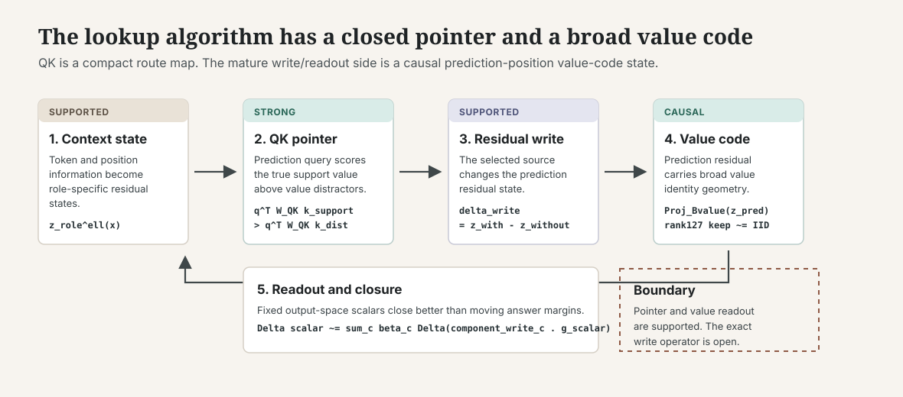
  <figcaption><strong>Figure 6. Lookup algorithm evidence ladder.</strong> The QK pointer is the cleanest closed link. The write/readout side is now identified as a contextual prediction-position value-code state, while the construction of the prediction context and full moving-margin closure remain open.</figcaption>
</figure>

The first step is contextualization. A raw token embedding is not enough. Earlier layers turn key, value, and prediction slots into contextual residual states:

```text
z_role^ell(x)
```

where `role` can mean `query_key`, `support_value`, `value_distractor`, or `prediction`. Contextual SVD and key-separability runs show that useful QK directions align with these contextual states more cleanly than with a naive static embedding story. This is supported, but not closed: I do not yet have a simple formula for how learned token and positional vectors compose into those contextual states.

The second step is the pointer. This is the strongest link:

```text
score(prediction, source)
  = q_prediction^T W_QK k_source
```

and the route scalar is:

```text
C_QK
  = E[score(prediction, support_value)
      - mean score(prediction, value_distractors)]
```

QK is the most complete link in the account. The route appears as low-rank `W_QK` growth, the route scalar rises with singular structure, causal and cross-seed controls select the same role, and first-order attribution using the exact AdamW update tracks the realized growth. In the traced diagnostic window, the sharpening is mostly query-side: the prediction-side geometry learns to ask the right question.

The third step is value movement. This is where the story stops looking like a clean low-rank matrix theorem. The measured object is:

```text
delta_write(x)
  = z_with_source(x) - z_without_source(x)

C_write
  = E[g_ref(x) . delta_write(x)]
```

In words: remove the source, measure the missing residual change, and ask whether that change points in a direction the mature answer readout uses. The evidence says this write mostly lives at the prediction position. The aggregate prediction-position functional write effect is about `+4165.317`; the support-value-position effect is about `-17.307`. Most of the useful signal is residual-skip signal, with `L0MLP` adding a smaller positive nonlinear correction. This is a real computation, but it is not a closed `W_OV` formula.

The stronger write object is contextual. A source-only transfer asks whether support value-code predicts the target prediction value-code:

```text
z_src(x) = P_src h_layer1,support(x)
z_tgt(x) = P_value h_layer2,prediction(x)

z_hat_tgt(x) = A z_src(x) + b
```

That is useful but incomplete. The better model includes the prediction slot's own context:

```text
z_ctx(x) = P_ctx h_layer1,prediction(x)

z_hat_tgt(x) = A z_src(x) + B z_ctx(x) + b
```

This is the concrete write-side mechanism I can currently support: the model does not simply copy a support value into an empty prediction slot. The prediction slot already contains a value-readout scaffold, and the retrieved support value helps shape or select that scaffold.

The fourth step is the value code at prediction. The current best object is not a neuron and not a rank-1 direction. It is broad value-token identity geometry:

```text
B_value
  = top directions of centered value-token embedding states

z_prediction_value
  = projection of z_prediction onto B_value
```

At `layer_2_post_mlp / prediction`, this value-code state becomes useful in the same formation band as the write coupling. Before step `1500`, the prediction state does not read out the answer value. After step `1750`, it does:

| step | final-norm prediction value accuracy | final-norm prediction value margin |
|---:|---:|---:|
| `1500` | `0.0719` | `-0.752` |
| `1750` | `0.6078` | `0.666` |
| `2000` | `0.6797` | `2.730` |
| `2500` | `0.6471` | `3.031` |
| `3500` | `0.7647` | `5.264` |

Removing value identity from that prediction state damages the mature circuit. At step `3500`, removing rank-16 value identity drops validation margin from `5.264` to `0.297` and validation accuracy from `0.7647` to `0.4771`. A rank-matched key-identity removal is much weaker: at the same step, rank-7 value removal drops margin by `2.294`, while rank-7 key removal drops margin by only `0.593` and does not drop validation accuracy.

Keeping only the value-code subspace shows why this is not a low-rank OV theorem. Rank `16` is not sufficient: at step `3500`, keeping only rank-16 value identity gives validation margin `-4.248` and accuracy `0.451`. But keeping nearly all value identity, rank `127`, almost preserves IID behavior: margin `5.707`, accuracy `0.7582`. The write/readout side is therefore broad value-code geometry, not one compact vector.

The fifth step is readout. For fixed output-space scalars, the final residual movement is substantially explainable by component DLA movement:

```text
Delta scalar
  ~= sum_c beta_c Delta(component_write_c . g_scalar)
```

This works best for fixed, differentiable scalars. In the matched `1500 -> 2500` closure run, correct-value logit reaches `R^2 = 0.868`, fixed-source competitor margin reaches `0.639`, and fixed-target competitor margin reaches `0.558`. Moving answer margin is weaker because the wrong-token branch often changes.

So the current algorithm ledger is:

| algorithm step | variable being carried | carrier | evidence | formation |
| --- | --- | --- | --- | --- |
| contextualize slots | key/value role identity | contextual residual states | contextual SVD and key-separability beat static embeddings | early scaffold |
| choose support slot | latest matching support value | QK route from prediction to support-value position | low-rank `W_QK`, route scalar, causal/cross-seed controls | `750 -> 2500` |
| move value evidence | answer-value information | prediction-position residual delta | source ablation, position split, functional write scalar | `1500 -> 2500` |
| form answer code | value-token identity | broad prediction-position value-code subspace | value-identity removal hurts; high-rank keep nearly preserves IID | `1750 -> 3500` |
| restore value code | support value plus prediction scaffold | `A z_src + B z_ctx + b` | contextual transfer rescue nearly restores stable write/readout scalars | `1750 -> 3500` |
| read out answer | correct value logit | final residual and unembedding/readout directions | output closure is strong for fixed scalars; branch-aware margin helps | partial |
| explain formation | why this role formed | optimizer trajectory and data pressure | AdamW attribution, Q/K-side split, train data-gradient support | strongest for QK |

This is the main difference from a fully closed Fourier-style grokking story. I can explain the pointer in weight, activation, causal, optimizer, and cross-seed terms. I can identify the downstream residual object as a broad value-code state. I can show that the useful write is concentrated at the prediction position and that the answer readout causally uses value identity there.

What I cannot yet write down is the exact operator that builds the prediction scaffold itself:

```text
tokens, positions, prior residual stream
  -> prediction-position context
  -> readout-ready value scaffold
```

The algorithm is therefore closed at the level of variables, roles, causal subspaces, and formation timing. It is not yet closed as a fully isolated low-rank write operator or a closed-form equation for the prediction context.

## The Early Scaffold

The first measured growth stage is small but informative.

From `0 -> 750`, the support-value QK route has only weak movement:

```text
actual QK route growth: +0.070
Adam momentum part:     +0.067
```

The final QK direction is not fully present yet, but it is beginning to rotate toward its mature form. In the reference seed, the top `L2H1 W_QK` direction has final-direction cosine about `0.188` at step `250`, about `0.588` at step `750`, and about `0.845` by step `2250`.

This is the scaffold stage. It does not yet look like the finished lookup mechanism. But it biases the later route: a direction is being carved out before it becomes behaviorally dominant.

## Act 2: The Pointer Crystallizes

QK is the clean half because QK is routing.

For one attention head, the effective route map is:

```text
W_QK = W_Q W_K^T
```

The attention score between a prediction-position query and a candidate source position is:

```text
score(prediction, source) = q_prediction^T W_QK k_source
```

The route scalar asks whether the head prefers the true support-value position over value distractors:

```text
C_QK(theta)
  = E[ score(prediction, support_value)
       - mean score(prediction, value_distractors) ]
```

This is not a universal importance metric. It is a task-specific progress scalar. It asks one concrete question:

```text
is this route learning to look at the right previous value?
```

In the reference seed, `L2H1` becomes the clearest route carrier. During the main formation window, rank-8 support-value separation increases by `+4.19295`. The route score tracks QK singular-value growth with correlation `0.9934`.

<figure class="paper-figure">
  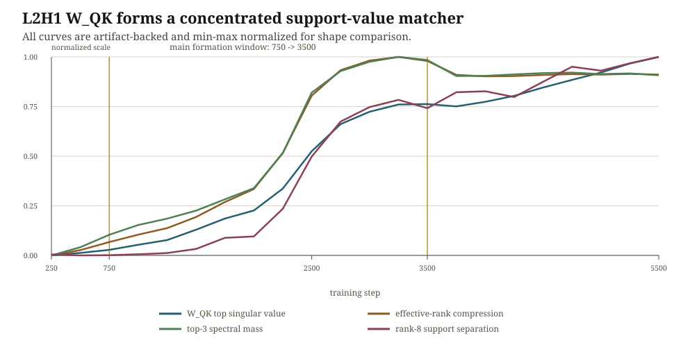
  <figcaption><strong>Figure 7. QK crystallization.</strong> The support-value route becomes concentrated in `L2H1 W_QK`: singular mass grows while effective rank compresses.</figcaption>
</figure>

The singular vectors are not best understood as raw token-embedding directions. The useful route aligns with contextual residual state: what earlier layers have made the key and value positions mean inside the network.

<figure class="paper-figure">
  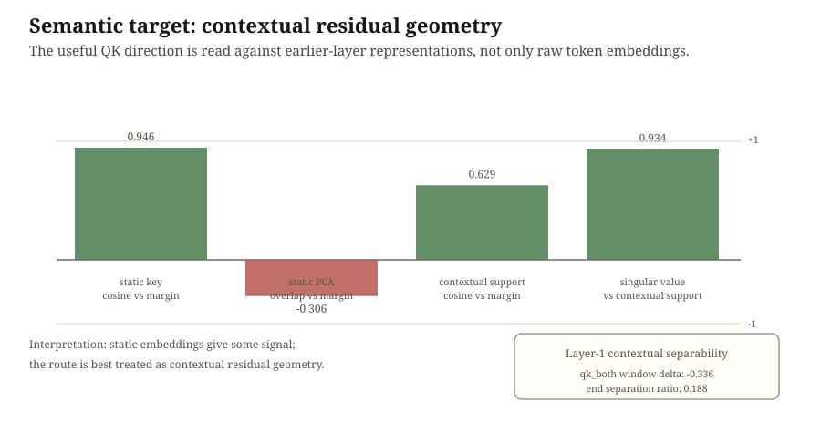
  <figcaption><strong>Figure 8. Context matters.</strong> The route aligns with contextual residual directions more cleanly than with a naive static embedding story.</figcaption>
</figure>

This gives the first complete computational object:

```text
prediction-position query
  scores
true support-value state
  above
value distractor states
```

And it gives a weight-level object:

```text
W_QK = U Sigma V^T
```

The top singular structure of `W_QK` is not just decorative. It grows when the support-value route grows.

## Act 3: Adaptive Preconditioning Shapes The Pointer

The raw gradient did not explain the route birth in the traced run. AdamW's actual update did.

The key optimizer lesson is not simply "momentum did it." The traced AdamW trajectory is momentum-heavy during the clean birth window, but the matched ablation shows that `beta1 = 0` still learns the task and forms an even stronger measured route under this recipe. The more precise claim is about adaptive, preconditioned update geometry: AdamW changes which directions are reachable at this budget.

For every adjacent checkpoint, I measured:

```text
Delta C_QK ~= grad_theta C_QK(theta_t) . Delta theta_actual
```

Then I decomposed the actual update into pieces:

```text
raw SGD-equivalent update
clipped SGD-equivalent update
Adam current-gradient component
Adam historical momentum component
weight decay
reconstructed AdamW update
```

For the reference seed route over `0 -> 6000`:

```text
actual route growth:              +4.11462
reconstructed AdamW prediction:   +5.21734
raw SGD-equivalent / actual:       0.76%
Adam current / actual:            57.7%
Adam momentum / actual:           74.0%
weight decay / actual:            -4.9%
```

The percentages can sum above 100% because components reinforce and oppose each other. The important fact is that the raw SGD-equivalent update is tiny.

The trace is not one uniform story. It has windows:

```text
0 -> 750:
  weak setup; actual +0.070, momentum +0.067

750 -> 2500:
  clean route birth; actual +1.665, raw SGD-equivalent -0.003, momentum +1.605

2500 -> 3500:
  fresh gradients join; actual +1.673, current +1.165, momentum +1.137

3500 -> 6000:
  optimizer still pushes; actual +0.706, current +1.205, momentum +0.236
```

The critical window is `750 -> 2500`. The route grows, but the raw SGD-equivalent term is slightly negative and the current Adam gradient is almost zero. Momentum carries the useful movement.

<figure class="paper-figure">
  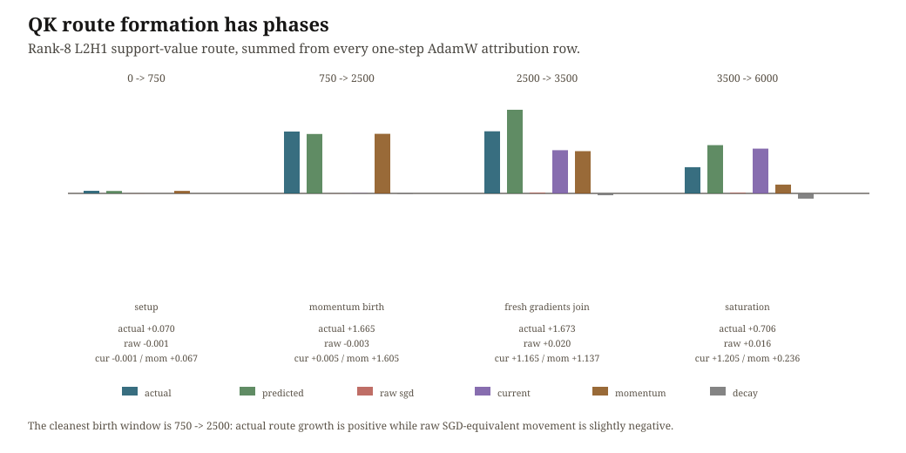
  <figcaption><strong>Figure 9. QK formation has windows.</strong> The cleanest birth window is `750 -> 2500`: the route grows while the raw SGD-equivalent term is slightly negative and Adam momentum carries the useful direction.</figcaption>
</figure>

This does not mean gradients are irrelevant. AdamW is built from gradients. It means the object that wrote the route was not the instantaneous raw gradient alone. The object was the optimizer trajectory: accumulated state, adaptive scaling, and preconditioning.

The update does not land symmetrically inside QK. In the traced `5500 -> 5550` diagnostic window, `L2H1` route sharpening is mostly query-side:

```text
L2H1 query-side actual growth: +0.155511
L2H1 key-side actual growth:   -0.076688
```

The same query-side dominance appears for `L1H2` and `L0H0`, although their key-side terms do not oppose growth as strongly. This is a useful mechanistic detail: AdamW is not merely enlarging a QK matrix. It is mostly shaping the prediction-side residual geometry that asks the right lookup question.

The gradient was not literally lying. It was answering a local-slope question in a dense competition phase. Several candidate routes are being trained at once. Their instantaneous gradient contributions can cancel in the shared parameters, so the raw gradient can look near-zero or even point against the role that will win. Momentum integrates those noisy local samples across steps. The consistent signal survives the cancellation.

The data support is also uneven. A source-checkpoint data-update attribution asks whether data-group loss gradients point along the route gradient. Validation query-key gradients point against the route (`-3.332346`), while train clean query-key gradients support it (`+1.691921`). The support is not uniform across keys: `K07` is strongest at about `+4.25`, while `K01` is weakest at about `+0.16`. So the route is not just an optimizer artifact in the abstract; the train distribution supplies a structured pressure for it.

This raised the obvious control question: if AdamW's actual update explains the route, would plain SGD build the same route under the same experimental recipe?

I ran a matched seed-7 optimizer ablation. The AdamW variants learned the task and formed a strong support-value route:

```text
AdamW baseline:       validation answer accuracy 0.976, QK separation 8.03
AdamW beta1 = 0:      validation answer accuracy 0.984, QK separation 9.26
AdamW beta2 = 0.999:  validation answer accuracy 0.985, QK separation 7.33
```

The matched SGD variants did not:

```text
SGD + momentum, baseline LR:  validation answer accuracy 0.002
plain SGD, baseline LR:       validation answer accuracy 0.000
best SGD + momentum LR sweep: validation answer accuracy 0.0085
best observed SGD QK sep:     about 0.118
```

The best SGD+momentum run is not random. It reaches about `0.340` validation token accuracy and about `0.349` read-key accuracy, but only `0.0085` answer accuracy. It learns some surface/key-position structure while failing the actual value-retrieval computation.

The `beta1 = 0` result matters. It means first-moment momentum is not strictly necessary in this tested AdamW family. The better statement is not "momentum did everything." The sharper hypothesis is that AdamW-style adaptive/preconditioned update geometry makes the route-forming direction reachable under this recipe, while same-budget SGD and SGD+momentum do not.

<figure class="paper-figure">
  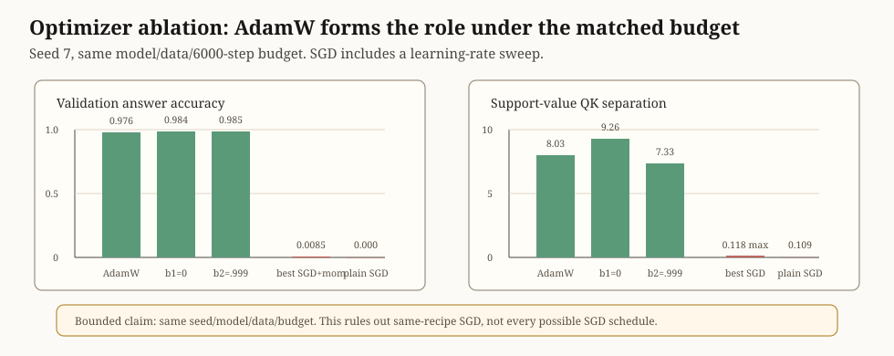
  <figcaption><strong>Figure 10. Optimizer ablation.</strong> AdamW variants learn the lookup role and form a strong support-value route. Same-budget SGD variants do not, even across the tested learning-rate sweep.</figcaption>
</figure>

This is still bounded. It does not prove that SGD can never learn with more steps, different schedules, different initialization scale, or broader tuning. The optimizer ablation tests the same seed, same model, same data, same `6000`-step budget, and the tested SGD/SGD+momentum learning-rate sweep. It rules out the simplest objection: same-recipe SGD did not form the same role under this budget.

The early route-birth story is also not the whole 16k training story. The broader run has three visible behavioral windows: `1500 -> 2000`, where usable lookup first appears; `4250 -> 4750`, where heldout-pair behavior consolidates; and `7500 -> 8000`, where upper-layer representations reorganize. The paper focuses on the early and mid formation microscope because that is where the exact stepwise optimizer traces and QK/write diagnostics are strongest.

## Act 4: The Body Plan Repeats, The Address Moves

The opening mystery needs a control. A circuit story that only works for one head in one seed is weak. So I repeated the route search across five additional seeds.

The support-value retrieval role repeated. The address changed.

```text
seed 0011: QK winner L2H0
seed 0013: QK winner L2H2
seed 0017: QK winner L2H3
seed 0023: QK winner L2H1
seed 0029: QK winner L1H2
```

Winner heads grew positively in all five seeds. Bottom-control heads moved negatively in all five seeds. The raw SGD-equivalent term remained small across winners, with mean raw-gradient fraction around `0.74%`.

This is one of my main interpretability lessons:

```text
component address is unstable;
role pattern is stable.
```

If the question is "does `L2H1` always do it?", the answer is no. If the question is "does a support-value retrieval role form?", the answer is yes.

## Act 5: The Write Side Differentiates Into A Scaffold

QK asks where to read. OV/write asks what useful state gets created after reading.

Those are not the same kind of object.

The natural copy hypothesis is:

```text
retrieve support value -> copy answer code into prediction slot
```

That is too simple. The evidence points to a scaffolded write: the prediction slot is already becoming a value-readout workspace, and retrieved support information helps make that workspace answer-specific. This section follows that differentiation: first the source creates a prediction-position residual change, then that residual becomes a broad value-code state, and finally source-plus-prediction context nearly restores the removed value-code component.

QK produces a score:

```text
query dot key -> attention preference
```

OV writes a vector into the residual stream:

```text
head_output = attention @ V
residual_write = head_output W_O
```

That vector is not judged immediately. It is added to the residual stream, normalized, passed through later attention and MLP blocks, normalized again, and finally unembedded into logits. So the naive question is wrong:

```text
does W_OV point directly at the answer embedding?
```

The useful question is:

```text
does the source write a residual change that the mature model can read as answer-useful?
```

That is why the write scalar is defined through a readout direction:

```text
C_write(theta) = E_x [ g_ref(x) . delta_write_theta(x) ]
```

Here `delta_write_theta(x)` is the residual change caused by a source at a specific position, and `g_ref(x)` is the mature answer-scalar gradient direction at the readout boundary.

<figure class="paper-figure">
  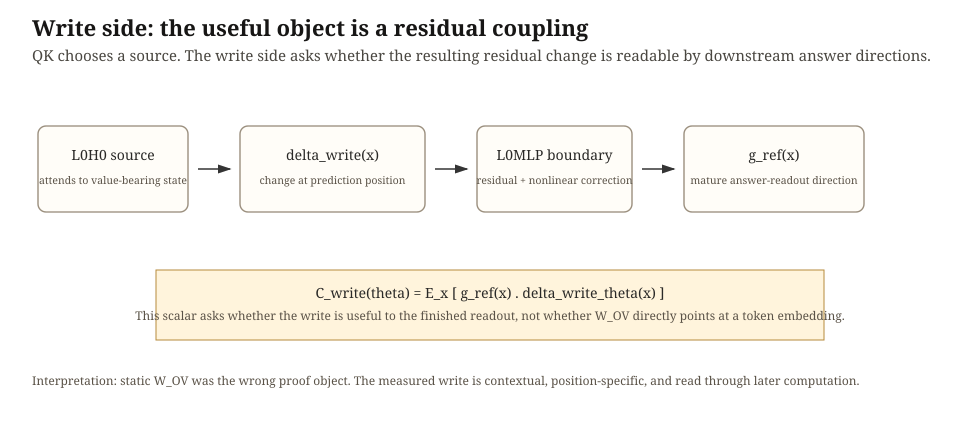
  <figcaption><strong>Figure 11. The write proof object.</strong> The measured write is a residual coupling, not a static `W_OV` answer-vector claim.</figcaption>
</figure>

The value content matters. In the reference seed, forcing `L0H0` to read the correct support-value vector gave a positive OV map score. Keeping the same forced support attention but shuffling the value vector made the score strongly negative. The head had to read the right value-bearing content, not merely attend to a plausible place.

The write lives mostly at the prediction position. Position rescue showed a large prediction-slot effect and almost no useful support-slot effect for the same write scalar. So the story is not "write an answer at the support slot, then carry it forward." The better story is:

```text
the source changes the current prediction residual state;
downstream readout geometry knows how to use that change.
```

## The Write Coupling Turns On

The write direction was not born from nothing. Mature-looking directions are partly present early. What changes sharply is their coupling to answer-readout directions.

This is the key difference from QK. At step `750`, the L0H0-caused input residual delta already overlaps the step-2500 input-delta basis by about `0.661`; the MLP-output delta overlaps the step-2500 MLP-output basis by about `0.721`. So the direction is not random early and mature later. The direction is already partly there. What is missing early is functional coupling: the scalar-relevant write effect is only about `2.864` at step `750`, then jumps to about `50.185` by step `1750` and `91.624` by step `2500`.

For the reference seed, the clearest write/readout boundary is `L0H0 -> L0MLP` at the prediction position. The local decomposition is:

```text
F_l(z) = MLP_l(LN_2(z))

delta_in
  = z_clean[input_stage] - z_L0H0_ablated[input_stage]

mlp_output_delta
  = F_l(z_clean) - F_l(z_ablated)

post_mlp_total_delta
  = delta_in + mlp_output_delta
```

Then the scalar-relevant write effect is:

```text
C_total = E[ g_ref . post_mlp_total_delta ]
        = E[ g_ref . delta_in ]
        + E[ g_ref . mlp_output_delta ]
```

In words: split the useful write into the residual skip part and the nonlinear MLP correction.

<figure class="paper-figure">
  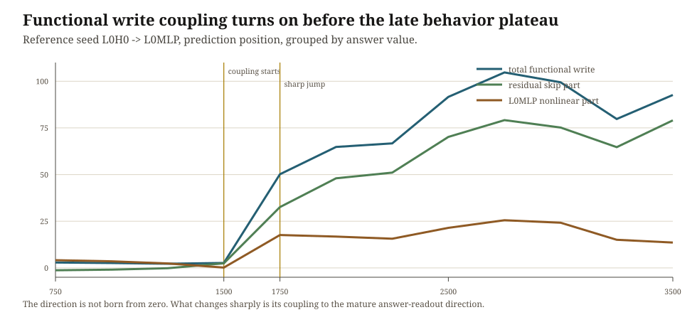
  <figcaption><strong>Figure 12. Functional write birth.</strong> The write-readout coupling jumps around `1500 -> 1750`, mostly through the residual skip part, with `L0MLP` adding a smaller positive correction.</figcaption>
</figure>

Over `1500 -> 2500`, the reference seed fixed-readout write scalar grows by about `+4.06` across the four endpoint/scalar rows. The split is:

```text
input/residual part:       about 78% of the growth
L0MLP output part:         about 22% of the growth
raw SGD-equivalent on total scalar: about 0.13% of actual growth
Adam momentum on total:    about 93% of actual growth
```

The position split is sharp. The aggregate prediction-position functional write effect is about `+4165.317`, while the support-value position is about `-17.307`. This is why I treat the write object as a prediction-slot residual state, not as a support-slot memory object.

This is not the same mechanism as QK. QK visibly forms a low-rank route map. The write side looks more like an already-available residual direction becoming functionally coupled to the mature readout. Later MLPs mostly preserve this useful state through the residual stream; their local nonlinear output can be weak or even oppose the write scalar. `L0MLP` is the clearest positive local converter, adding the smaller nonlinear correction on top of the residual signal.

<figure class="paper-figure">
  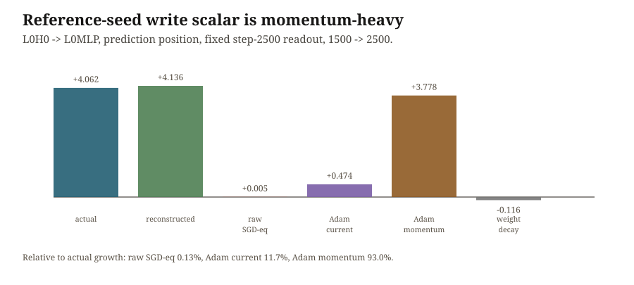
  <figcaption><strong>Figure 13. Reference write optimizer split.</strong> In the reference seed and this fixed-readout scalar, the write coupling is momentum-heavy. This is not the same measurement as the later cross-seed aggregate.</figcaption>
</figure>

## The Readout Becomes A Broad Value Code

The write side creates a value-code state, but not a tiny one.

The next question after "does the prediction residual change usefully?" is:

```text
what is actually present in that residual state?
```

I tested this by comparing prediction-position residual vectors with value-token identity geometry. The value basis is built from centered value-token embedding directions. This is the natural basis for this model because the LM head is tied to the token embedding matrix:

```text
logit(V_i)
  = z_final . embedding(V_i)
```

So if the model is preparing to output `V_i`, one thing I should see is value-token identity geometry at the prediction position.

That is what appears. In the reference run, the final-norm prediction state does not read out the answer value before the write-side birth window:

```text
step 1500:
  value accuracy 0.0719
  value margin  -0.752
```

Immediately after the write coupling turns on, the same prediction-position state becomes answer-value readable:

```text
step 1750:
  value accuracy 0.6078
  value margin   0.666

step 3500:
  value accuracy 0.7647
  value margin   5.264
```

This is the answer to the earlier vague phrase "useful residual information." The useful residual information is, at least on IID/counterfactual behavior, a value-token identity code at the prediction position.

The causal test supports that interpretation. At `layer_2_post_mlp / prediction`, removing rank-16 value identity hurts validation behavior after formation:

```text
step 3500:
  baseline margin       5.264
  value-removed margin  0.297
  margin drop           4.967

  baseline accuracy     0.7647
  value-removed acc     0.4771
  accuracy drop         0.2876
```

A rank-matched key control is much weaker. At the same site and step, rank-7 value removal drops validation margin by `2.294`; rank-7 key removal drops it by only `0.593` and does not reduce validation accuracy.

The sufficiency test gives the important caveat. Keeping only rank-16 value identity destroys much of the behavior:

```text
step 3500, validation_iid:
  baseline:      margin  5.264, accuracy 0.765
  keep rank 16: margin -4.248, accuracy 0.451
```

But keeping nearly the full value identity subspace almost preserves IID behavior:

```text
step 3500, validation_iid:
  keep rank 127: margin 5.707, accuracy 0.758
```

So the write/readout side is not low-rank the way QK is. The QK route forms a compact pointer. The readout side forms a broad value-code state.

### The Prediction Slot Supplies The Scaffold

The next closure attempt asked whether the support value-code itself can rebuild the prediction value-code. This is the most natural copy-style hypothesis:

```text
support value-code -> prediction value-code
```

It works, but only partly. Source-only transfer is strong on stable answer evidence, but does not fully reproduce the margin geometry. At step `3500`, source-only transfer rescues `0.949` of negative-answer-loss damage and `0.750` of value-accuracy damage, but only `0.320` of the fixed removed-branch margin and `-0.080` of the moving margin.

Adding prediction-position context changes the picture. The contextual transfer is:

```text
prediction value-code ~= A support_value_code + B prediction_context + b
```

At step `3500`, this source-plus-context rescue reaches `1.005` on negative answer loss, `0.875` on value accuracy, and `0.754` on the fixed removed-branch margin. That is much closer to the oracle patch.

The important twist is that context alone is already strong:

| step | scalar | source-only | context-only | source + context |
|---:|---|---:|---:|---:|
| `2500` | fixed removed branch | `0.473` | `0.780` | `0.858` |
| `2500` | negative answer loss | `0.835` | `0.968` | `0.995` |
| `3000` | fixed removed branch | `0.252` | `0.718` | `0.872` |
| `3500` | fixed removed branch | `0.320` | `0.640` | `0.754` |
| `3500` | negative answer loss | `0.949` | `0.959` | `1.005` |

So the write side is not "copy the retrieved value into an empty slot." The prediction slot has already been prepared as a value-readout scaffold. The retrieved support value contributes to the scaffold, but the scaffold itself carries much of the recoverable value-code signal.

The split boundary matters. Rank-127 keep is strong on `validation_iid` and `counterfactual`, but does not rescue heldout-pair or structural-OOD margins. So the claim is not "this explains every split." The claim is:

```text
for the mature IID/counterfactual circuit,
the prediction residual contains a broad value-token identity code
that is causally used by the answer readout.
```

## The Write Role Also Moves Rooms

The write role also repeats across seeds, and the address also moves. This matters because it says the role/address split is not only a QK routing phenomenon.

The selected write/readout paths are not always the same:

```text
seed 0011: L1H3 -> L1MLP
seed 0013: L1H3 -> L1MLP
seed 0017: L1H1 -> L1MLP
seed 0023: L2H1 -> L2MLP
seed 0029: L1H1 -> L1MLP
```

Winner write paths have much larger final functional write effects than bottom controls. For fixed-source competitor margin, winners average about `510`, runners about `388`, and bottoms about `177`. For negative answer loss, winners average about `416`, runners about `195`, and bottoms about `10`.

Most of the winner effect is the residual write itself. The winning paths are about `90%` residual-skip effect and about `10%` local MLP-output correction on the two cross-seed write scalars.

First-order attribution using the exact AdamW update across the five selected winner write paths shows the same broad optimizer lesson:

```text
raw SGD-equivalent / predicted: about 1.2%
Adam current / predicted:  about 87%
Adam momentum / predicted: about 14%
weight decay / predicted:  about -1.4%
```

These numbers are different from the reference-seed fixed scalar in Figure 13 because they measure a different object: selected winner write paths across five seeds, aggregated over their write scalars. The current-vs-momentum split varies by seed and address. That matters. The cross-seed write result should be stated as "AdamW-preconditioned updates carry the useful write growth", not "momentum always dominates every write-side run."

<figure class="paper-figure">
  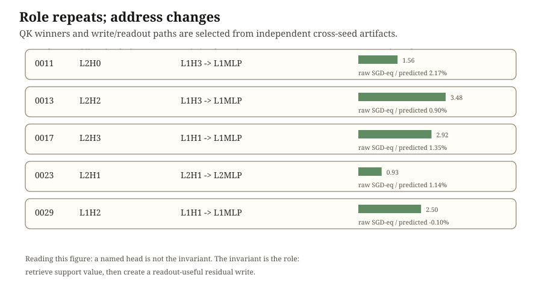
  <figcaption><strong>Figure 14. The ghost moves rooms on both sides.</strong> The retrieval role and the write/readout role repeat, while their component addresses vary with seed.</figcaption>
</figure>

## Methodological Note: Moving Answer Margins Hide Circuits

A route can be real even when it does not fully explain the usual answer margin.

One reason is that the answer margin is not always a stable scalar during training. The correct logit is fixed by the task, but the best wrong token can change across checkpoints or along an interpolation path between checkpoints. When that wrong-token branch changes, the measured margin is no longer one smooth object. It becomes a moving target.

This matters for line-integral and endpoint-gradient diagnostics. These methods assume that I am explaining change in a fixed scalar. If the wrong-token branch changes during the path, then the diagnostic can fail even when the internal route is real and causally important.

For this reason, formation audits should also use fixed-branch or fixed-competitor scalars. Instead of only measuring:

```text
margin = logit(correct) - max_wrong logit(wrong)
```

I also measure fixed output-space quantities where the competitor or readout direction is held constant. These fixed scalars give a cleaner target for route attribution, line integrals, and optimizer-update accounting.

In the matched `1500 -> 2500` formation-window audit, the best wrong-token competitor changed in `312 / 512` rows (`60.9%`). That is not a small nuisance. On those switch rows, the target-branch correction carried about `71.6%` of the moving-margin energy. Direct moving-margin output closure reached only `R^2 = 0.407` over all rows. Holding the branch fixed and adding the exact branch correction improved the switch-row comparison from `0.416` direct to `0.506 -> 0.517`.

This is not only a limitation of this run. It is a methodological caution for future circuit-formation audits. If the scalar being explained changes branches during training, the circuit can be hidden by the measurement.

## The Computation Ledger

This is the current end-to-end computation story.

This is also the reproducible mathematical ledger. Each line names the variable, the equation I measure, and the tool that reproduces it.

| object | measured equation | reproducing tool |
| --- | --- | --- |
| QK route | `C_QK = E[s_support - mean(s_distractor)]` | `bilinear-qk-match-separation` |
| QK route birth | `Delta C_QK ~= grad C_QK . Delta theta_actual` | `bilinear-qk-rank-adam-state-attribution` |
| write scalar | `C_write = E[g_ref . delta_write]` | `mlp-input-functional-subspace-report` |
| write growth | `Delta C_write ~= grad C_write . Delta theta_actual` | `mlp-functional-write-adam-state-attribution` |
| value code | `z_value = B_value^T h_prediction` | `value-code-subspace-report` |
| value-code causality | remove or keep `Proj_B_value(h_prediction)` | `geometry-subspace-intervention` |
| source-only transfer | `z_hat = A z_support + b` | `value-code-transfer-map-report` |
| contextual transfer | `z_hat = A z_support + B z_prediction_context + b` | `value-code-transfer-rescue` |
| fixed readout | `logit(V_i) = h_final^T E[V_i]` | `output-route-closure` |
| branch-aware margin | fixed or split wrong-token branch | `answer-margin-branch-decomposition` |

The pointer half:

```text
q_prediction^T W_QK k_support_value
  >
q_prediction^T W_QK k_value_distractor
```

In words: at the prediction position, a QK route scores the true support-value position above distractor value positions.

The write/readout half:

```text
delta_write(x)
  = residual_with_source(x) - residual_without_source(x)

C_write
  = E_x [ g_ref(x) . delta_write(x) ]
```

In words: the source creates a prediction-position residual change that points in a direction the mature answer readout uses.

The local boundary:

```text
post_mlp_total_delta
  = residual_skip_delta + local_mlp_output_delta
```

In words: most of the measured fixed-readout write signal is already present in the residual skip, and `L0MLP` adds a smaller positive correction in the reference seed.

The value-code boundary:

```text
z_prediction_value
  = projection_B_value(z_prediction)
```

In words: the mature prediction residual carries broad value-token identity geometry. Removing value identity hurts behavior; keeping nearly all of it almost preserves IID behavior.

The contextual transfer boundary:

```text
z_hat_prediction_value
  = A z_support_value + B z_prediction_context + b
```

In words: support value-code helps restore the target prediction value-code, but prediction context already carries much of the recoverable signal. The write operator is contextual, not a pure support-value copy.

The proof ledger is:

| claim | measured object | status |
| --- | --- | --- |
| QK route | `C_QK = E[score(pred, support) - mean score(pred, distractors)]` | strong |
| QK weight birth | `W_QK = W_Q W_K^T = U Sigma V^T` | strong |
| QK optimizer cause | `Delta C_QK ~= grad C_QK . Delta theta_actual` | strong for AdamW-trained runs |
| cross-seed QK role | winner / runner / bottom scans across five seeds | strong |
| write functional subspace | `C_write = E[g_ref . delta_write]` | supported |
| prediction value code | value-identity projection at `layer_2_post_mlp / prediction` | supported and causal; broad |
| source-only value transfer | `z_hat = A z_support + b` | supported but partial |
| contextual value transfer | `z_hat = A z_support + B z_prediction_context + b` | supported for stable write/readout scalars |
| write optimizer cause | `Delta C_write ~= grad C_write . Delta theta_actual` | supported for AdamW-trained runs |
| static `W_OV` theorem | raw `W_OV` low-rank answer-vector story | not supported |
| full answer-margin closure | small route/write family explains all behavior | partial |
| matched-budget SGD ablation | AdamW variants versus SGD variants under seed-7 LR sweep | AdamW succeeds; SGD sweep fails; broader SGD remains open |

The [artifact map](artifact_map.html) links each row of this ledger to the run family that supports it.

The ledger is important because it keeps three claims separate:

```text
causal claim:
  ablating or patching this object changes behavior

dynamic claim:
  optimizer updates built this object during training

computational claim:
  this object implements this operation
```

I have all three strongly for the QK side. For the write side, I have causal evidence for the prediction-position value code, dynamic evidence for write/readout growth, and a contextual transfer model that nearly restores stable write/readout scalars. I do not have a clean static `W_OV` theorem or a closed-form equation for how the prediction context itself is built.

## What Would Weaken This Claim

The role-level interpretation has concrete failure modes.

It would be weakened if bottom-control heads showed the same route growth as selected winners, if cross-seed winners failed to separate from runners and bottom controls, or if the support-value route scalar did not survive heldout and distractor controls. It would also be weakened if the AdamW reconstruction failed to track actual route movement.

The write-side interpretation would be weakened if shuffled-value controls preserved the write scalar, if support-position rescue matched prediction-position rescue, if value-identity removal failed to hurt behavior, if key-identity controls matched value-identity interventions, if contextual transfer failed to improve stable rescue scalars, or if selected write/readout subspaces failed cross-seed validation. Those are the reasons I treat QK as strong, the value-code readout as supported and causal, the contextual write operator as supported, and the closed-form construction of prediction context plus full answer-margin closure as still open.

## Closure: What I Explain And What I Do Not

A route can be real without fully explaining the answer margin.

During `1500 -> 2500`, a 14-route family containing QK pointer terms, early write terms, and output proxies gives partial route-to-scalar closure. It explains more of clean fixed or differentiable scalars than of negative answer loss, but it does not close the whole behavior.

Output-space closure is stronger in the same window. For correct-value logit, route/write scalar closure is about `R^2 = 0.37`, while output-space closure reaches `0.868` in the matched branch/fixed-scalar run. Fixed-source competitor margin reaches `0.639`; fixed-target competitor margin reaches `0.558`; moving answer margin reaches only `0.407`, for the branch-switching reason above.

<figure class="paper-figure">
  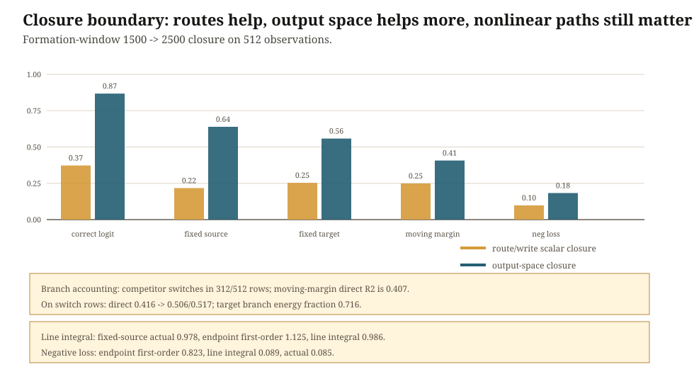
  <figcaption><strong>Figure 15. Closure boundary.</strong> Route/write scalars are meaningful coordinates, but output-space closure is stronger, and nonlinear path curvature explains part of the remaining gap.</figcaption>
</figure>

The other closure problem is nonlinear write-side conversion. A first-order endpoint gradient can be badly wrong. The line-integral diagnostic shows that integrating along the path can follow the actual endpoint change much better than a single endpoint linearization, especially for negative answer loss.

The value-code transfer runs make that boundary more concrete. Source-only support-to-prediction transfer is useful but partial. Source-plus-prediction-context transfer nearly restores stable write/readout scalars: at step `3500`, it rescues `1.005` of negative-answer-loss damage and `0.754` of fixed removed-branch margin damage. But context-only rescue is already high (`0.959` and `0.640` on the same two scalars), so the remaining algorithmic question is how the prediction context became a value-readout scaffold in the first place.

So the honest closure statement is:

```text
route/write scalars are meaningful;
output-space closure is stronger;
source plus prediction context nearly closes stable write/readout rescue;
full moving-margin sufficiency by a small route set remains open.
```

## What This Means

The important interpretability object is not always a named head or neuron. In this model, the stable object is a role.

This matters because seed-level replication fails if I use the wrong address. `L2H1` is not always the circuit. But a support-value retrieval role appears across seeds. A contextual write/readout role appears across seeds too.

The value-code result sharpens what that write/readout role is doing in the reference run. It is not merely "making the residual better." It creates a prediction-position state whose broad value-token identity geometry is enough to almost preserve IID answer behavior when kept at high rank, and whose removal damages the mature circuit. The contextual transfer rescue adds the next piece: the support value-code does not act alone. The prediction slot itself supplies much of the value-code scaffold, and support retrieval helps make that scaffold answer-specific.

Formation tracking adds something that post-hoc interpretability does not usually give. A trained-model circuit analysis can say:

```text
this component matters now.
```

The formation audit can ask:

```text
did training actually write this role into the weights,
and which optimizer-state terms carried that movement?
```

That is the difference between a static circuit map and a developmental account.

<figure class="paper-figure">
  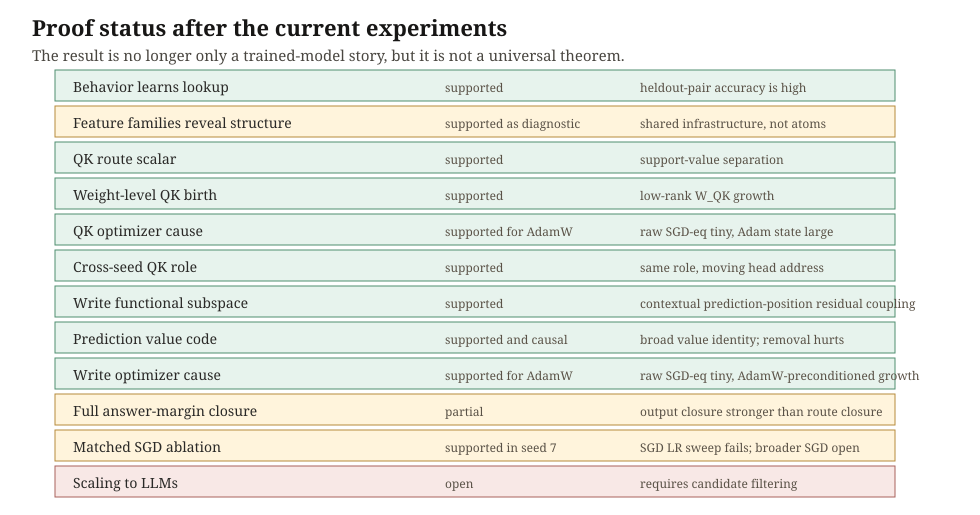
  <figcaption><strong>Figure 16. Proof status.</strong> I have strong QK formation evidence, causal value-code readout evidence, and contextual write-transfer evidence, with explicit open gaps around prediction-context construction and full moving-margin closure.</figcaption>
</figure>

## Limitations And Future Tests

This is a controlled mechanistic case study, not a universal theory of transformers.

The main limitations are:

| limitation | current status |
| --- | --- |
| full answer-margin closure | partial; output-space closure is stronger than route closure |
| matched-budget SGD vs AdamW training ablation | run for seed 7; AdamW variants learn and form the role, SGD LR sweep does not |
| scaling across width, depth, and task families | not done here |
| neuron-level decomposition | blocked by superposition; subspace-level methods are more honest |
| static `W_OV` low-rank theorem | not supported by current evidence |
| pure support-to-prediction value copy | incomplete; source-only transfer helps but does not close stable margins |
| closed-form prediction-context construction | not yet derived; current proof is role/subspace-level |

The write-side current-vs-momentum variation is not a weakness to hide. It is a finding: the reference-seed fixed write scalar is momentum-heavy, while the cross-seed selected-winner aggregate is mostly Adam current-gradient with a smaller momentum contribution. The stable statement is that AdamW-preconditioned updates carry write growth and the raw SGD-equivalent term is tiny.

The optimizer ablation is still not the final word. It is one seed, one architecture, one training budget, and a finite learning-rate sweep. The current claim is therefore bounded: under the matched seed-7 recipe, AdamW variants learn and form the route, while the tested SGD variants do not. Longer SGD runs, broader schedules, different initialization scales, and cross-seed optimizer ablations remain future tests.

The remaining write-side closure target is specific. To close the prediction scaffold, I would need to decompose `h_layer1,prediction` into embedding, learned position, attention, MLP, residual-skip, and layernorm contributions; show which pieces construct the value-code scaffold; and then run the same remove/restore tests on those pieces. That is a new closure project, not a missing row in the current evidence table.

Other next experiments are:

```text
1. scale width/depth and test whether role-address dissociation persists;
2. apply the role-level method to another task family;
3. derive or falsify a closed-form construction of the prediction-position value scaffold;
4. improve closure with residual-state and line-integral proof objects.
```

## Conclusion

This study does not show that all transformer circuits form this way. It shows that, in a controlled symbolic retrieval setting, the stable unit of formation can be a role rather than a component address. The QK side of that role becomes visible as a low-rank support-value matcher, and first-order attribution using the exact AdamW update shows that AdamW-preconditioned updates, not the instantaneous raw-gradient direction alone, carry its growth. A matched seed-7 ablation supports the optimizer story: AdamW variants form the role, while the tested SGD variants do not. The write side repeats across seeds as a contextual residual coupling rather than a clean `W_OV` matrix. In the reference run, the mature prediction residual contains a broad value-token identity code that the answer readout causally uses, and source-plus-prediction-context transfer nearly restores stable write/readout scalars. The result is therefore an empirical algorithm ledger: the measured variables and causal subspaces are reproducible, while the write side is not yet derived from a simple prior basis like Fourier modes. The remaining challenge is to test whether this role-level, optimizer-state-aware account survives broader optimizer sweeps, scaling, and less synthetic tasks, and to derive a closed-form construction of the prediction-position value scaffold if one exists.

## Audit Trail

The paper page is the narrative. The other pages are the audit surface.

Use the reproducibility page for exact commands, environment notes, and expected outputs. Use the CLI guide for the tools added during this project. Use the artifact map to connect each claim to its run directory.

The most important artifact families are:

```text
QK birth:
  weight_svd_trace
  bilinear_qk_match_separation
  bilinear_qk_rank_adam_state_attribution

cross-seed QK:
  symbolic_kv_cross_seed_adam/*/cross_seed_head_selection.json
  symbolic_kv_cross_seed_adam/*/bilinear_qk_rank_adam_state_attribution

write-side functional subspace:
  mlp_input_functional_subspace
  mlp_functional_subspace_trajectory
  mlp_functional_write_adam_state_attribution

value-code readout:
  value_code_subspace
  value_code_causal_intervention
  value_code_transfer_map
  value_code_transfer_rescue

closure:
  route_to_scalar_closure
  output_route_closure
  answer_margin_branch_decomposition
  component_output_rescue_line_integral
```

The research claim is intentionally bounded:

```text
In this small symbolic transformer,
AdamW-trained circuit formation is best explained at the role and subspace level.

QK forms a low-rank support-value route.
The write side forms a contextual residual coupling and a broad prediction-position value-code state.
Both roles replicate across seeds while their component addresses move.
```

## References

- Vaswani, Ashish, Noam Shazeer, Niki Parmar, Jakob Uszkoreit, Llion Jones, Aidan N. Gomez, Lukasz Kaiser, and Illia Polosukhin. [Attention Is All You Need](https://arxiv.org/abs/1706.03762). 2017.
- Kingma, Diederik P., and Jimmy Ba. [Adam: A Method for Stochastic Optimization](https://arxiv.org/abs/1412.6980). 2014.
- Loshchilov, Ilya, and Frank Hutter. [Decoupled Weight Decay Regularization](https://arxiv.org/abs/1711.05101). 2017.
- Elhage, Nelson, Neel Nanda, Catherine Olsson, et al. [A Mathematical Framework for Transformer Circuits](https://transformer-circuits.pub/2021/framework/index.html). Transformer Circuits Thread, 2021.
- Olsson, Catherine, Nelson Elhage, Neel Nanda, et al. [In-context Learning and Induction Heads](https://transformer-circuits.pub/2022/in-context-learning-and-induction-heads/index.html). Transformer Circuits Thread, 2022.
- Elhage, Nelson, Tristan Hume, Catherine Olsson, et al. [Toy Models of Superposition](https://transformer-circuits.pub/2022/toy_model/index.html). Transformer Circuits Thread, 2022.
- Meng, Kevin, David Bau, Alex Andonian, and Yonatan Belinkov. [Locating and Editing Factual Associations in GPT](https://arxiv.org/abs/2202.05262). 2022.
- Power, Alethea, Yuri Burda, Harri Edwards, Igor Babuschkin, and Vedant Misra. [Grokking: Generalization Beyond Overfitting on Small Algorithmic Datasets](https://arxiv.org/abs/2201.02177). 2022.
