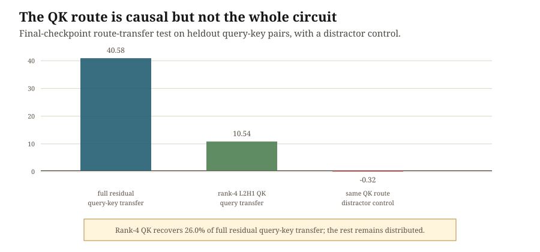
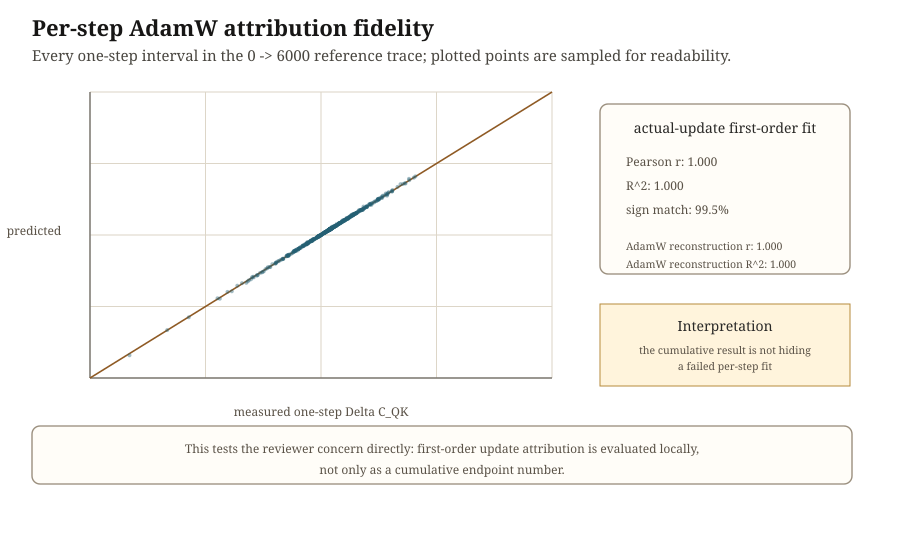
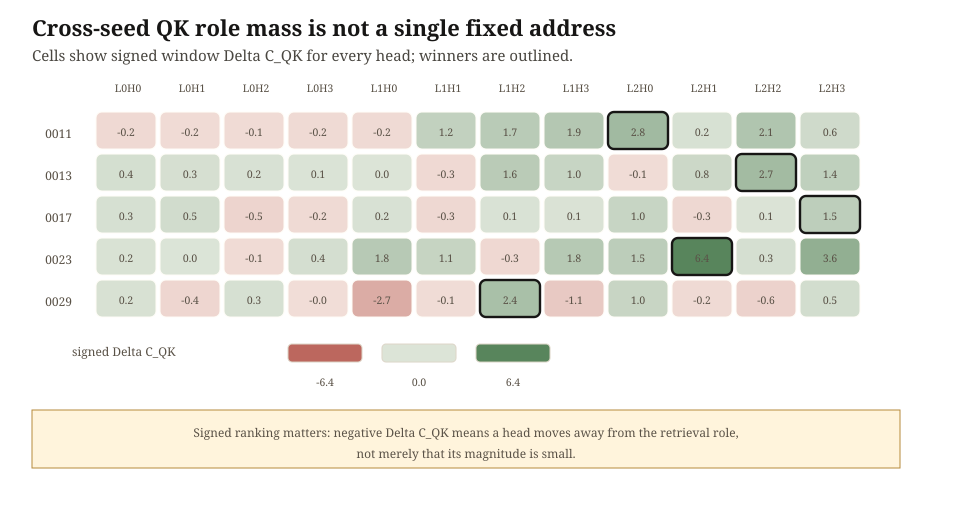
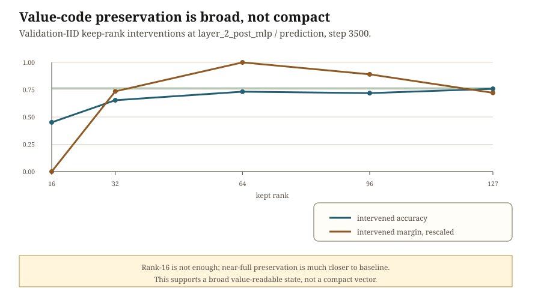

# From Loss To Lookup: Tracing Circuit Formation In A Small Transformer

Nelson Alex

Living draft: 2026-06-11

## How To Read This Draft

This is the public, readable version of the paper. It is longer than a workshop PDF because it explains the story, the math objects, and the evidence in one place. The command-level audit trail lives in the [reproducibility page](reproducibility.html) and the [analysis CLI guide](analysis_cli_guide.html).

The main claim is narrow. I am not claiming a universal theory of transformer circuits. I am claiming that, in one controlled symbolic lookup model, a retrieval role can be followed from behavior into route geometry, causal tests, optimizer-update attribution, cross-seed address movement, and write/readout structure.

## Abstract

Mechanistic interpretability often studies trained circuits after they already exist. I study how one circuit-like role forms during training.

The setting is a small decoder-only transformer trained on a symbolic latest-write key-value lookup task. A read token asks for a key, and the model must return the most recent value previously written for that key. The task is synthetic, but it forces three separable internal operations: identify the queried key, retrieve the latest matching support value rather than a distractor or stale value, and write value identity into the prediction-position residual stream.

The clearest result is on the QK side. In the reference seed, a support-value retrieval role forms as a low-rank `W_QK` matcher. Causal route-transfer tests show that the route carries a real query-key variable, while also showing that the full mechanism remains distributed. First-order attribution using the actual AdamW parameter update tracks the measured route growth; the instantaneous raw-gradient / SGD-equivalent direction explains little of that movement. Across additional seeds, the retrieval role repeats, but the winning head address changes.

The write/readout side is real but less closed. It is better described as a contextual, high-rank prediction-position value-code operation than as a clean static `W_OV` theorem. The result is a controlled formation audit, not a full closed-form reverse engineering result.

## The Paper In One Screen

<div class="claim-box">
<p><strong>One-sentence claim.</strong> In this controlled symbolic transformer, the more stable object is a lookup role, not a named component address: the QK side becomes a low-rank support-value pointer built along the actual AdamW update trajectory, while the write/readout side becomes a broad contextual value-code state at the prediction position.</p>
</div>

<div class="evidence-grid">
  <div class="evidence-card">
    <strong>What forms?</strong>
    A support-value retrieval role measured by `C_QK`, not a single fixed neuron or universally fixed head.
  </div>
  <div class="evidence-card">
    <strong>Where is it clean?</strong>
    The QK route. `W_QK = W_Q W_K^T` becomes low-rank and separates the true support value from distractors.
  </div>
  <div class="evidence-card">
    <strong>What builds it?</strong>
    In the traced AdamW run, first-order attribution using the actual parameter update tracks route growth; raw SGD-equivalent movement is tiny.
  </div>
  <div class="evidence-card">
    <strong>What moves?</strong>
    Across seeds, the role repeats while the winning head address changes.
  </div>
  <div class="evidence-card">
    <strong>What is weaker?</strong>
    The write side. It is causal and measurable, but broad and contextual rather than a compact closed-form `W_OV` copy rule.
  </div>
  <div class="evidence-card">
    <strong>What remains open?</strong>
    Full moving-margin closure, a closed-form write operator, broad optimizer sweeps, scaling, and real-language transfer.
  </div>
</div>

| Claim | Main evidence | Boundary |
| --- | --- | --- |
| QK route forms | `C_QK` growth, low-rank `W_QK`, support-over-distractor separation | strongest part of the account |
| QK route is causal | full residual transfer `40.58`, rank-4 QK transfer `10.54`, distractor control `-0.317` | important but not the whole circuit |
| AdamW tracks route growth | cumulative attribution plus one-step fidelity scatter | first-order scalar attribution, not exact nonlinear equality |
| Role/address dissociation | all-head cross-seed role-mass heatmap and winner/control attribution | six seeds in one task family |
| Write/readout is contextual | prediction-position split, value-code intervention, transfer rescue | causal but not closed-form |

### Reader Glossary

| term | meaning here |
| --- | --- |
| component | a named module such as an attention head or MLP block |
| address | the component name that currently carries a role, such as `L2H1` |
| role | a task-level function measured by a scalar, such as retrieving the true support value |
| route growth | positive change in a role scalar such as `Delta C_QK` |
| QK | the attention part that scores where a position should look |
| OV / write | the attention part that adds a vector after attention has selected sources |
| residual perturbation | the vector change added to the residual stream by a component |
| direct readout | how much a vector points directly toward the answer logits before later processing |

<figure class="paper-figure">
  
  <figcaption><strong>Figure 1. The measured chain.</strong> The audit follows one role from loss pressure, to optimizer state, to weight geometry, to route separation, to output behavior.</figcaption>
</figure>

## Introduction

A trained circuit is the adult form. This paper asks what happened while it was growing.

That biological language is only a reading aid. I do not mean that neural networks literally grow like organisms. I mean that the finished mechanism can hide its developmental history. A trained model may contain a clean-looking behavior, but during training the useful structure can pass through dense, overlapping, partially competing states.

The first surprise was negative. I did not start with the QK route. I first tried component maps, feature families, neuron groups, and causal interventions. They found real structure, but they did not find a stable atom of computation. Early components could be causally important while having weak or misleading direct logit attribution. Feature families shared neurons, opposed each other, and sometimes predicted the wrong birth order.

That failure changed the object of study. Instead of asking:

```text
which head or neuron is the circuit?
```

I asked:

```text
which task-level role is being written into the model,
and how does that role move through weights, activations, and optimizer state?
```

I use **role** to mean a task-level computational function measured by a scalar, independent of which component implements it. A role is not a mystical object. It is a measurable question. For this task, the main role is:

```text
at the prediction position, score the true support value
above distractor values.
```

This matters because component names are not always the right explanatory unit. In this model, the retrieval role repeats across seeds, but the winning head changes. The head address is a room. The role is the thing moving through rooms.

The paper has three positive results and one boundary.

First, the QK side is the strongest result. In the reference seed, `L2H1 W_QK` becomes a low-rank support-value matcher. It is not merely a pretty attention pattern: route-transfer tests show that the rank-4 QK query route transfers a real query-key variable, while a distractor control is near zero or negative.

Second, the optimizer accounting is informative. In the traced AdamW run, route growth is tracked by first-order attribution using the actual AdamW parameter update. The instantaneous raw-gradient / SGD-equivalent direction explains little of the measured movement. This does not mean gradients are irrelevant. AdamW is built from gradients. The point is narrower: the local raw-gradient direction alone is not the update object that explains the measured role growth in this run.

Third, role/address dissociation appears across seeds. The support-value retrieval role repeats, but the winning head changes. The write/readout role also repeats with moving component paths.

The boundary is the write side. QK has a compact matrix object, `W_QK`. Write/readout does not reduce to a similarly clean static `W_OV` theorem. The better current account is:

```text
support value-code + prediction context
  -> prediction-position value-code
  -> answer readout
```

This account is causal and artifact-backed, but not closed-form.

## Related Work

This work uses standard transformer-circuit language. The transformer architecture is from [Vaswani et al. 2017](https://arxiv.org/abs/1706.03762). The QK/OV decomposition follows the Transformer Circuits framework of [Elhage et al. 2021](https://transformer-circuits.pub/2021/framework/index.html). I use that language; I do not claim it as new.

Circuit formation has already been studied. [Olsson et al. 2022](https://transformer-circuits.pub/2022/in-context-learning-and-induction-heads/index.html) connect induction heads to a training-time phase change. [Singh et al. 2024](https://openreview.net/forum?id=O8rrXl71D5) study what must go right for induction heads to form. My setting is different: latest-write symbolic lookup rather than induction-copy, with emphasis on role-scalar growth, actual optimizer-update attribution, and a write/readout side that does not become a clean static OV map.

Progress-measure work is the closest precedent for tracking circuit formation with interpretable scalars. [Power et al. 2022](https://arxiv.org/abs/2201.02177) introduced grokking as delayed generalization on small algorithmic datasets. [Nanda et al. 2023](https://openreview.net/forum?id=9XFSbDPmdW) reverse-engineer modular addition and use mechanistic progress measures to divide training into phases. This paper follows that tradition, but the role is retrieval/write rather than Fourier modular addition, and the role growth is tied to the actual AdamW update trajectory.

Superposition motivates subspace and role-level explanations. [Elhage et al. 2022](https://transformer-circuits.pub/2022/toy_model/index.html) show how features can share representational capacity. [Bricken et al. 2023](https://transformer-circuits.pub/2023/monosemantic-features/) push analysis toward learned feature decompositions. In this model, superposition shows up pragmatically: component and feature-family analyses find load-bearing structure, but not stable atoms of the lookup computation.

Role/address dissociation also has precedent. [Tigges et al. 2024](https://openreview.net/forum?id=3Ds5vNudIE) show that circuit algorithms can remain consistent across training and scale even when implementing attention-head identities change. This paper should not be read as the first claim that algorithms can outlive head names. The narrower contribution is a from-initialization formation audit of such a role in a controlled benchmark, tied to route geometry, causal tests, and optimizer-update attribution.

Causal circuit methods are also inherited. Causal tracing and model-editing work such as [Meng et al. 2022](https://arxiv.org/abs/2202.05262) localizes facts in trained models. Path patching [Goldowsky-Dill et al. 2023](https://arxiv.org/abs/2304.05969), automated circuit discovery [Conmy et al. 2023](https://openreview.net/forum?id=89ia77nZ8u), and EAP/EAP-IG [Hanna et al. 2024](https://huggingface.co/papers/2403.17806) provide methods and faithfulness language for circuit discovery. I use related causal logic, but the target is formation over training, not only circuit discovery at one checkpoint.

Mechanistic data attribution asks where interpretable mechanisms come from. [Chen et al. 2026](https://huggingface.co/papers/2601.21996) trace interpretable LLM units to influential training samples. My work is complementary: instead of attributing a trained unit to corpus examples, I track the growth of a controlled role scalar through checkpoints and optimizer updates.

The optimizer result is specific to AdamW. Adam is from [Kingma and Ba 2014](https://arxiv.org/abs/1412.6980), and decoupled weight decay from [Loshchilov and Hutter 2017](https://arxiv.org/abs/1711.05101). The current evidence does not prove that SGD can never learn this task. It shows that under the tested seed-7 recipe and finite budget, AdamW-family runs formed the role while tested SGD and SGD+momentum runs did not.

## Method / Setup

### The Task

The task rule is latest-write lookup. The sequence contains writes and reads:

```text
W K03 V14   W K01 V09   R K03   W K03 V02   R K03
```

The final read should return `V02`, not `V14`, because `V02` is the latest previous write for key `K03`.

<figure class="paper-figure">
  
  <figcaption><strong>Figure 2. Latest-write lookup.</strong> The model must return the most recent value written for the queried key, not just any value associated with the key.</figcaption>
</figure>

The task is small on purpose. It is a microscope, not a benchmark for language ability. It is still not trivial: the model must identify the queried key, distinguish the latest matching value from stale values and distractors, and put value identity into the prediction-position residual stream.

The benchmark includes shortcut checks. Exact sequence overlap across splits is `0`, latent-program overlap is `0`, and heldout leakage outside the heldout split is `0`. Trivial heuristics are weak: `first_value_for_key` and `last_value_before_query` score `0`, while the strongest tested `most_frequent_value_before_query` heuristic is only about `0.146`.

<figure class="paper-figure">
  
  <figcaption><strong>Figure 3. Split geometry.</strong> The benchmark separates ordinary validation from heldout answer-pair and structural tests.</figcaption>
</figure>

<figure class="paper-figure">
  
  <figcaption><strong>Figure 4. Answer-pair matrix.</strong> Heldout-pair evaluation checks whether the model can answer key-value combinations excluded from training.</figcaption>
</figure>

### Model And Runs

The shared model recipe is:

| field | value |
| --- | --- |
| reference seed | `7` |
| layers / heads | `3 / 4` |
| `d_model` / `d_ff` | `128 / 512` |
| parameters | `626,048` |
| batch size / steps | `128 / 16,000` |
| optimizer | AdamW |
| learning rate | `0.0004` |
| betas / weight decay | `0.9, 0.95 / 0.01` |
| gradient clip / warmup | `1.0 / 200 steps` |

There are two seed-7 runs that can be confused if they are not named clearly.

`symbolic_kv_heldout_generalization` is the sparse-checkpoint selection run used to choose a strong heldout-generalizing model. It reaches heldout-pair answer accuracy around `0.8730`, while structural OOD remains weaker at around `0.5082`.

`symbolic_kv_reference_formation` uses the same model and optimizer recipe with dense checkpoints. Most exact optimizer/SVD formation analysis uses its `0 -> 6000` horizon. The dense run is not treated as an independent cross-seed replication.

### Vocabulary

The internal names are engineering names for matrix operations.

| term | plain meaning in this paper |
| --- | --- |
| residual stream | the shared vector workspace passed through the model |
| QK | the part of attention that decides where a position looks |
| OV / write | the part of attention that decides what vector is added after looking |
| MLP | a nonlinear transformation of the residual stream |
| route | a measured path by which one position affects another |
| role | a task-level function measured by a scalar, independent of the component address |
| address | the named component that currently carries a role, such as `L2H1` |

This vocabulary matters because the names are not the computation itself. They are handles for directions, subspaces, and matrix products inside a learned system.

### Measured Objects

The QK route scalar is:

```text
C_QK(theta)
  = E_x[ score_theta(prediction, support_value)
       - mean_d score_theta(prediction, value_distractor_d) ].
```

This asks whether the prediction position scores the true support value above distractor values.

The write scalar is:

```text
C_write(theta)
  = E_x[ g_ref(x) . delta_write_theta(x) ].
```

Here `delta_write` is the residual change caused by a source component, and `g_ref` is a mature answer-relevant readout direction.

For first-order update attribution, I use:

```text
Delta C
  ~= grad_theta C(theta_t) . Delta theta_actual.
```

The parameter update is measured exactly from checkpoints and optimizer state. The scalar attribution is first-order. That distinction is important: I am not claiming the scalar change is exactly linear.

For AdamW decomposition, `Delta theta_actual` is split into raw SGD-equivalent, clipped SGD, Adam current-gradient component, Adam historical-momentum component, weight decay, and reconstructed AdamW update.

Each major claim is linked to an artifact family: QK route birth, optimizer attribution, cross-seed scans, write-side functional subspaces, value-code interventions, transfer rescue, and closure diagnostics. The reproducibility page and CLI guide give the command-level audit trail.

## Results

The formation story has overlapping stages. Dense candidate structure appears first. Then a QK pointer crystallizes. Optimizer-state geometry shapes the pointer. The role repeats across seeds while the address moves. The write side differentiates into a prediction-position scaffold and broad value-code readout.

<figure class="paper-figure">
  
  <figcaption><strong>Figure 5. Circuit growth timeline.</strong> The stages overlap in training time. I use them as a developmental spine, not a strict chronological partition.</figcaption>
</figure>

### 1. Before The Pointer: Dense Candidate Substrate

The circuit did not start as a clean circuit.

Component maps found load-bearing pieces, but they did not identify a stable atom of computation. Late components often had clean direct readout toward the answer. Early components were messier: they were causally important, but their direct logit attribution could be weak or even point the wrong way. That means an early component can matter by shaping the workspace used by later components, even if it does not directly write the final answer logit.

The feature-family pass sharpened the problem. I hoped feature families would be cleaner than neurons. They were useful, but not clean atoms. Candidate stories shared neurons, opposed each other through other neurons, and contained sign-conflicted units. One transparent feature-family birth model predicted the wrong family would form first. That failure is what forced the role-level framing.

The useful conclusion is not:

```text
feature analysis failed.
```

It is:

```text
feature and component analysis found real structure,
but the stable explanatory object was not a neuron, feature family, or named head.
```

So I use the dense early substrate as motivation, not as the main claim. The main claim begins when the role scalar becomes measurable.

### 2. The QK Pointer Crystallizes

QK is the cleanest part of the account.

In attention, QK decides which source positions a destination position scores highly. For the lookup task, the important destination is the prediction position, and the important source is the true support value. The key question is:

```text
does the prediction position score the true support value
above distractor values?
```

In the reference seed, the answer becomes yes. `L2H1 W_QK` becomes a low-rank support-value matcher:

```text
W_QK = W_Q W_K^T.
```

The route appears as measured `C_QK` growth, singular-value concentration, and support-value-over-distractor separation.

<figure class="paper-figure">
  
  <figcaption><strong>Figure 6. QK birth.</strong> The reference route becomes visible as low-rank `W_QK` growth and support-value-over-distractor separation.</figcaption>
</figure>

This is the closest part of the paper to a closed mechanistic object. There is a weight-space matrix, a role scalar, a trajectory, and a route interpretation that all point in the same direction.

### 3. The QK Pointer Is Causal, But Not The Whole Circuit

A route scalar alone is not enough. It could be a correlated measurement rather than a mechanism. So I also use a route-transfer test.

The route-transfer score asks how much clean behavior returns when a chosen route is patched from the clean run into a corrupted run:

```text
route_score
  = patched_transfer_margin - corrupted_transfer_margin.
```

At the final checkpoint:

| object patched | query-key transfer |
| --- | ---: |
| full `layer_1_post_mlp` residual | `40.58` |
| rank-4 `L2H1` QK query route | `10.54` |
| same QK route on distractor pairs | `-0.317` |

<figure class="paper-figure">
  
  <figcaption><strong>Figure 7. QK route transfer.</strong> The rank-4 `L2H1` QK query route transfers a real query-key variable, while the distractor control is negative. It recovers about a quarter of full residual transfer, so the mechanism is important but distributed.</figcaption>
</figure>

This is exactly the kind of result the paper needs to stay honest. The route is causal. It is not the whole circuit. The full residual state transfers much more than the best small QK route.

### 4. The Actual AdamW Update Tracks Route Birth

The optimizer question is:

```text
which update object explains the route growth?
```

The relevant first-order measurement is:

```text
Delta C_QK
  ~= grad_theta C_QK(theta_t) . Delta theta_actual.
```

In the from-initialization trace:

| quantity | value |
| --- | ---: |
| actual route growth | `+4.11462` |
| AdamW reconstruction | `+5.21734` |
| raw SGD-equivalent contribution | `+0.03136` |
| raw SGD-equivalent / actual | `0.76%` |

So the instantaneous raw-gradient / SGD-equivalent direction is much too small to explain the route birth in the traced run. The actual AdamW parameter update is the right explanatory object for this scalar.

The same attribution is not only an endpoint story. On the one-step trace, measured `Delta C_QK` and first-order prediction from the actual parameter update line up almost exactly after rounding: Pearson `r = 1.000`, `R^2 = 1.000`, and sign match `99.5%`. This does not make the nonlinear scalar change exact over long intervals, but it answers the local-fidelity concern.

<figure class="paper-figure">
  
  <figcaption><strong>Figure 8. Per-step AdamW fidelity.</strong> The one-step actual-update prediction matches measured `Delta C_QK` locally. The cumulative endpoint mismatch is therefore not hiding a failed per-step attribution.</figcaption>
</figure>

The update also does not land symmetrically inside QK. In a traced `5500 -> 5550` diagnostic window, the leading route sharpens mostly through the query side:

| term | actual growth |
| --- | ---: |
| `L2H1` query-side term | `+0.155511` |
| `L2H1` key-side term | `-0.076688` |

This is a useful mechanistic detail. AdamW is not simply enlarging a QK matrix. It is mostly shaping the prediction-side geometry that asks the right lookup question.

The phase structure matters:

```text
0 -> 750:
  weak early setup

750 -> 2500:
  clean route birth; actual +1.665
  raw SGD-equivalent -0.003
  Adam momentum +1.605

2500 -> 3500:
  current gradient and momentum both push

3500 -> 6000:
  optimizer still pushes, but realized route growth saturates
```

<figure class="paper-figure">
  
  <figcaption><strong>Figure 9. QK formation has windows.</strong> The cleanest birth window is `750 -> 2500`: the route grows while the raw SGD-equivalent term is slightly negative and Adam momentum carries the useful direction.</figcaption>
</figure>

The matched seed-7 optimizer ablation is a bounded control, not an impossibility theorem. Under the tested recipe and finite `6000`-step budget:

| variant | validation answer accuracy | QK separation |
| --- | ---: | ---: |
| AdamW baseline | `0.976` | `8.03` |
| AdamW `beta1 = 0` | `0.984` | `9.26` |
| best SGD+momentum sweep | `0.0085` | `~0.118` |

The `beta1 = 0` result is important. It means the story is not simply "first-moment momentum is necessary." The sharper claim is about adaptive preconditioning under the tested budget. AdamW changes which directions are reachable quickly.

The best SGD+momentum run was not random noise. It learned shallow structure: token accuracy around `0.340` and read-key accuracy around `0.349`, but answer accuracy only `0.0085`. It learned that the task has structure, but it did not form the value-retrieval role.

<figure class="paper-figure">
  
  <figcaption><strong>Figure 10. Bounded optimizer ablation.</strong> AdamW-family runs solve and form the measured route under the tested recipe. Same-budget SGD variants do not. This is not a universal SGD impossibility theorem.</figcaption>
</figure>

### 5. The Role Repeats While The Address Moves

For cross-seed scans, heads are ranked by the predefined support-value route scalar on the same fixed probe set. Winners are top positive movers. Controls are bottom-ranked or weak/negative movers under the same scalar.

I rank by signed `Delta C_QK`, not by `|Delta C_QK|`, because negative movement is meaningful: it means a head is moving away from the retrieval role, not merely that its magnitude is small.

<figure class="paper-figure">
  
  <figcaption><strong>Figure 11. Cross-seed role mass.</strong> The heatmap shows signed `Delta C_QK` for every head in each seed. The winner changes, but positive route mass is structured rather than an arbitrary argmax over identical heads.</figcaption>
</figure>

Across five additional seeds, the winning head changed:

| seed | QK winner | scan score | support-win delta |
| ---: | --- | ---: | ---: |
| `0011` | `L2H0` | `2.815` | `0.157` |
| `0013` | `L2H2` | `2.727` | `0.523` |
| `0017` | `L2H3` | `1.463` | `0.183` |
| `0023` | `L2H1` | `6.361` | `0.843` |
| `0029` | `L1H2` | `2.428` | `0.248` |

Winner-vs-control attribution over `750 -> 2500` shows that this is not just all heads growing:

| seed | winner | winner actual | bottom | bottom actual |
| ---: | --- | ---: | --- | ---: |
| `0011` | `L2H0` | `1.448` | `L0H0` | `-0.190` |
| `0013` | `L2H2` | `1.451` | `L1H1` | `-0.230` |
| `0017` | `L2H3` | `3.178` | `L0H2` | `-0.254` |
| `0023` | `L2H1` | `1.500` | `L1H2` | `-0.114` |
| `0029` | `L1H2` | `1.439` | `L1H0` | `-2.577` |

Winner heads grow positively in all five seeds. Bottom controls move negatively in all five seeds. Raw SGD-equivalent contribution is tiny across winners, with mean raw-gradient fraction around `0.74%` of actual route growth.

<figure class="paper-figure">
  
  <figcaption><strong>Figure 12. Role/address dissociation.</strong> The support-value retrieval role repeats across seeds, but the winning head address changes. The write/readout role also repeats with moving component paths.</figcaption>
</figure>

The interpretation is precise:

```text
within this setup, the measured role is more stable than the component address.
```

It is not:

```text
all transformer roles always move addresses.
```

### 6. The Write Side Is Contextual, Not QK Again

The write side is the main mechanistic gap and also the most interesting boundary.

For QK, the clean object is:

```text
W_QK = W_Q W_K^T.
```

For write/readout, the better object is a contextual residual perturbation at the prediction position. OV writes into the residual stream, but that write is later processed by residual addition, layer norm, later attention, MLPs, final normalization, and unembedding. So the right question is not:

```text
does W_OV point directly at the answer embedding?
```

The right question is:

```text
does the residual vector written by the component land in directions
that the later network reads as answer evidence?
```

For an MLP block:

```text
delta_in
  = z_clean[input_stage] - z_source_ablated[input_stage]

mlp_output_delta
  = MLP(z_clean[input_stage]) - MLP(z_source_ablated[input_stage])

post_mlp_total_delta
  = delta_in + mlp_output_delta
```

For a scalar `s` with residual gradient `g_s = grad_z s`:

```text
C_total = E[g_s . post_mlp_total_delta]
        = E[g_s . delta_in] + E[g_s . mlp_output_delta]
        = C_skip + C_mlp.
```

The position split is decisive:

| position | aggregate scalar-relevant effect |
| --- | ---: |
| `prediction` | `4165.317` |
| `support_value` | `-17.307` |

The useful write-side signal is overwhelmingly at the prediction/read position. This rules out the simple picture where the model writes the answer at the support slot and then carries it forward.

The local split shows that `L0MLP` is the only tested MLP with a large positive local conversion:

| component | total effect | residual/direct part | MLP-transformed part |
| --- | ---: | ---: | ---: |
| `L0MLP` | `1648.453` | `1219.088` | `429.365` |
| `L1MLP` | `1329.142` | `1399.580` | `-70.438` |
| `L2MLP` | `1187.722` | `1319.112` | `-131.390` |

Most of the write side is residual carrying, with a smaller local positive conversion at `L0MLP`.

<figure class="paper-figure">
  
  <figcaption><strong>Figure 13. Write/readout mechanism.</strong> The measured write is a contextual residual coupling, not a static `W_OV` answer-vector claim.</figcaption>
</figure>

The mature-looking write directions are present surprisingly early. Against a step-2500 reference basis, `delta_in` overlap is already about `0.661` at step `750`; MLP-output overlap is about `0.721`. But the scalar-relevant effect is tiny until the birth window:

| step | total functional write effect | residual/direct part | L0MLP transformed part |
| ---: | ---: | ---: | ---: |
| `750` | `2.864` | `-1.257` | `4.121` |
| `1500` | `2.647` | `2.472` | `0.174` |
| `1750` | `50.185` | `32.584` | `17.601` |
| `2500` | `91.624` | `70.177` | `21.446` |
| `3500` | `92.627` | `79.046` | `13.582` |

<figure class="paper-figure">
  
  <figcaption><strong>Figure 14. Write coupling birth.</strong> The mature-looking write direction is partly present early. What turns on sharply around `1500 -> 1750` is coupling to answer/value readout directions.</figcaption>
</figure>

The write-side optimizer attribution is also AdamW-carried in the reference seed. For the fixed-readout write scalar over `1500 -> 2500`:

| quantity | value |
| --- | ---: |
| actual scalar growth | `1.015` |
| first-order actual-update prediction | `1.034` |
| raw SGD fraction | `0.124%` |
| Adam current-gradient fraction | `11.50%` |
| Adam momentum fraction | `91.35%` |
| weight decay fraction | `-2.85%` |
| actual-update sign match | `99.7%` |

Across selected cross-seed write paths, the current-vs-momentum split varies more. The safe statement is that raw SGD-equivalent movement stays tiny and AdamW-preconditioned updates carry the useful write growth.

### 7. The Prediction Residual Becomes A Broad Value Code

The prediction-position residual state becomes value-readable during formation.

At `layer_2_post_mlp / prediction`, removing the rank-16 `embedding_value_identity` subspace damages validation behavior after the value code turns on:

| step | baseline margin | intervened margin | margin drop | baseline acc | intervened acc | acc drop |
| ---: | ---: | ---: | ---: | ---: | ---: | ---: |
| `1750` | `0.666` | `-1.157` | `1.822` | `0.6078` | `0.2092` | `0.3987` |
| `2500` | `3.031` | `-0.634` | `3.666` | `0.6471` | `0.3595` | `0.2876` |
| `3500` | `5.264` | `0.297` | `4.967` | `0.7647` | `0.4771` | `0.2876` |

A rank-matched key-identity control is weaker. At step `3500`, rank-7 value removal drops margin by `2.294`, while rank-7 key removal drops margin by only `0.593` and does not drop validation accuracy.

Low-rank value identity is not sufficient. At step `3500`:

```text
baseline:      margin  5.264, accuracy 0.765
keep rank 16: margin -4.248, accuracy 0.451
keep rank127: margin  5.707, accuracy 0.758
```

The available keep-rank sweep gives a coarser curve:

<figure class="paper-figure">
  
  <figcaption><strong>Figure 15. Value-code dimensionality curve.</strong> Keeping rank 16 is far from enough, while near-full rank preservation is much closer to baseline. The current curve is coarse, but it supports the broad-code interpretation.</figcaption>
</figure>

<div class="boundary-box">
<p>The rank-127 result should not be read as a compact-code result. In a 128-dimensional residual stream, keeping 127 dimensions is close to keeping the whole state. I read this as evidence against a small low-rank value-vector story and in favor of a broadly distributed value-readable prediction-position state.</p>
</div>

The broad-code claim has split boundaries. Rank-127 keep is strong on `validation_iid` and `counterfactual`, but does not rescue heldout-pair or structural-OOD margins. The current claim is:

```text
for mature IID/counterfactual answer behavior,
the prediction-position residual contains a broad value-identity code
that the readout causally uses.
```

### 8. The Prediction Slot Supplies Much Of The Scaffold

The next question was whether the support value-code is copied into the prediction value-code.

The source-only transfer model is:

```text
z_hat_prediction_value = A z_support_value + b.
```

This helps, but only partly. At step `3500`, source-only transfer rescues `0.949` of negative-answer-loss damage and `0.750` of value-accuracy damage, but only `0.320` of the fixed removed-branch margin and `-0.080` of the moving margin.

The contextual model is:

```text
z_hat_prediction_value
  = A z_support_value + B z_prediction_context + b.
```

At step `3500`, source-plus-context rescue reaches:

| scalar | source-only | context-only | source + context |
| --- | ---: | ---: | ---: |
| fixed removed branch | `0.320` | `0.640` | `0.754` |
| negative answer loss | `0.949` | `0.959` | `1.005` |
| value accuracy | `0.750` | not isolated | `0.875` |

<figure class="paper-figure">
  
  <figcaption><strong>Figure 16. Contextual transfer.</strong> Support value-code transfer is real, but prediction-position context already carries much of the recoverable value-code scaffold.</figcaption>
</figure>

This is the main write-side twist. The support value does not write the whole answer code from scratch. The prediction slot already carries much of the readout-ready value-code scaffold, and support retrieval helps shape that scaffold into the answer-specific state.

The cross-seed write audit supports a role-level version of this story. It ran `28 / 28` functional-subspace reports. Selected winner write paths were:

| seed | source head | downstream MLP |
| ---: | --- | --- |
| `0011` | `L1H3` | `L1MLP` |
| `0013` | `L1H3` | `L1MLP` |
| `0017` | `L1H1` | `L1MLP` |
| `0023` | `L2H1` | `L2MLP` |
| `0029` | `L1H1` | `L1MLP` |

The write role repeats, and the address also moves. But this evidence is weaker than QK because the write object is broader and more contextual.

### 9. Moving Answer Margins Can Hide Formation

The usual answer margin is:

```text
logit(correct) - max_wrong logit(wrong).
```

This is not always a stable scalar during training. The correct token is fixed by the task, but the best wrong token can change across checkpoints or along an interpolation path. When that branch changes, the scalar being explained changes too.

In the matched `1500 -> 2500` formation-window audit:

| bucket | observations | competitor switches | switch fraction |
| --- | ---: | ---: | ---: |
| all | `512` | `312` | `0.609` |
| competitor switch | `312` | `312` | `1.000` |
| same competitor | `200` | `0` | `0.000` |

Output-space closure looks much cleaner on fixed or branch-aware scalars:

| scalar | R squared |
| --- | ---: |
| `correct_value_logit` | `0.868` |
| `fixed_source_competitor_margin` | `0.639` |
| `fixed_target_competitor_margin` | `0.558` |
| `moving_answer_margin` | `0.407` |
| `negative_answer_loss` | `0.183` |

<figure class="paper-figure">
  
  <figcaption><strong>Figure 17. Closure boundary.</strong> Fixed-output and fixed-branch scalars are cleaner formation targets than moving answer margin.</figcaption>
</figure>

This is a methodological result, not just a limitation. Moving answer margin is often the first scalar people reach for, but it can be a bad proof target for formation audits when the wrong-token branch changes.

### 10. Current Computation Ledger

The ledger separates three kinds of claims:

```text
causal claim:
  ablating or patching the object changes behavior

dynamic claim:
  actual optimizer updates built the object during training

computational claim:
  the object implements a specific part of the lookup algorithm
```

The current paper-level ledger is:

| object | math target | artifact family | status |
| --- | --- | --- | --- |
| behavior | `logit(correct) - max wrong` | evaluation / scalar diagnostics | learned lookup supported |
| QK route | `C_QK` | QK geometry, contextual alignment, route transfer | strong |
| QK weight birth | `W_QK = W_Q W_K^T` | `weight_svd_trace`, rank-8 QK reports | strong |
| QK optimizer attribution | `Delta C_QK ~= grad C_QK . Delta theta_actual` | from-init AdamW attribution, cross-seed controls | strong in traced runs |
| role/address dissociation | fixed-probe `C_QK` winner scans | cross-seed QK/write scans | supported in this setup |
| write functional subspace | `C_write = E[g_ref . delta_write]` | `mlp_input_functional_subspace`, trajectory | supported |
| write optimizer attribution | `Delta C_write ~= grad C_write . Delta theta_actual` | write AdamW attribution | supported |
| value-code readout | prediction value-identity projection | value-code intervention / keep / transfer rescue | causal and supported |
| static OV theorem | low-rank `W_OV` copy story | controls and functional split | not supported |
| moving-margin closure | full moving answer margin | branch decomposition / closure | partial |

The strongest safe statement is:

```text
QK is the most complete part of the account.
The write/readout side is causal and contextual, but not closed-form.
```

## Limitations

This is a controlled mechanistic case study, not a universal theory of transformer circuit formation.

| limitation | current boundary |
| --- | --- |
| synthetic task | useful for auditability, not language-model realism |
| small model | 3 layers, 4 heads, 626k parameters |
| optimizer ablation | one seed, one architecture, one budget, finite LR sweep |
| SGD claim | tested SGD variants did not form the role; no impossibility theorem |
| write side | contextual value-code account, not closed-form scaffold derivation |
| full margin closure | fixed/output scalars close better than moving margin |
| role/address result | six seeds in this setup, not a universal field-level law |
| scaling | not tested on larger open-weight models |

The write side is the main open mechanistic gap. The current account says:

```text
support value-code + prediction context
  -> prediction-position value-code
  -> answer readout
```

but it does not derive, in closed form, how the prediction context becomes a value-readout scaffold. A Fourier-style closed algorithm would require that missing operator.

The optimizer result also remains bounded. The current evidence supports:

```text
under the tested seed-7 recipe and finite budget,
AdamW-family runs learned and formed the role,
while tested SGD variants did not.
```

It does not support:

```text
plain SGD can never learn this circuit.
```

Longer SGD runs, broader schedules, different initialization scales, cross-seed optimizer ablations, and larger-task variants remain future tests.

## Reproducibility

The online paper does not upload all raw run artifacts. That would be too large and not useful for most readers. Instead, the repository gives:

- the task/model/training setup on the [reproducibility page](reproducibility.html),
- the command-level analysis entry points in the [analysis CLI guide](analysis_cli_guide.html),
- local artifact paths for each major claim,
- scripts for rebuilding public figures from existing compact analysis artifacts.

The important reproducibility rule is simple:

```text
main text claims -> artifact family -> command that regenerates it
```

The raw `results.md` file remains a research ledger. The public paper should be read as the cleaned argument.

## Conclusion

This study does not show that all transformer circuits form this way. It shows that, in one controlled symbolic retrieval setting, the useful unit of formation can be a role rather than a fixed component address.

The QK side is the cleanest part. It becomes visible as a low-rank support-value matcher. Causal route transfer shows that the route carries real query-key information while remaining only part of a distributed mechanism. First-order attribution using the actual AdamW parameter update tracks route growth; the raw SGD-equivalent direction explains little of the measured movement.

The write side is real but different. It is a contextual, high-rank prediction-position value-code operation rather than a static `W_OV` theorem. The mature prediction residual contains broad value-token identity geometry that the answer readout causally uses. Source-plus-prediction-context transfer nearly restores stable write/readout scalars, but context-only rescue is already strong, leaving the construction of the prediction scaffold as the main open algorithmic question.

The contribution is therefore a formation audit: one lookup role is followed from behavior, to route geometry, to causal subspaces, to optimizer-update attribution, to cross-seed address movement, and to write/readout structure. The account is strongest where the role scalar is fixed and differentiable, and most open where the scalar switches branches or the write operator is broad and contextual.

## References

- [Ameisen et al. 2025, Circuit Tracing: Revealing Computational Graphs in Language Models](https://transformer-circuits.pub/2025/attribution-graphs/methods.html)
- [Bricken et al. 2023, Towards Monosemanticity: Decomposing Language Models With Dictionary Learning](https://transformer-circuits.pub/2023/monosemantic-features/)
- [Chen et al. 2026, Mechanistic Data Attribution: Tracing the Training Origins of Interpretable LLM Units](https://huggingface.co/papers/2601.21996)
- [Conmy et al. 2023, Towards Automated Circuit Discovery for Mechanistic Interpretability](https://openreview.net/forum?id=89ia77nZ8u)
- [Elhage et al. 2021, A Mathematical Framework for Transformer Circuits](https://transformer-circuits.pub/2021/framework/index.html)
- [Elhage et al. 2022, Toy Models of Superposition](https://transformer-circuits.pub/2022/toy_model/index.html)
- [Geva et al. 2023, Dissecting Recall of Factual Associations in Auto-Regressive Language Models](https://aclanthology.org/2023.emnlp-main.751/)
- [Goldowsky-Dill et al. 2023, Localizing Model Behavior with Path Patching](https://arxiv.org/abs/2304.05969)
- [Hanna et al. 2024, Have Faith in Faithfulness: Going Beyond Circuit Overlap When Finding Model Mechanisms](https://huggingface.co/papers/2403.17806)
- [Kingma and Ba 2014, Adam: A Method for Stochastic Optimization](https://arxiv.org/abs/1412.6980)
- [Loshchilov and Hutter 2017, Decoupled Weight Decay Regularization](https://arxiv.org/abs/1711.05101)
- [Meng et al. 2022, Locating and Editing Factual Associations in GPT](https://arxiv.org/abs/2202.05262)
- [Nanda et al. 2023, Progress Measures for Grokking via Mechanistic Interpretability](https://openreview.net/forum?id=9XFSbDPmdW)
- [Olsson et al. 2022, In-Context Learning and Induction Heads](https://transformer-circuits.pub/2022/in-context-learning-and-induction-heads/index.html)
- [Power et al. 2022, Grokking: Generalization Beyond Overfitting on Small Algorithmic Datasets](https://arxiv.org/abs/2201.02177)
- [Singh et al. 2024, What Needs To Go Right For An Induction Head?](https://openreview.net/forum?id=O8rrXl71D5)
- [Tigges et al. 2024, LLM Circuit Analyses Are Consistent Across Training and Scale](https://openreview.net/forum?id=3Ds5vNudIE)
- [Vaswani et al. 2017, Attention Is All You Need](https://arxiv.org/abs/1706.03762)
